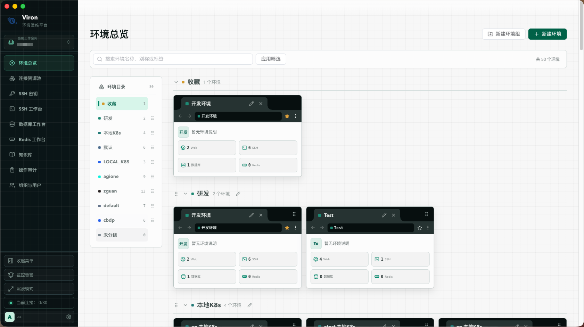
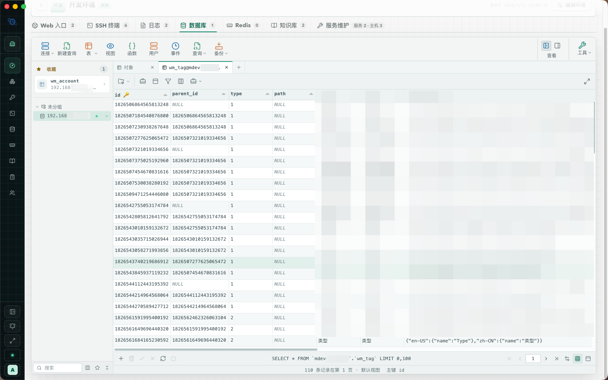
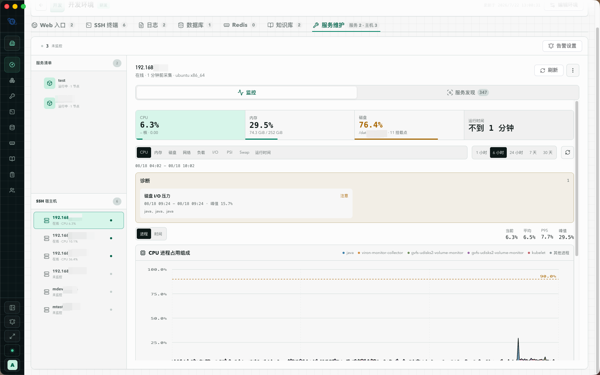

<p align="center"></p>

<h1 align="center">Viron</h1>

<p align="center">
  以环境为中心的运维工作台<br />
  <a href="./LICENSE"></a>
  
</p>

Viron 把同一个业务环境里的网站入口、SSH 主机、MySQL / MariaDB、Redis、实时日志和服务监控放在一个工作空间中，并在浏览器与桌面客户端里直接完成操作。连接凭据由服务端加密保存，权限按工作空间校验。

<p align="center"></p>

## 功能

- **环境工作区**：按环境组织 Web、SSH、日志、数据库、Redis 和服务维护；后台已连接环境可用画中画返回现场。
- **Web 多账号**：每个登录账号使用独立浏览器配置，支持自动填充、多页面和登录态恢复。
- **SSH / SFTP**：真实终端、跳板机、分屏、命令历史与收藏、ZMODEM，以及双栏文件传输。
- **数据库**：面向 MySQL / MariaDB 的对象树、SQL 编辑、表设计、数据网格、导入导出和结构 / 数据同步。
- **Redis**：Standalone 工作台，支持 TLS、SSH 隧道、键浏览和受控命令。
- **服务维护**：经现有 SSH 链路安装 `viron-monitor`，纳管 systemd、Docker、Podman、Supervisor 和 Kubernetes 工作负载，并提供趋势图与告警。
- **协作与审计**：个人空间、组织、项目组和资源授权；操作事件、终端录像与 SQL 历史可追溯。
- **MCP**：可选接入 Codex 等 MCP 客户端，在当前账号权限内读取资源并执行受控操作。

## 界面

**环境总览** — 按组浏览环境卡片，查看每个环境的 Web、SSH、数据库和 Redis 资源。

<p align="center"></p>

**Web 入口** — 同一环境内切换网站和登录账号，按需打开隔离的浏览器页面。

<p align="center"></p>

**SSH 终端** — 真实终端、命令历史与收藏，以及分屏和 SFTP。

<p align="center"></p>

**实时日志** — 经 SSH 跟踪多个文件，支持过滤、高亮和上下文。

<p align="center"></p>

**数据库** — MySQL / MariaDB 对象树、查询和表数据维护。

<p align="center"></p>

**服务维护** — 宿主机监控、服务发现和告警。

<p align="center"></p>

## 运行方式

| 方式 | 适用场景 |
| --- | --- |
| Full 服务端 | 浏览器直接打开服务地址。目标连接由中心服务发起，Web 页面由服务端 Chromium 打开。 |
| Lite 服务端 + 桌面客户端 | 中心只提供控制面和凭据授权。目标流量默认由当前电脑发出。 |
| Full 服务端 + 桌面客户端 | 可按设备在本机直连与服务端转发之间切换。 |

当前版本为 **0.1.6**。桌面客户端支持 macOS 12+（Apple Silicon / Intel）和 Windows（x86 / x64 / arm64）。

## 快速开始

需要 Docker 24 与 Docker Compose v2。

```bash
cp .env.example .env
```

编辑 `.env`，至少修改首次管理员密码。然后启动 Full 服务端：

```bash
docker compose -f docker-compose.full.yml up -d --build
```

浏览器打开 `http://127.0.0.1:8080`。健康检查为同一地址的 `GET /healthz`。

只为桌面客户端提供服务、不需要浏览器页面时，改用 Lite：

```bash
docker compose -f docker-compose.lite.yml up -d --build
```

生产环境请保持 `ALLOW_WEAK_PASSWORDS=false`。直接使用 HTTP 时保持 `COOKIE_SECURE=false`；放在 HTTPS 反向代理后面时设为 `true`。元数据库默认使用 `DATA_DIR` 下的 SQLite；也可以改为已有的 MySQL 8+ / MariaDB 10.6+。

更完整的部署、迁移、备份和客户端安装说明见 [使用手册](./docs/USER-GUIDE.md)。

## 本地开发

需要 Node.js 22.19+。

```bash
npm ci
cp .env.example .env
./scripts/dev-service.sh start
```

默认 API 地址为 `http://127.0.0.1:8080`。启用浏览器客户端时，开发界面为 `http://127.0.0.1:5173`。

```bash
npm run typecheck
npm test
npm run build
```

## 文档

| 文档 | 内容 |
| --- | --- |
| [使用手册](./docs/USER-GUIDE.md) | 功能说明、操作路径和管理维护 |
| [技术设计](./TECHNICAL-DESIGN.md) | 架构、安全边界、数据模型和验收口径 |
| [MCP](./docs/MCP.md) | 远程 / 本机 MCP 接入与能力范围 |
| [脚本同步](./docs/SCRIPT-SYNC.md) | 隔离脚本同步的输入输出约定 |
| [路线图](./docs/ROADMAP.md) | 尚未交付的后续方向 |
| [安全政策](./SECURITY.md) | 漏洞披露方式 |

## 安全

连接密码、私钥、Cookie 和 TLS 材料使用 AES-256-GCM 加密保存。实例主密钥默认生成在数据目录中，权限为 `0600`。MCP 默认关闭；开启后也不会把已保存的秘密写入工具参数或返回结果。

请勿把 `.env`、`data/` 或 `secrets/` 提交到版本库。发现漏洞请按 [SECURITY.md](./SECURITY.md) 私下报告。

## 许可

本项目以 [Apache License 2.0](./LICENSE) 发布。第三方组件见 [NOTICE](./NOTICE) 和 [monitor/THIRD_PARTY_NOTICES.md](./monitor/THIRD_PARTY_NOTICES.md)。

Navicat 是 PremiumSoft CyberTech Ltd. 的商标。SecureCRT 是 VanDyke Software, Inc. 的商标。Viron 与这些产品没有从属关系，仅提供独立实现的连接导入和协议兼容。
