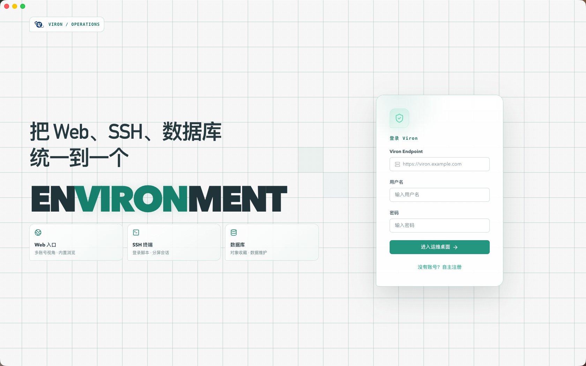
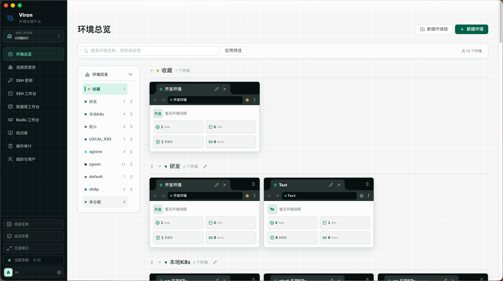
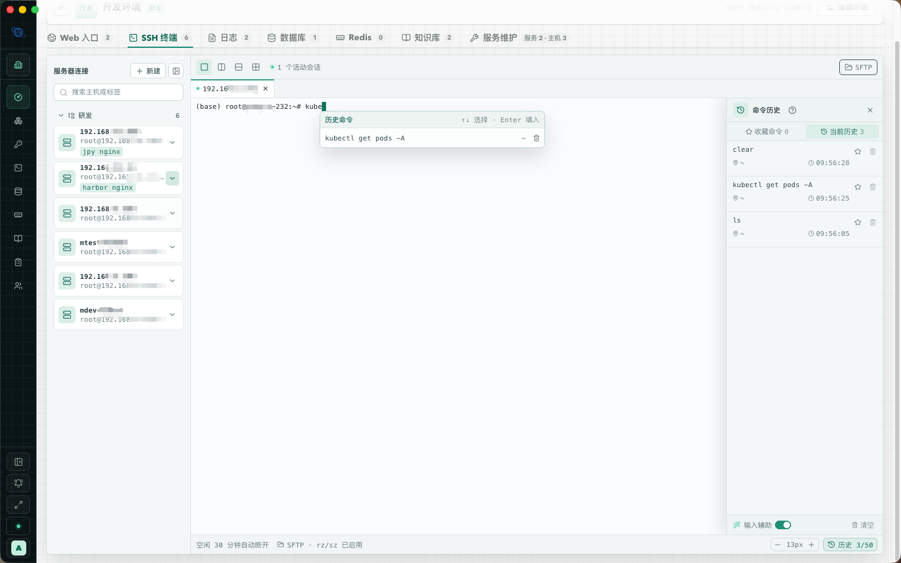
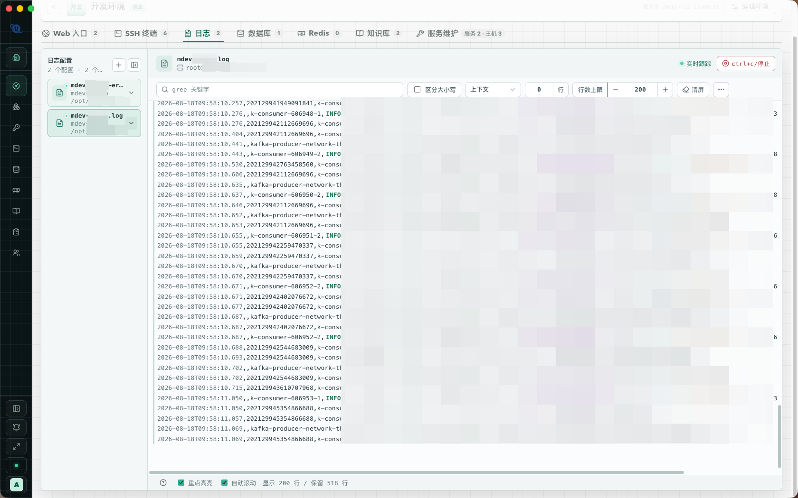
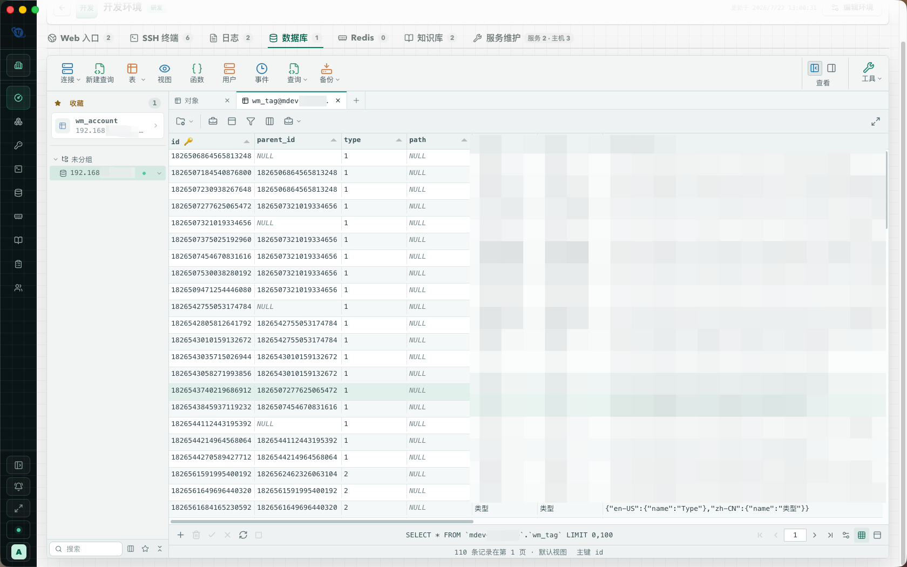
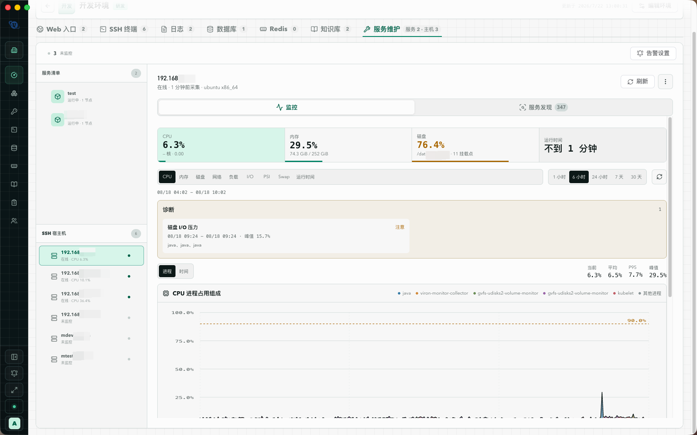

<p align="center"></p>

<h1 align="center">Viron</h1>

<p align="center">
  <a href="./README.md">简体中文</a> · <a href="./README.en.md">English</a>
</p>

<p align="center">
  开发运维全家桶<br />
  <a href="./LICENSE"></a>
  
</p>

Viron 是面向开发与运维的一站式工作台。它把 Web 浏览器、SSH 终端、MySQL / MariaDB、Redis、主机监控和 Agent 放在同一个环境里，减少在终端、数据库客户端、浏览器和跳板机之间来回切换。组织、项目组和资源授权用来控制谁能进哪套环境；操作审计、终端录像和 SQL 历史用来追溯谁做了什么。

<p align="center"></p>

## 服务端、Web 客户端和桌面 App

Viron 是同一套产品的三个部分，共用账号、工作空间、环境和加密凭据，并不是三套互不相干的工具。

```text
                         Viron 服务端
              账号 · 权限 · 凭据 · 审计 · 环境
                            │
           ┌────────────────┴────────────────┐
           │                                 │
         Full 版本                         Lite / Full
      静态页面 + Chromium                 API / WebSocket
           │                                 │
      Web 客户端                          桌面 App
      （浏览器打开）                     （macOS / Windows）
      目标流量从服务端出去                 默认本机直连，
                                         也可改走服务端转发
```

**服务端** 是控制面。用户、组织、环境、加密凭据和审计都保存在这里。Web 和 App 都连接到同一个 Endpoint。服务端有两个版本：

| 版本 | 包含什么 | 不包含什么 |
| --- | --- | --- |
| **Full** | API、WebSocket、Web 页面、用于打开目标网站的 Chromium，以及 SSH / SFTP / 日志 / 数据库 / Redis 的服务端转发 | 浏览器使用时没有缺项 |
| **Lite** | API、凭据授权，以及 SSH / SFTP / 日志 / 数据库 / Redis 的服务端转发 | 没有 Web 页面，也没有 Chromium。请用 App 连接，不要用浏览器打开 |

**Web 客户端** 是 Full 服务端提供的页面。用浏览器打开服务地址即可，不用安装。SSH、数据库、Redis、日志和目标网站都由**服务端**发起；目标网页跑在服务端 Chromium 里。适合不装客户端、需要统一网络出口的场景。

**桌面 App** 是同一套工作台的 macOS 12+ / Windows 安装包。在 App 里填写 Viron Endpoint（Lite 或 Full 都可以）。目标连接默认从**当前电脑**发出；本机到不了目标时，可以把支持的协议改成服务端转发。如果服务端不能代理网站（Lite，或 Full 未提供该能力），App 仍用本机 Chromium 打开这些页面。App 还提供原生悬浮层、本机 MCP 和系统通知。

| | Web 客户端 | 桌面 App |
| --- | --- | --- |
| 怎么进入 | 浏览器打开 Full 服务地址 | 安装 App，填写 Endpoint |
| 对接哪类服务端 | 只对接 Full | Lite 或 Full 都可以 |
| 目标流量从哪出去 | 一律从服务端 | 默认从本机，也可改走服务端 |
| 目标网站怎么打开 | 服务端 Chromium | 本机 Chromium；Full 支持转发时也可以走服务端 |
| 更适合 | 免安装、统一出口 | 直连内网，或按网络位置混用两种出口 |

工作台界面是同一套。选 Web 还是 App，只是连接从哪里发出，不是另一套产品。

### Web 入口的后台登录

网页版的服务端浏览器与桌面 App 的本机浏览器复用同一套后台登录流程。在隐藏的认证页面中填写账号密码，销毁认证页面后再打开业务页面，并再次检查业务页是否仍处于登录页。认证页面不加载用户扩展，也不提供开发者工具或完整页面截图。浏览器存储按 Endpoint、Viron 用户和目标账号独立保存，关闭账号不会清空 Cookie、localStorage、IndexedDB 或扩展设置；当前认证页面的 sessionStorage 会接续到业务页面。后台登录前暂停扩展和已有页面，认证页面销毁后恢复扩展。「清除登录状态」只重置网站数据，保留扩展设置。

添加或编辑 Web 入口时，展开「后台登录配置」：

- 普通登录表单可自动识别。复杂页面填写用户名、密码、登录按钮的 CSS 选择器，建议提供「登录成功标记」。
- 协议勾选框与随之弹出的协议确认对话框会通过安全局部画面交给用户确认，系统不会自动同意协议。确认后自动继续；验证码仍通过「继续登录」提交。
- 验证码、短信码或滑块填写「验证区域选择器」。使用者只会看到该区域，并可在其中操作；账号密码框、覆盖密码框的区域、iframe 和 Shadow DOM 验证控件会被拒绝。
- 多步登录可配置 `type`、`click`、`interactive`、`success` 步骤。输入用户名使用 `{USERNAME}`，密码使用 `{SECRET}`，最后一步必须为 `success`。密码更新后无需修改步骤。跨域登录必须显式添加允许的 Origin。

未确认登录成功、选择器含糊、验证区域不安全、证书异常或登录超时，均保持保护，不会开放已填写密码的页面。新窗口登录、iframe 内登录和依赖本地硬件的认证尚不支持；后台登录不能自动绕过验证码。该保护同时适用于网页版、App 服务端转发模式与 App 本机 Web 模式，账号存储仍按各自执行端隔离。详见 [后台登录与验收边界](PROTECTED-WEB-LOGIN.md)。它保护正常使用过程中的密码展示，不承诺抵御本机管理员对进程内存的调试。

## 功能

- **Web 浏览器**：以网站为单位录入多个登录账号，并可同时打开。账号之间登录态隔离，开发时不用反复切换视角。
- **SSH 终端**：真实终端，支持登录脚本、命令历史和收藏，常用命令不用反复手敲。同时提供双栏 SFTP，以及浏览器里的 `rz` / `sz`。
- **数据库**：MySQL / MariaDB 工作台覆盖 Navicat 日常运维中约 70% 的能力，包括对象树、SQL、表设计、数据网格、导入导出和同步。
- **Redis**：Standalone 工作台覆盖绝大多数常用场景，包括键浏览、六种核心类型维护、TTL 和受控命令。
- **监控**：经现有 SSH 链路一键安装 `viron-monitor`，采集主机状态，并在异常时告警。
- **Agent**：内置助手可以分析当前环境信息，必要时按确认直接操作环境数据。同时也提供 MCP，方便接到其他 Agent 里使用。
- **组织与审计**：支持管理员主动授权和成员申请授权；组织可配置顺序多级审批、任一人通过或全部人会签，允许指定审批人自审批并明确留痕。申请、审批、授权、修改、撤销和到期都有独立台账及权限快照；操作事件、终端录像和 SQL 历史可按成员追溯。

## 界面

示例图来自真实使用界面。图中含内部信息，因此做了大面积马赛克，请见谅。

**环境总览** — 按组浏览环境卡片，查看每个环境的 Web、SSH、数据库和 Redis 资源。

<p align="center"></p>

**SSH 终端** — 登录脚本、命令历史，以及 SFTP 和 `rz` / `sz`。

<p align="center"></p>

**实时日志** — 经 SSH 跟踪多个文件，支持过滤、高亮和上下文。

<p align="center"></p>

**数据库** — MySQL / MariaDB 对象树、查询和表数据维护。

<p align="center"></p>

**监控** — 一键安装采集服务，查看主机状态并接收告警。

<p align="center"></p>

## 快速开始

需要 Docker 24 与 Docker Compose v2。当前版本为 **0.1.9**。

```bash
cp .env.example .env
```

编辑 `.env`，至少修改首次管理员密码。然后启动 Full 服务端：

```bash
docker compose -f docker-compose.full.yml up -d --build
```

浏览器打开 `http://127.0.0.1:8080`。存活检查为同一地址的 `GET /healthz`；容器健康检查为 `GET /readyz`，它会真实探测元数据库，不可用时返回 503。

只为桌面客户端提供服务、不需要浏览器页面时，改用 Lite：

```bash
docker compose -f docker-compose.lite.yml up -d --build
```

生产环境请保持 `ALLOW_WEAK_PASSWORDS=false`。直接使用 HTTP 时保持 `COOKIE_SECURE=false`；放在 HTTPS 反向代理后面时设为 `true`。元数据库默认使用 `DATA_DIR` 下的 SQLite；也可以改为已有的 MySQL 8+ / MariaDB 10.6+。

桌面客户端仅提供 macOS 12+ Apple Silicon（`arm64`）和 Windows 32 位 x86（`ia32`）安装包。分别使用 `npm run package:macos:arm64` 和 `npm run package:windows:x86` 构建；`npm run package:desktop:requested` 构建这两种客户端。更完整的部署、迁移、备份和客户端安装说明见 [使用手册](./docs/USER-GUIDE.md)。

## 本地开发

需要 Node.js 22.19+。

```bash
npm ci
cp .env.example .env
./scripts/dev-service.sh start
```

默认 API 地址为 `http://127.0.0.1:8080`。启用浏览器客户端时，开发界面为 `http://127.0.0.1:5173`。

`dev-service.sh start` 在后台运行本地源码，并等待 API 的 `/readyz` 和前端页面都可访问后才成功返回，期间会分别显示就绪状态；关闭浏览器客户端时只等待 API。默认最多等待 120 秒，可通过环境变量或 `.env` 中的 `DEV_SERVICE_HEALTH_TIMEOUT_SECONDS` 调整。启动进程退出或等待超时时，命令返回非零退出码并显示最近日志；超时后后台服务可能仍在初始化。使用 `./scripts/dev-service.sh status` 查看进程和监听端口，使用 `./scripts/dev-service.sh logs` 查看完整日志。`./scripts/dev-service.sh down` 与 `stop` 等效；`restart` 也会等待服务就绪。

```bash
npm run typecheck
npm test
npm run build
```

## 文档

| 文档 | 内容 |
| --- | --- |
| [使用手册](./docs/USER-GUIDE.md) | 功能说明、操作路径和管理维护 |
| [技术设计](./TECHNICAL-DESIGN.md) | 架构、安全边界、数据模型和验收口径 |
| [MCP](./docs/MCP.md) | 远程 / 本机 MCP 接入与能力范围 |
| [脚本同步](./docs/SCRIPT-SYNC.md) | 隔离脚本同步的输入输出约定 |
| [路线图](./docs/ROADMAP.md) | 尚未交付的后续方向 |
| [安全政策](./SECURITY.md) | 漏洞披露方式 |

## 安全

连接密码、私钥、Cookie 和 TLS 材料使用 AES-256-GCM 加密保存。实例主密钥默认生成在数据目录中，权限为 `0600`。MCP 默认关闭；开启后也不会把已保存的秘密写入工具参数或返回结果。

请勿把 `.env`、`data/` 或 `secrets/` 提交到版本库。发现漏洞请按 [SECURITY.md](./SECURITY.md) 私下报告。

## 许可

本项目以 [Apache License 2.0](./LICENSE) 发布。第三方组件见 [NOTICE](./NOTICE) 和 [monitor/THIRD_PARTY_NOTICES.md](./monitor/THIRD_PARTY_NOTICES.md)。

Navicat 是 PremiumSoft CyberTech Ltd. 的商标。SecureCRT 是 VanDyke Software, Inc. 的商标。Viron 与这些产品没有从属关系，仅提供独立实现的连接导入和协议兼容。
