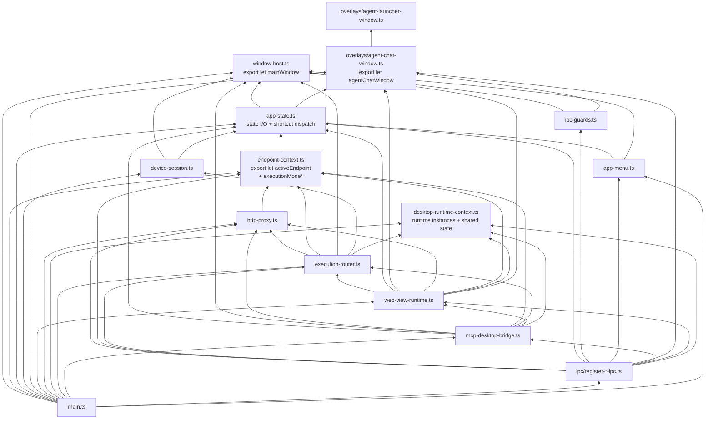
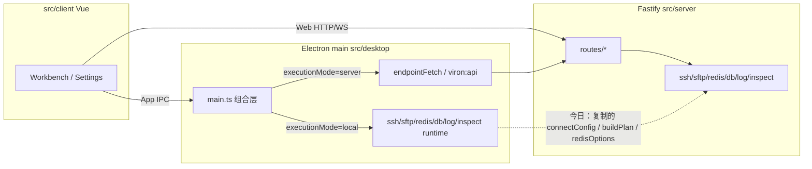
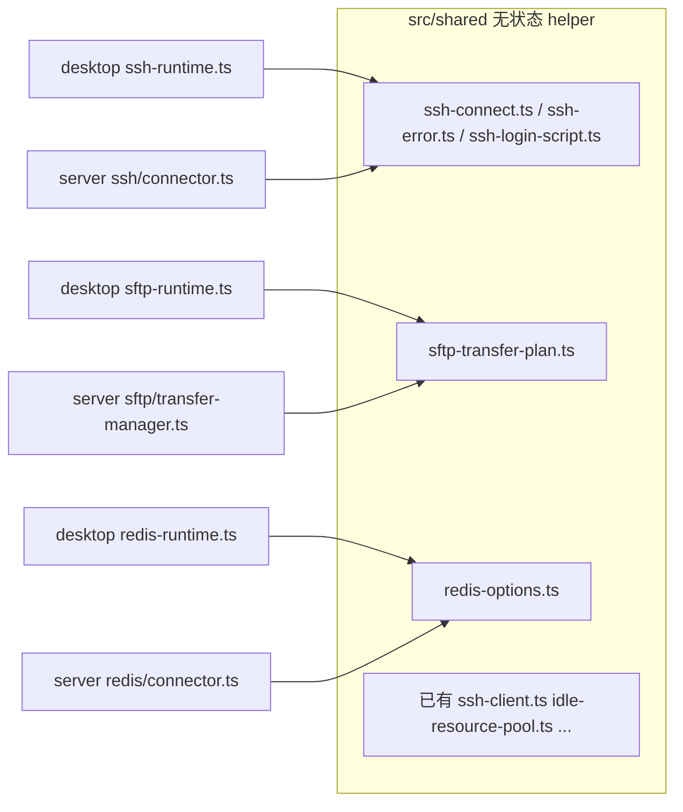
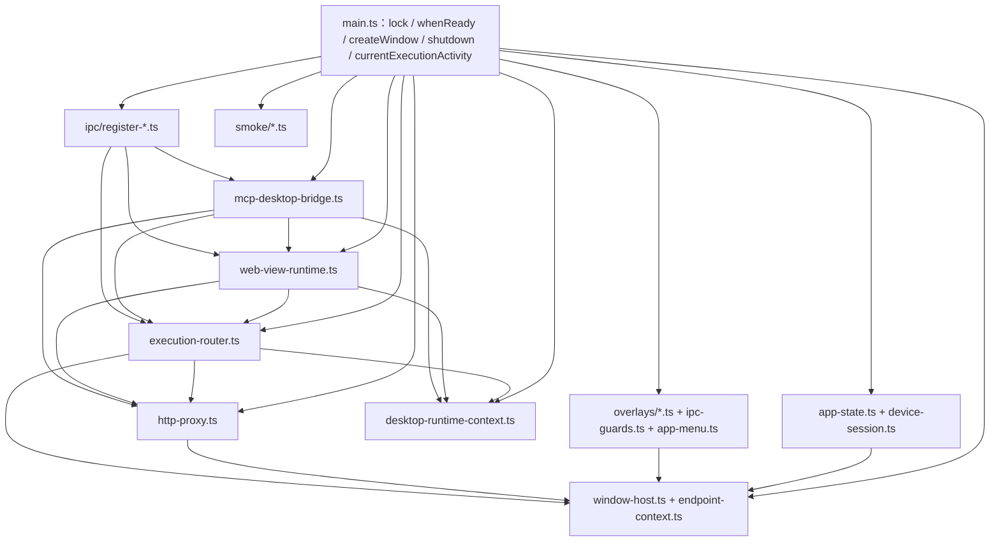

# Viron 内部结构重构与代码优化实施规格

| 字段 | 值 |
| --- | --- |
| 文档标题 | Viron 内部结构重构与代码优化实施规格 |
| 作者 | Viron maintainers（Codex 实施规格） |
| 日期 | 2026-08-23 |
| 状态 | Draft |
| 实现者 | Codex |
| 仓库 | `/Users/futongyong/project/hyperone/viron` |
| 性质 | **行为保持重构**（behavior-preserving refactor） |

本文是给 Codex 的**实施规格**，不是讨论稿。按 PR 顺序在**同一条堆叠分支**上执行。每一步都有**具名符号清单**、禁止改动、命令和验收。行为将要改变时立刻停下来，不要自行发明产品改动或「顺便对齐」两端实现。

---

## Codex 执行规则

1. **Git（堆叠，禁止从过期 `main` 开互不相关的 F2–F5）**
   - 禁止在 `main` 上开发、提交或推送。未经用户明确要求，不得把功能分支合并进 `main`。
   - 本程序**只切一次**功能分支：从最新 `main` 检出 `codex/internal-structure-refactor`。
   - 文末每个 PR 项 = 该分支上的**一个提交**（或从**上一 PR 提交 tip** 再 `git checkout -b codex/<pr-slug>`）。**禁止**对 PR 6 之后的项执行 `git checkout main && git checkout -b ...`。
   - 若用户要拆成多个 GitHub PR：PR *n* 的基线必须是 PR *n-1* 的 tip，而不是当前 `main`。
   - 分支名使用 `codex/` 前缀。
2. **一次一个 PR，顺序 = Key Decision 5 = 文末 PR Plan，全部串行。** 禁止「PR 2–5 可并行」：它们共享 `ssh-runtime.ts` / `sftp-runtime.ts` / `redis-runtime.ts`（PR 2 改全部 runtime 的 `contextKey`；PR 3–5 再改同一批文件）。Vue PR **依赖** `main.ts` 拆分完成（PR 11），因为 `tests/agent-floating-window.test.ts` 同时读取 `main.ts`、`DatabaseWorkbench.vue`、`AgentFloatingWindow.vue`、`SettingsView.vue`。
3. **行为保持**：不新增产品功能，不改 UX，不改 HTTP 路径、IPC 通道名、cookie、localStorage key、SQL alias、`/data/envman.db` 文件名。提取模块时公开 API 取最小集；禁止 `export *`。
4. **发现行为必须变才能拆**：停止该工作项，在 PR 描述写明阻塞点。两端测试不一致时**不要**把一边改成另一边。
5. **体积**：新文件与拆完后的残留文件原则上 `< ~800` 行。God file 残留硬检查点 `< 1200` 行，目标 `< 800`。**例外（硬性）：** `ServiceMaintenancePanel.vue` 与 `AgentFloatingWindow.vue` 的硬门是 **script+template 行数**，不是整个 `.vue` 的 `wc -l`。它们的 scoped CSS 必须留在原 `.vue`，禁止为了压行数把 CSS 搬进 `base.css` 或兄弟 `.css`（会改特异度并打散 CSS-lock 测试）。纯数据转储（`i18n-messages.ts`、schema DDL、MCP catalog）例外，且本程序不拆它们。
6. **类型纪律**：`src/` 无 `as any` / `@ts-ignore`。保持 `strict`。
7. **CSS-lock 测试**：现有 `readFileSync`/`readFile` + `toContain` 一律保留，本程序不新增。字符串或**标识符名**搬家时，**同一 PR** 只改**该断言**的读取路径，并加一行：`// contract unchanged; implementation moved from <old-path>`。被 grep 的**标识符不得改名**。**禁止**把 `tests/agent-floating-window.test.ts` 顶部的整份 `const desktopMain = readFileSync(...main.ts)` 一次性改成新文件：该绑定覆盖 overlay、smoke、`viron:api` deny list、agent IPC slice、web-view mouse-event、`currentAgentRuntimeScope()` 定义、以及留在 `main.ts` 的 whenReady `executeSshDiagnostic`/`executeDatabaseRead`。必须拆成 per-assertion `readFileSync`（可与留下的 `desktopMain` 并存，例如 `desktopChatOverlay`）。`currentAgentRuntimeScope()`（带括号）在 PR 8 改读 `execution-router.ts`，不要和 whenReady 无括号的 `currentScope: currentAgentRuntimeScope` 绑在一起。模式同 `connection-quality.test.ts`。
8. **验证**：每个 PR 跑 `npm run typecheck` + 点名测试。下列 PR **必须再跑全量 `npm test`**：PR 1（改 `base.css`）、PR 3、PR 4、PR 5、PR 8、PR 10、PR 11、PR 17。点名测试与全量套件不一致 → 停，不要「修 helper 去迁就一边」。PR 11 还必须跑 `npm run build:desktop` 与真 Electron 启动烟测，不能用默认 skip 的 integration suite 代替。
9. **提交粒度**：一个 PR 只做该工作项。不要引入 ESLint/Prettier 工作流或 Pinia/Vuex。
10. **i18n**：中文字面量当 key。共享 helper 返回中文源串；桌面展示路径再 `tr()`。不要改 `src/shared/i18n-messages.ts`。
11. **机械搬函数，禁止为拆而重写 DI。** Overlay / IPC 抽出时保持**现有函数名**为 `export function`。不要引入 `OverlayHost` class，不要把 `layoutAgentLauncherWindow` 改名为 class method（除非同时 `export function layoutAgentLauncherWindow` 作为别名且测试改读新文件后仍能 grep 到原名）。窗口 `let` 留在拥有它的 overlay 模块内，`main.ts` 不重新 `new BrowserWindow` 那些 overlay。
12. **闭包归属铁律（否则该提交无法同时满足原样搬迁 / 无环 / 可编译）。** 函数只能在 PR *n* 搬走，当且仅当它读取的每个模块级 `let` 已经由**不 import 目标文件**的模块 `export`。禁止 `new-module.ts` import `main.ts`。跨两个未来模块的函数**留在 `main.ts`**，不要用回调注册表或 host 对象硬拆。Vue composable **禁止**兄弟文件互相 import：只从 `.vue` 壳注入一份 ctx。

---

## 模块依赖铁律

外部只读评审指出：按旧 F0 把 `ipc-guards` / `sendShortcutAction` / `installApplicationMenu` / `publicState` 放进 PR 6，无法在该提交同时满足「原样搬迁、无循环依赖、可编译」。下列图是实施合同，不是示意。

今日 `main.ts` 里这些函数的真实闭包（核对过 HEAD）：

| 函数 | 读取的模块级 `let` / 其它尚未独立的函数 | 最早可搬家的 PR |
| --- | --- | --- |
| `readState` / `writeState` / `shortcutPreferences` / `currentAgentEntryMode` / `electronAccelerator` | 无窗口；只 `app.getPath` + 文件 | **PR 6** |
| `deviceIdentity` 等 device 文件函数 | 无窗口 | **PR 6** |
| `confirmSystemKeyAccess` | `mainWindow`、`systemKeyAccessConfirmedThisLaunch`、`systemKeyAccessConsentPrompt` | **PR 6**（consent `let` 随 `device-session.ts`；`mainWindow` 来自 `window-host.ts`） |
| `endpointSession` | 无 | **PR 6** |
| `endpointStateKey` / `executionModeForEndpoint` / `currentExecutionMode` / `executionScopeForEndpoint` | `activeEndpoint` + `readState` | **PR 6**（叶子 `endpoint-context.ts`，解开 PR 8 的 http↔execution 环） |
| `publicState` | `activeEndpoint`、`currentExecutionMode()`、`readState`、`app.getVersion` | **留 `main.ts`**（避免 `app-state` ↔ `endpoint-context` 环；它也不是 CSS-lock 目标） |
| `sendShortcutAction` | `mainWindow`、`agentChatWindow`、`agentChatLoaded` | **PR 7**（chat overlay 已 `export let`） |
| `installApplicationMenu` | `sendShortcutAction`、`mainWindow` | **PR 7** |
| `isTrustedAppSender` / `trustedSender` / `trustedAgentChatSender` | `mainWindow`、`agentChatWindow` | **PR 7** |
| `trustedMainWindowSender` | 仅 `mainWindow` | 可 PR 6，但 **整组 ipc-guards 必须同文件同 PR** → 跟 chat 守卫一起 **PR 7** |
| `requestUrl` / `endpointFetch` / `endpointJson` | `activeEndpoint`、`currentExecutionMode`、`executionScopeForEndpoint` | **PR 8** `http-proxy.ts` → import `endpoint-context.ts`（**禁止** import `execution-router.ts`） |
| `currentDesktopAuthContext` / `reserveDesktopRuntime` / `touchDesktop*` | `endpointJson`、`activeEndpoint`、runtime 实例 | **PR 8** `execution-router.ts` → import `http-proxy.ts` + `desktop-runtime-context.ts`（单向） |
| `openServiceSocket` / `sendServiceSocketEvent` | `activeEndpoint`、`currentExecutionMode`、`mainWindow` | **PR 8**；`mainWindow` 从 `window-host.ts` 读 |
| `currentExecutionActivity` | `activeEndpoint`、`currentExecutionMode`、**`desktopWebViews.size`** | **留 `main.ts`**（跨 execution + web-view 两域；web-view 已 import `reserveDesktopRuntime`，再反向 import 会成环） |
| `closeDesktopExecution` | runtime 实例，不读 `desktopWebViews` | **PR 8** |

允许的 desktop import DAG（箭头 = import；禁止反向）：



硬禁止：

- `overlays/agent-chat-window.ts` import `app-state.ts` 或 `ipc-guards.ts` 或 `app-menu.ts`
- `http-proxy.ts` import `execution-router.ts` 或 `web-view-runtime.ts`
- `execution-router.ts` import `web-view-runtime.ts`
- `desktop-runtime-context.ts` import `http-proxy.ts` / `execution-router.ts` / `web-view-runtime.ts` / `mcp-desktop-bridge.ts` / 任一 IPC registrar
- `mcp-desktop-bridge.ts` 假装只依赖 HTTP：它必须显式 import 真实使用的 AppState / Window / Endpoint / HTTP / Execution / Web / RuntimeContext API，禁止通过 `main.ts` 偷渡
- `web-view-runtime.ts` 的依赖超出 `window-host.ts` / `endpoint-context.ts` / `app-state.ts` / `overlays/agent-chat-window.ts` / `http-proxy.ts` / `execution-router.ts` / `desktop-runtime-context.ts`
- 任何抽出模块 `import ... from "./main.js"`

**Electron 集成测试边界：** `tests/desktop-local-*.integration.test.ts` 用 `describe.skipIf(!process.env.VIRON_DESKTOP_*_TEST)` **spawn 真 Electron**。默认 `npm test` **会 skip**，不算回归网。PR 4 内环用 `tests/desktop-ssh-runtime.test.ts`（进程内 ssh2 mock）。不要为了跑绿去设那些 env；也不要把 skip 的集成测试写成「必须通过」。PR 11 另加不依赖 Endpoint/凭据的 `verify:desktop-startup`：构建后用临时 user-data 启动 Electron `--smoke-test`，要求退出码 0 且 stdout 含 `VIRON_DESKTOP_SMOKE`。

---

## Overview

Viron 是双运行时产品：Web 请求一律打到 Fastify；桌面 App 在 `executionMode === "local"` 时由 Electron main 的 `*-runtime.ts` 本地执行，在 `"server"` 时由 main 转发到 Endpoint。维护成本来自组合层从未搬走：`src/desktop/main.ts` 6549 行（203 个 function，102 个 `ipcMain.handle`）、`DatabaseWorkbench.vue` 3609 行（201 个本地函数）。独立路由页包装器 `src/client/views/DatabaseWorkbenchView.vue`（31 行，`defineOptions({ name: "DatabaseWorkbenchView" })`）**本程序不改**。

本程序只做内部拆分与无状态 helper 提取。双运行时进程边界不变。完成后：`main.ts` 降为锁 / `whenReady` / `createWindow` / shutdown；Vue 工作台 `<script>` 进入 colocated composable（同一 SFC 实例，KeepAlive 不丢状态）；desktop/server 共用 SSH/SFTP/Redis 纯函数。HTTP/IPC/cookie/存储键/CSS 锁定字符串与标识符保持原值。

---

## Background & Motivation

### 当前规模（2026-08-23 实测）

| 树 | 行数 |
| --- | ---: |
| `src/client`（ts/vue/css） | 50561 |
| `src/server`（ts） | 30886 |
| `src/desktop`（ts/cts） | 15574 |
| `src/shared`（ts） | 12148 |
| `tests`（ts） | 22985 |
| `monitor`（go） | 4059 |

TypeScript `strict`；`src/` 中无 `as any` / `@ts-ignore` / `export *`。无 Pinia。`tsconfig.server.json` 与 `tsconfig.desktop.json` 已 include `src/shared/**/*.ts`；client `tsconfig.json` 不含 shared（`vue-tsc` 不检查 `node:crypto` 的 shared SSH helper，可接受）。

KeepAlive 有两条路径，都要保留：

- `App.vue`：`include="SshWorkbenchView,DatabaseWorkbenchView"`（缓存的是 **view 包装器**）。
- `EnvironmentDetailView.vue`：分别 KeepAlive **`DatabaseWorkbench`、`ServiceMaintenancePanel`、`SshWorkbench`、`RedisWorkbench`、日志、知识库** 组件本身。

### 痛点

1. `main.ts` 混杂状态、菜单、5 类 overlay、HTTP 代理、MCP、execution、WebContentsView、IPC、smoke。Runtime 类已独立。
2. Vue god 组件已有子组件，壳仍拥有 wiring。`handleNavigatorMenuAction` 2584–2739（156 行）。
3. SSH/SFTP/Redis helper 双份复制（含 `tryKeyboard`）。
4. 死代码：`PlannedFeatureNotice.vue`；重复 CLI。

`src/server/app.ts`（212 行）不要重排。`i18n-messages.ts`（5052）、`mcp-tools.ts`（2193）、`mysql-schema.ts`（1155）不拆。

---

## Goals & Non-Goals

### Goals

- 删除死代码与重复 CLI。
- 按**符号清单**把 `main.ts` 拆到具名模块；残留 `< 1200`（目标 `< 800`）。
- 去重 `contextKey` / `jsonResponse`（不合并 `mcpJsonResponse`）。
- 提取共享 SSH / SFTP plan / Redis options；**两个 runtime 进程保留**。
- Vue god 的 `<script>` 抽到 composable/子视图；工作台禁止拆成会 remount 的子 Vue。
- 可选：剪切 `SQLITE_SCHEMA` 原文；**不**引入 migrator。

### Non-Goals

见「明确不做」。

---

## Key Decisions

1. **只做行为保持重构。**
2. **双运行时保留。** 只抽无状态 helper。
3. **中文 i18n key 不变。** desktop 边界才 `tr()`。
4. **无 Pinia、无 ESLint 工作流、无 MCP catalog 重写。**
5. **第一波顺序（PR Plan 必须与此一致，禁止 Vue 与 `main.ts` 拆分并行）：** 死代码 → desktop `contextKey`/`jsonResponse` → 共享 SSH / login-script / error-map / SFTP-plan / Redis-options → `main.ts` 拆分（**state + `endpoint-context` + window-host（PR 6）→ overlay 函数 + 依赖 `agentChatWindow` 的 menu/guards（PR 7）→ HTTP + execution foundation + runtime ownership（PR 8）→ web-view（PR 9）→ 可独立 IPC registrar + MCP（PR 10，6 个 root handler 留 main）→ smoke + Electron startup（PR 11）**）→ Vue（DatabaseWorkbench → ServiceMaintenance → AgentFloatingWindow → Settings → Organization）→ 可选 schema 文件剪切。
6. **CSS-lock 测试保留，不新增。** 同 PR 改读取路径。被 grep 的标识符名不得改。
7. **体积：** 新模块 `< ~800`。`main.ts` / `DatabaseWorkbench.vue` / `SettingsView.vue` / `OrganizationView.vue` 硬检查点 `< 1200`。`ServiceMaintenancePanel.vue` 与 `AgentFloatingWindow.vue` 硬门 = script+template，CSS 留在 `.vue`。
8. **Overlay = 机械搬 `export function`，保留 CSS-lock 标识符。** 不引入 `OverlayHost` class。`raiseAgentOverlayWindows` 放在 `overlays/agent-chat-window.ts`（唯一调用方 `applyAgentChatChromeVisibility` 旁边），单向 import launcher 的窗口 `let`；`moveTop` 顺序锁定为 chat → visual launcher → interaction launcher，并在函数上用注释冻结。Dock 使用 `electronScreen.getCursorScreenPoint()`；launcher **禁止**使用。chat 模块禁止 import `app-state.ts`。
9. **Vue：** 工作台只 composable；`DatabaseWorkbenchView.vue` 不动。Settings/Organization 可拆子 Vue。工作台 composable **禁止兄弟互相 import**：由 `.vue` 壳 `create*Context()` 一次，各文件只接收 ctx。
10. **具名导出，禁止 `export *`。**
11. **兼容：** `envman_session`、`envman-theme`、`envman-language`、`envman:route-reload:`、`SELECT 1 AS envman_connection_check`、`/data/envman.db`、`-- ENVMAN_STATEMENT_BOUNDARY`。
12. **Monitor Go 模型不去重**（两个 `go.mod`，1.25.0 vs 1.26.0）。
13. **Schema migrator = Phase 2。** 第一波只剪切字符串；`openDatabase` / `ensureAdmin` 调用**与 HEAD 相同的函数名、相同顺序**。`claimLegacyResources` 只从 `ensureAdmin` 调用，不要塞进 `openDatabase`。
14. **叶子模块解开环，而不是 host/DI。** PR 6 抽出 `endpoint-context.ts`（`activeEndpoint` + 四个 execution-mode helper）和 `window-host.ts`（`mainWindow`）。两个可变导出都必须有唯一 setter，外部禁止给 import binding 赋值。`app-state.ts` 禁止 import `endpoint-context.ts`。PR 8 的 `http-proxy.ts` 只依赖 `endpoint-context.ts`，不依赖 `execution-router.ts`。`publicState` 与 `currentExecutionActivity` 留在 `main.ts`。ipc-guards / 菜单 / `sendShortcutAction` 推迟到 PR 7。

---

## Proposed Design

### 当前与目标：双运行时





进程边界不变。`forward()` 在 SSH connector 与 **database** runtime 还有副本（返回 `Readable` vs `ClientChannel`）。**PR 3 不抽 database `forward`。**

### 目标：`main.ts` 按符号搬家（不是按行号切）



---

## 工作项详述

---

### 工作项 A — 删除死代码并去重 admin reset CLI

#### 1. 现状

- `PlannedFeatureNotice.vue` 15 行，零 importer。CSS 仅 `base.css` 498–506、3924、4776。
- `scripts/reset-admin-password.ts`（34）与 `src/server/cli/reset-admin-password.ts`（32）。`package.json` `"admin:reset": "tsx scripts/reset-admin-password.ts"`。
- `docs/USER-GUIDE.md` 仍文档 `node dist/server/cli/reset-admin-password.js`。

#### 2. 目标

删除组件与 CSS。`admin:reset` 指向 `src/server/cli/reset-admin-password.ts`。删除 `scripts/` 副本。CLI usage **两行都保留**：

```
Usage: npm run admin:reset -- <username> <new-password>
Usage: node dist/server/cli/reset-admin-password.js <username> <new-password>
```

因此 **不改** `docs/USER-GUIDE.md`。若有人删掉 dist 那一行 → 必须同步 USER-GUIDE；本规格选择保留，故指南不动。

#### 3. 步骤

1. `rg PlannedFeatureNotice planned-feature` 确认仅组件 + `base.css`。
2. 删组件；从 `base.css` 只删 `planned-feature-*` 与 `@keyframes planned-feature-in`，不碰相邻选择器。
3. 更新 CLI usage 为两行；改 `package.json`；删 `scripts/reset-admin-password.ts`。

#### 4. 禁止改动

- 不改其它 CSS。不改参数顺序。不改 argon2id / session 删除。不改 USER-GUIDE。

#### 5. 验证（必须全量）

```bash
npm run typecheck
npm test
```

点名内环若需：`tests/dialog-style.test.ts tests/database-grid-styles.test.ts tests/ssh-terminal-styles.test.ts tests/database-navicat-toolbar-order.test.ts`。

#### 6. 验收

- [ ] 组件与 `planned-feature` CSS 消失
- [ ] `scripts/reset-admin-password.ts` 消失；`admin:reset` 可用
- [ ] USER-GUIDE 未改
- [ ] 全量 `npm test` 通过

#### 7. 体积

无新文件。

---

### 工作项 B — 提取 desktop `contextKey` / `jsonResponse`

#### 1. 现状

`contextKey` 七处逐字复制（非 export）：`ssh-runtime.ts:129`、`sftp-runtime.ts:160`、`log-runtime.ts:55`、`redis-runtime.ts:58`、`database-runtime.ts:141`、`database-operations-runtime.ts:96`、`connection-inspection-runtime.ts:58`。

`jsonResponse` 四处。database / database-operations / redis：`status === 204 ? "No Content"` + `body === undefined` 时无 headers。inspection（`:62-68`）**要求** `body: unknown`、总是 JSON headers、无 204 分支。今日 inspection 调用点总是传 body。

`mcpJsonResponse`（`main.ts:2156`）与 `desktopResponseToMcp`（`:2160`）是 **MCP `McpApiResponse`**，**禁止**并入本 helper。

`DesktopSshContext` 必须继续可从 `ssh-runtime.ts` 作 `export type` 导入。

#### 2. 目标

```ts
// src/desktop/ssh-context.ts
export interface DesktopSshContext {
  endpoint: string;
  userId: string;
  workspaceType: "personal" | "organization";
  workspaceId: string;
}
export function contextKey(context: DesktopSshContext): string {
  return `${context.endpoint}\0${context.userId}\0${context.workspaceType}\0${context.workspaceId}`;
}
```

```ts
// src/desktop/json-response.ts
export interface DesktopJsonResponse {
  status: number;
  statusText: string;
  headers: Array<[string, string]>;
  body: string;
}
export type DesktopDatabaseResponse = DesktopJsonResponse;
export type DesktopRedisResponse = DesktopJsonResponse;
export type DesktopInspectionResponse = DesktopJsonResponse;

export function jsonResponse(status: number, body?: unknown): DesktopJsonResponse {
  return {
    status,
    statusText: status === 204 ? "No Content" : status >= 400 ? "Error" : "OK",
    headers: body === undefined ? [] : [["content-type", "application/json; charset=utf-8"]],
    body: body === undefined ? "" : JSON.stringify(body),
  };
}
```

各 runtime 删除本地接口，改用上述 alias（或继续 `import type { DesktopDatabaseResponse }` 从 json-response）。**不要改 inspection 调用点**（继续传 body）。`ssh-runtime.ts`：`export type { DesktopSshContext } from "./ssh-context.js"`。`contextKey` **不要**新做成 public export（可从 ssh-context 导出供 runtime 用，但不要从 ssh-runtime 再导出）。

#### 3. 步骤

按上替换 7+4 处。`rg "function contextKey|function jsonResponse" src/desktop` 只剩 json-response/ssh-context。

#### 4. 禁止改动

- `\0` 顺序。不改 inspection 调用。不碰 `mcpJsonResponse` / `desktopResponseToMcp`。不放到 `src/shared`。

#### 5. 验证

```bash
npm run typecheck
npm test -- tests/desktop-ssh-runtime.test.ts tests/desktop-log-runtime.test.ts tests/desktop-database-runtime.test.ts tests/desktop-database-operations-runtime.test.ts tests/desktop-connection-quality-probe.test.ts tests/redis.test.ts tests/sftp-transfer.test.ts tests/desktop-local-inspection.integration.test.ts tests/desktop-local-ssh.integration.test.ts tests/desktop-local-database.integration.test.ts tests/desktop-local-log.integration.test.ts
```

#### 6. 验收

- [ ] 一处 `contextKey`、一处 `jsonResponse`
- [ ] alias 名称保留
- [ ] `mcpJsonResponse` 仍只在 MCP 桥
- [ ] typecheck + 点名测试通过

#### 7. 体积

各 `< 50` 行。

---

### 工作项 C — 共享 SSH login script / error map / connect config

#### 1. 现状

`normalizeSshLoginScript`：`src/server/ssh/options.ts:6-9`；desktop 复制 `normalizedLoginScript` 于 `ssh-runtime.ts:358`、`log-runtime.ts:59`。

错误正则顺序：authentication → timed out → ECONNREFUSED → ENOTFOUND|EAI_AGAIN → Host key。desktop 包 `tr()`。

`connectConfig` 两边均设置 `tryKeyboard = true`（`authType === "keyboardInteractive"`），`connectClient` 把 password 传给 `connectSshClient`。

`forward()` **四份**：`src/desktop/ssh-runtime.ts:174`、`src/server/ssh/connector.ts:130`（`Promise<Readable>`）；`src/desktop/database-runtime.ts:241`、`src/server/database-workbench/connector.ts:110`（`Promise<ClientChannel>`）。**本 PR 不抽 database 两份。** SSH 两份可以抽到 `ssh-connect.ts`，也可以继续重复到后续 PR——默认：**SSH 两份可以抽；database 两份明确 out of scope。**

Server `inspectionError`（`connection-inspection.ts:8-16`）文案/顺序与 SSH helper **不同**（`认证失败，请检查用户名和凭据`、`目标端口拒绝连接`）。Desktop inspection 已委托 `desktopSshErrorMessage`。**任何改 inspection 字符串 = 行为变化 → 停。** 本 PR Files **不要**包含 `connection-inspection.ts`。

#### 2. 目标

`src/shared/ssh-login-script.ts`：现有 `normalizeSshLoginScript` 原文。`options.ts` **具名** re-export，保留 `preserveSshLoginScript`。`tests/ssh-login-script.test.ts` import 路径保持从 `options.js`。

`src/shared/ssh-error.ts`：

```ts
export function sshErrorMessage(error: unknown): string {
  const value = error instanceof Error ? error.message : String(error);
  if (/authentication/i.test(value)) return "SSH 认证失败，请检查用户名和凭据";
  if (/timed out/i.test(value)) return "SSH 连接超时";
  if (/ECONNREFUSED/i.test(value)) return "SSH 端口拒绝连接";
  if (/ENOTFOUND|EAI_AGAIN/i.test(value)) return "无法解析 SSH 主机地址";
  if (/Host key/i.test(value)) return "SSH 主机指纹不匹配";
  return value;
}
```

`desktopSshErrorMessage` 仍从 `ssh-runtime.ts` export：`return tr(sshErrorMessage(error));`。

`src/shared/ssh-connect.ts` **必须**是下面这份实现（含 `tryKeyboard`、passphrase、两个中文 key），不得用「只写 keepalive」的缩写稿：

```ts
import { createHash } from "node:crypto";
import type { Readable } from "node:stream";
import type { ConnectConfig } from "ssh2";

export interface SshConnectInput {
  host: string;
  port: number;
  username: string;
  authType: "password" | "privateKey" | "keyboardInteractive";
  credential: { password?: string; privateKey?: string; passphrase?: string };
  options: { keepAliveSeconds?: number; hostKeySha256?: string };
}

export function sshHostVerifier(expected: string | undefined): ConnectConfig["hostVerifier"] {
  if (!expected) return undefined;
  const normalizedExpected = expected.replace(/^SHA256:/i, "").replace(/=+$/, "");
  return (key: Buffer) => {
    const actual = createHash("sha256").update(key).digest("base64").replace(/=+$/, "");
    return actual === normalizedExpected;
  };
}

export function buildSshConnectConfig(
  connection: SshConnectInput,
  sock: Readable | undefined,
  translate: (key: string) => string = (key) => key,
): ConnectConfig {
  const config: ConnectConfig = {
    host: connection.host,
    port: connection.port,
    username: connection.username,
    readyTimeout: 15_000,
    keepaliveInterval: Math.max(0, Number(connection.options.keepAliveSeconds ?? 30)) * 1000,
    keepaliveCountMax: 3,
    hostVerifier: sshHostVerifier(connection.options.hostKeySha256),
    sock,
  };
  if (connection.authType === "privateKey") {
    if (!connection.credential.privateKey) throw new Error(translate("该连接没有保存私钥"));
    config.privateKey = connection.credential.privateKey;
    if (connection.credential.passphrase) config.passphrase = connection.credential.passphrase;
  } else {
    if (!connection.credential.password) throw new Error(translate("该连接没有保存密码"));
    config.password = connection.credential.password;
    if (connection.authType === "keyboardInteractive") config.tryKeyboard = true;
  }
  return config;
}
```

desktop `connectConfig` 改为调用 `buildSshConnectConfig(connection, sock, tr)`。server 用默认 `translate`。`connectClient` 仍本地：keyboardInteractive 时传 password 给 `connectSshClient`。

#### 3. 步骤

按上替换。不要改 log 的 `OUTPUT_BUFFER_LIMIT = 256 * 1024`。不要合并 pool。

#### 4. 禁止改动

- 正则顺序与中文。`tryKeyboard` 必须在。
- 不改 `connection-inspection.ts` 字符串。
- 不改 database `forward`。
- 不碰 `mcpJsonResponse`。

#### 5. 验证（必须全量）

```bash
npm run typecheck
npm test
```

内环：`tests/ssh-login-script.test.ts tests/ssh-client.test.ts tests/ssh.test.ts tests/desktop-ssh-runtime.test.ts tests/desktop-log-runtime.test.ts tests/desktop-local-ssh.integration.test.ts tests/desktop-local-log.integration.test.ts`。`idle-resource-pool.test.ts` 不是本 PR 范围，不必点名。

#### 6. 验收

- [ ] `rg "tryKeyboard" src/shared/ssh-connect.ts` 命中
- [ ] `rg "认证失败，请检查用户名和凭据" src` 与 `rg "SSH 认证失败" src` **两种文案都在**（inspection vs SSH）
- [ ] `connection-inspection.ts` 无 diff
- [ ] `database-runtime.ts` / `database-workbench/connector.ts` 的 `forward` 无 diff
- [ ] 全量 `npm test`

#### 7. 体积

三文件合计 `< 200` 行。

---

### 工作项 D — 共享 SFTP plan / copy

#### 1. 现状

算法接近但**不等价**：

- desktop `existingStats`（`sftp-runtime.ts:341-348`）用 `desktopSshErrorMessage(error)` 做 `/no such file/i`；server（`transfer-manager.ts:149-156`）用通用 `errorMessage`。
- desktop `copyEntry` 的 `signal: AbortSignal`（必填，`signal.aborted`）；server `signal?: AbortSignal`（`signal?.aborted`）。
- 循环还依赖 `conflictDecision`、`ensureDirectory`、`removeEntry`、`entryType`、`collectConflicts`。
- desktop `SftpFileSystem` 另有 `stat` + `close()`，**不要删**。
- `materializeEntry`（拖出到本机）留 desktop。

禁止「以 server 测试为准去改 desktop」。两端测试不一致 → **停**。

#### 2. 目标

```ts
// src/shared/sftp-transfer-plan.ts
export type SftpConflict = "overwrite" | "skip";
export interface SftpPlanAttributes {
  size: number;
  mode: number;
  isDirectory(): boolean;
  isSymbolicLink(): boolean;
}
export interface SftpPlanEntry { filename: string }
export interface SftpPlanFileSystem {
  lstat(path: string): Promise<SftpPlanAttributes>;
  readdir(path: string): Promise<SftpPlanEntry[]>;
  mkdir(path: string): Promise<void>;
  rmdir(path: string): Promise<void>;
  unlink(path: string): Promise<void>;
  chmod(path: string, mode: number): Promise<void>;
  createReadStream(path: string): NodeJS.ReadableStream;
  createWriteStream(path: string, options: { flags: "w"; mode: number }): NodeJS.WritableStream;
}
export interface SftpTransferPlan { sourceType: "file" | "directory"; totalBytes: number; totalFiles: number }
export interface SftpTransferProgress { transferredBytes: number; completedFiles: number; skippedFiles: number }

export function isSftpMissingFileCode(error: unknown): boolean {
  if (error === null || typeof error !== "object") return false;
  const code = "code" in error ? (error as { code?: unknown }).code : undefined;
  return code === 2 || code === "ENOENT" || code === "NO_SUCH_FILE";
}

export async function existingSftpStats(
  fs: SftpPlanFileSystem,
  path: string,
  isMissingFile: (error: unknown) => boolean,
): Promise<SftpPlanAttributes | null> { /* try lstat; isMissingFile → null; else throw */ }

export function sftpConflictDecision(
  targetPath: string,
  fallback: SftpConflict,
  decisions: Readonly<Record<string, SftpConflict>> | undefined,
): SftpConflict { return decisions?.[targetPath] ?? fallback; }

export async function buildSftpPlan(fs: SftpPlanFileSystem, path: string, signal: AbortSignal | undefined, translate: (key: string, values?: readonly unknown[]) => string): Promise<SftpTransferPlan>
export async function ensureSftpDirectory(...)
export async function removeSftpEntry(...)
export async function collectSftpConflicts(...)
export async function copySftpEntry(..., signal: AbortSignal | undefined, ...)
```

注入：

- desktop `isMissingFile`: `(error) => isSftpMissingFileCode(error) || /no such file/i.test(desktopSshErrorMessage(error))`
- server: `(error) => isSftpMissingFileCode(error) || /no such file/i.test(error instanceof Error ? error.message : String(error))`

`tests/sftp-transfer.test.ts` 必须增加 `null`、`undefined`、字符串与无 `code` 对象用例，均返回 `false`；helper 不得在处理 `unknown` 时先强转再解引用。

`copySftpEntry` 用 `if (signal?.aborted) throw signal.reason`（兼容必填/可选）。desktop 调用点继续传入 AbortSignal。

symlink / skip：`skippedFiles += buildPlan.totalFiles`；`mode & 0o777`；`TRANSFER_LIMIT = 3`；`DESKTOP_LOCAL_SFTP_CONNECTION_ID` 不变。

server 继续 export `transferSftpEntry`。adapter 把 `TransferSftp` 回调包成 `SftpPlanFileSystem`。desktop 不要为了满足 shared 类型而删 `stat`/`close`。

错误文案：desktop `tr(...)`；server 最终 `.message` 必须与现测字面量一致（路径用拼接，不要留下未替换 `{{0}}`）。

#### 3. 步骤

1. 抽出 shared，两端注入 `isMissingFile`。
2. 跑 server `tests/sftp-transfer.test.ts` **和** desktop SFTP 测试。不一致就停。

#### 4. 禁止改动

- 不把 desktop 行为「修」成 server。
- 不合并 local SFTP 进 server。
- 不改 IPC/HTTP。
- 不删 desktop `stat`/`close`。

#### 5. 验证（必须全量）

```bash
npm run typecheck
npm test
```

内环必须含：`tests/sftp-transfer.test.ts tests/sftp.test.ts tests/sftp-selection.test.ts tests/desktop-ssh-runtime.test.ts`。

**不要**把 `tests/desktop-local-ssh.integration.test.ts` 当成必过项：它 `describe.skipIf(!process.env.VIRON_DESKTOP_SSH_TEST)` 且 **spawn 真 Electron**。默认 `npm test` skip。未设置该 env 时失败或超时都不是本 PR 的回归信号。

#### 6. 验收

- [ ] shared 含 `existingSftpStats` / `ensureSftpDirectory` / `removeSftpEntry` / `sftpConflictDecision` / injectable `isMissingFile`
- [ ] desktop 与 server 测试均绿；若曾 diverge → 本 PR 应已 stop 而非静默统一
- [ ] `transferSftpEntry` 仍 export
- [ ] 全量 `npm test`

#### 7. 体积

`sftp-transfer-plan.ts` `< 450`。desktop `sftp-runtime.ts` 允许 800–900。

---

### 工作项 E — 共享 Redis `buildRedisOptions`

保持原字段级对象，包括 `connectionName` 由调用方传入、`connectTimeout`/`commandTimeout` 默认 10_000、`retryStrategy: () => null`、TLS `servername` fallback。

`isDesktopRedisExecutionPath` 必须继续 `new URL(path, "http://desktop.local").pathname` 再测正则，禁止简化成 raw `path`。

不抽 SSH tunnel。不碰 `mcpJsonResponse`。

验证：全量 `npm test`。内环 `tests/redis.test.ts tests/redis-availability.test.ts tests/redis-workbench-format.test.ts`。无 desktop local Redis integration 测试，全量套件即回归网。

禁止改动加一条：不把 `mcpJsonResponse` 折进 `jsonResponse`。

---

### 工作项 F — `main.ts` 按符号拆分（6 个连续 PR：F0–F5）

**禁止按行号切文件。** 下列是每个新文件的**拥有符号**。把函数**原样** `export function` 搬走，标识符名不变。

#### 跨域符号（不得跟错文件）

| 符号 | 归属 | 说明 |
| --- | --- | --- |
| `publishDesktopAppState` | **留 `main.ts`**（与 `publicState` 同 owner） | 默认参数直接调用 `publicState()`；搬到 `app-state.ts` 会迫使新模块 import `main.ts`。仅两个调用 handler 一并留 main。 |
| `raiseAgentOverlayWindows` | `src/desktop/overlays/agent-chat-window.ts`（**不要**独立 `raise-agent-overlays.ts`） | 唯一调用方是同文件的 `applyAgentChatChromeVisibility`（今日 `main.ts:976`）。函数体读本模块 `agentChatWindow` 以及 launcher 的 `agentLauncherVisualWindow` / `agentLauncherWindow`。chat **单向** `import { agentLauncherWindow, agentLauncherVisualWindow } from "./agent-launcher-window.js"`（launcher 导出这两个 `let`；只在函数体内解引用，不要在模块顶层读）。launcher **禁止** import chat。`moveTop` 顺序锁定：① `agentChatWindow` ② `agentLauncherVisualWindow` ③ `agentLauncherWindow`，在函数上写注释冻结。 |
| `cachedDesktopWebUrl` `rememberDesktopWebLastUrl` `forgetDesktopWebLastUrl` | `web-view-runtime.ts` | 不是 app-state。 |
| `desktopWebSession` | `web-view-runtime.ts` | |
| `localMcpLauncherPath` `localMcpStatus` | `mcp-desktop-bridge.ts` | |
| `sendImmersiveNavigationAction` | `overlays/immersive-navigation-window.ts` | 在 trustedSender 之前就存在，不是 ipc-guards。 |
| `endpointStateKey` `executionModeForEndpoint` `currentExecutionMode` `executionScopeForEndpoint` | `endpoint-context.ts`（PR 6） | 唯一实现；后续模块只 import，禁止在 `execution-router.ts` 复制。 |
| `requireDesktopString` `requireDesktopInput` `desktopBinary` | `ipc/desktop-ipc-parse.ts`（与 SSH/agent IPC 一起，F4 / PR 10） | **不是** web-view。 |
| `agentSettingsInput` `agentModelListInput` `agentChatRequest` `monitorAlertNotificationInput` `agentDatabaseContextInput` | `ipc/register-agent-ipc.ts` 或同文件 parse | 不是 web-view。 |
| `closeDesktopExecution` | `execution-router.ts` | 定义 3577。 |
| `closeDesktopMcpOperations` | **定义**在 `mcp-desktop-bridge.ts`。**调用点**见下表，搬家时 **Promise.all 成员与参数（含 `false`）逐字保留**。 |

`closeDesktopMcpOperations` 调用点（定义在 PR 10 搬到 MCP；调用点同一提交按下表分别留 `main.ts` 或进 registrar。PR 9 不提前拆 IPC）：

| 位置 | 必须保留的源码片段（测试锁定） |
| --- | --- |
| `viron:execution-mode:set` | `closeDesktopMcpOperations(),\n      closeAllDesktopWebViews(),\n      closeDesktopExecution(tr("App 连接模式已切换"))` |
| `viron:endpoint:set` 切换 | `closeDesktopMcpOperations(),\n          closeAllDesktopWebViews(),\n          closeDesktopExecution(tr("Endpoint 已切换"))` |
| `viron:endpoint:clear` | `await Promise.all([closeDesktopMcpOperations(), closeAllDesktopWebViews(), closeDesktopExecution(tr("Endpoint 已清除"))` |
| login/logout/workspace | `await Promise.all([closeDesktopMcpOperations(), closeAllDesktopWebViews(), closeDesktopExecution(reason)])` |
| `before-quit` | `closeDesktopMcpOperations(false),\n    desktopMcpBroker?.close()` |
| MCP 窗口创建 | `["X-Viron-MCP-Origin", activeEndpoint.endpoint]`、`session: activeEndpoint.partition`、`contextIsolation: true`、`nodeIntegration: false`、`sandbox: true`、`modal: false`、`closable: true` |

**PR 9 不搬 IPC。** execution-mode / endpoint / viron:api / MCP enabled / **`viron:service-socket:*`**，以及 overlay、clipboard/titlebar/shortcuts/artifacts/download/web-view IPC 全部仍留 `main.ts`。PR 10 在依赖模块齐备后搬可独立 registrar；闭包 `publicState` / `currentExecutionActivity` 的 6 个 root handler 继续留 main。`tests/desktop-mcp-security.test.ts` 的读取路径也只在 PR 10 按断言拆分。

#### 残留 `main.ts` 必须留下的符号

- `app.commandLine.appendSwitch("use-mock-keychain")` 在 `app.whenReady()` **之前**（`macos-packaging.test.ts`）
- `process.argv.includes("--smoke-test") || app.requestSingleInstanceLock()`（`desktop-updater.test.ts`）
- `shouldBlockLaunchForActiveUpdate` + 「正在安装更新」
- `createWindow`（装配 overlay `layout*` 调用、`titleBarOverlay: desktopTitleBarOverlay("login")`）
- **`publicState`**（跨 app-state 与 endpoint-context）
- **`publishDesktopAppState`**（默认参数闭包 `publicState`）
- 6 个 root IPC handler：`viron:state`、`viron:agent:entry-mode:set`、`viron:execution-mode:set`、`viron:execution-activity`、`viron:endpoint:set`、`viron:endpoint:clear`。它们直接闭包前两项，禁止 registrar 反向 import main，也禁止为搬走而注入 callback
- `developmentApplicationIcon`（仅 `createWindow` / dock icon 使用，留 main.ts）
- `app.whenReady` 里 `DesktopAgentRuntime` 装配字面量 **`executeSshDiagnostic: async`、`executeDatabaseRead: async`**（`tests/agent-floating-window.test.ts` ~371–372；**F0–F5 都不搬这两段**）。同装配的 `currentScope: currentAgentRuntimeScope,`（~6492，**无 `()`**）也留在 `main.ts`，但那**不是**测试锁定串
- **`currentExecutionActivity`**（跨 `activeEndpoint` 与 `desktopWebViews.size`）
- **`async function currentAgentRuntimeScope()`** 定义（今日 ~2597）归 PR 8 `execution-router.ts`。测试 `toContain("currentAgentRuntimeScope()")` 命中的是该签名以及仍在 `main.ts` 的调用，**不是** whenReady 的无括号属性。**PR 8 必须把该断言单独改读 `execution-router.ts`**，且锁定串保持带 `()`，禁止弱化成无括号的 `currentAgentRuntimeScope`（会误匹配 `currentScope: currentAgentRuntimeScope`）
- `before-quit` / `window-all-closed` / `second-instance`
- `--smoke-test` 分支调用 smoke 函数（函数体在 F5 搬走）

#### F0 目标文件符号（PR 6）

**本 PR 只搬不依赖 `agentChatWindow` 的叶子。** `sendShortcutAction`、`installApplicationMenu`、整组 `ipc-guards` **留在 `main.ts`，到 PR 7。**

`window-host.ts`：`export let mainWindow`（名字锁定）+ **必需** `export function setMainWindow<T extends BrowserWindow | null>(next: T): T`（赋值后原值返回）。`mainWindow` 是供消费者读取的 live binding，唯一写入口是本文件的 setter；`createWindow` 用 `const createdMainWindow = setMainWindow(new BrowserWindow(...))` 保留非空类型收窄，其后原先依赖赋值收窄的直接访问改读该局部变量；`closed` 用 `setMainWindow(null)`。禁止对 import binding 写 `mainWindow = ...`。`preload`/`app.getAppPath()` helper 可放这里。本文件 **零** desktop 内部 import。

`app-state.ts`（真正的文件 I/O 叶子，**禁止** import `endpoint-context.ts`）：`DesktopStateFile`、`statePath`、`readState`、`writeState`、`shortcutPreferences`、`currentAgentEntryMode`、`electronAccelerator`。**不要**放 `publicState`、`publishDesktopAppState`、`sendShortcutAction`、web-url helpers。本文件在 PR 6 禁止 import overlays / endpoint-context。

`endpoint-context.ts`（解开 PR 8 环）：`export let activeEndpoint` + **必需** `export function setActiveEndpoint(next: ActiveEndpoint | null): void`，以及 `endpointStateKey`、`executionModeForEndpoint`、`currentExecutionMode`、`executionScopeForEndpoint`。`activeEndpoint` 只读导入，今日 endpoint set/clear 两处赋值都改成 `setActiveEndpoint(...)`；禁止对 import binding 写 `activeEndpoint = ...`。本文件 import `app-state.ts` 的 `readState`/`writeState`，**禁止** import http-proxy / execution-router / web-view / overlays / `publicState`。

`publicState` **留 `main.ts`**：它同时读 `readState`、`activeEndpoint`、`currentExecutionMode`。放进 `app-state.ts` 会立刻与 `endpoint-context.ts` 成环。

`device-session.ts`：`devicePath`、`readDeviceFile`、`writeDeviceFile`、`identityKey`、`rememberSystemKeyAccessConsent`、`forgetSystemKeyAccessConsent`、`hasStoredDeviceIdentity`、`systemKeyAccessCopy`、`deviceIdentity`、`confirmSystemKeyAccess`（consent 两个 `let` 放本文件；`mainWindow` 从 `window-host.ts` 读）、`endpointSession`。把今日 `currentDeviceAuthorization` catch 中紧随 `forgetSystemKeyAccessConsent()` 的 `systemKeyAccessConfirmedThisLaunch = false` **原子并入该函数**；这是唯一调用点，保持同一失败路径与顺序，避免 PR 8 对 imported consent binding 赋值。**不要**放 `desktopWebSession`。

PR 6 验收加两条：① `tsc` 后 `ipc-guards.ts` / `app-menu.ts` **还不存在**，`rg "function trustedAgentChatSender|function sendShortcutAction|function installApplicationMenu" src/desktop/main.ts` 仍命中；② `rg "(^|[^A-Za-z])(?:mainWindow|activeEndpoint)\s*=" src/desktop --glob '*.ts'` 的赋值只能出现在两个所有者模块的 setter 内，调用方必须命中 `setMainWindow` / `setActiveEndpoint`。

#### F1 overlay（PR 7）— 同名函数，模块级 `let` 留在该文件

`overlays/agent-launcher-window.ts` 拥有并 **`export let`**：`agentLauncherWindow`、`agentLauncherVisualWindow`（供 chat 单向 import）；另有 `agentLauncherState`、`agentLauncherLoaded`、`agentLauncherVisualLoaded`。函数：`layoutAgentLauncherWindow`、`publishAgentLauncherState`、`createAgentLauncherWindow`、`ensureAgentLauncherWindow`、`updateAgentLauncherWindow`。保持 `focusable: false`、`interaction.moveAbove(agentLauncherVisualWindow.getMediaSourceId())`。**禁止** `screen.getCursorScreenPoint()` / `agentLauncherHitTestTimer`。本文件禁止 import `agent-chat-window.ts` 或 `app-state.ts`。

`overlays/agent-chat-window.ts`：`export let agentChatWindow`、`export let agentChatLoaded`、`agentChatHostState`、`agentChatChromeVisible`、`agentChatIgnoreMouse`、`agentChatNativeOverlay`、`pendingAgentHostActions`。函数：`sendToAgentChat`（供 `app-state.ts` 单向 import）、`layoutAgentChatWindow`、`publishAgentHostState`、`applyAgentChatIgnoreMouse`、`applyAgentChatChromeVisibility`、`raiseAgentOverlayWindows`、`setAgentChatNativeOverlay`、`ensureAgentChatWindow`、`updateAgentChatHost`、`settleAgentHostAction`、`requestAgentHostAction`。

**同一 PR 7 再搬（因为它们闭包 `agentChatWindow`）：**

- `ipc-guards.ts`：`isTrustedAppSender`、`trustedSender`、`trustedMainWindowSender`、`trustedAgentChatSender`。import `window-host.ts` 的 `mainWindow` 与本 chat 文件的 `agentChatWindow`。chat **禁止** import `ipc-guards.ts`。
- `app-state.ts` 追加 `sendShortcutAction`（读 `mainWindow` + `agentChatWindow` / `agentChatLoaded`）。这是唯一允许的 app-state → chat 单向依赖；`publishDesktopAppState` 留 main，chat 仍禁止 import app-state。
- `app-menu.ts`：`installApplicationMenu`。调用点仍在 `createWindow` / language IPC（函数搬走，调用改 import）。`app-menu.ts` import `sendShortcutAction` 与 `window-host.ts`，**禁止** import chat。

`raiseAgentOverlayWindows` **写在本文件**（紧挨唯一调用方 `applyAgentChatChromeVisibility`），不要第三文件。函数顶部注释冻结顺序：

```ts
// z-order: chat, then visual launcher, then interaction launcher. Do not reverse.
export function raiseAgentOverlayWindows(): void {
  if (agentChatWindow && !agentChatWindow.isDestroyed() && agentChatWindow.isVisible()) agentChatWindow.moveTop();
  if (agentLauncherVisualWindow && !agentLauncherVisualWindow.isDestroyed() && agentLauncherVisualWindow.isVisible()) {
    agentLauncherVisualWindow.moveTop();
  }
  if (agentLauncherWindow && !agentLauncherWindow.isDestroyed() && agentLauncherWindow.isVisible()) {
    agentLauncherWindow.moveTop();
  }
}
```

只在函数体内读 launcher `let`，不要在模块初始化时读。本文件禁止 import `app-state.ts`。

`overlays/connection-quality-window.ts`：`connectionQualityWindow`、`connectionQualityVisualWindow`、`connectionQualityState`、loaded flags。函数：`layoutConnectionQualityWindow`、`publishConnectionQualityState`、`createConnectionQualityWindow`、`ensureConnectionQualityWindow`、`updateConnectionQualityWindow`。保持 `moveAbove(connectionQualityVisualWindow.getMediaSourceId())`。

`overlays/active-environment-dock-window.ts`：dock 全部 `let`（含 `activeEnvironmentDockPointerTimer`、`activeEnvironmentDockDrag`）。函数：`layoutActiveEnvironmentDockWindow`、`stopActiveEnvironmentDockCollapseLayout`、`scheduleActiveEnvironmentDockCollapseLayout`、`publishActiveEnvironmentDockState`、`publishActiveEnvironmentDockLayout`、`stopActiveEnvironmentDockPointerTracking`、`activeEnvironmentDockPointerInside`、`scheduleActiveEnvironmentDockPointerTracking`、`activeEnvironmentDockPosition`、`sendActiveEnvironmentDockPosition`、`handleActiveEnvironmentDockDrag`、`ensureActiveEnvironmentDockWindow`、`updateActiveEnvironmentDockWindow`、`updateActiveEnvironmentDockLayoutWindow`。**保留** `electronScreen.getCursorScreenPoint()`。

`overlays/immersive-navigation-window.ts`：`sendImmersiveNavigationAction`、`immersiveNavigationViewport`、`layoutImmersiveNavigationWindow`、`publishImmersiveNavigationState`、`ensureImmersiveNavigationWindow`、`updateImmersiveNavigationWindow`、`handleImmersiveNavigationDrag`。

`createWindow` 的 `move`/`resize`/`closed` 继续调用这些 **同名** `layout*`。

#### F2 HTTP / execution foundation / runtime ownership（PR 8）

本 PR 必须先于 web-view 与任何 IPC registrar；否则 `openDesktopWebView`、SSH/agent IPC 都只能反向 import 尚未存在的 execution API。

`http-proxy.ts`：`requestUrl`、`requestBody`、`endpointFetch`、`endpointJson`、`suggestedFilename`。**只** import `endpoint-context.ts`（`activeEndpoint` / `currentExecutionMode` / `executionScopeForEndpoint`）。**禁止** import `execution-router.ts`、`web-view-runtime.ts`、MCP 或 IPC。

`desktop-runtime-context.ts` 是 runtime 实例和跨域可变容器的唯一所有者：

- runtime live bindings：`desktopSshRuntime`、`desktopSftpRuntime`、`desktopLogRuntime`、`desktopDatabaseRuntime`、`desktopDatabaseOperationRuntime`、`desktopRedisRuntime`、`desktopConnectionInspectionRuntime`，以及可晚一步设置的 `desktopAgentRuntime`
- 共享容器：`desktopRuntimeRegistrations`、`pendingCredentialRequests`
- 共享 AsyncLocalStorage：`desktopAuditSourceContext`、`desktopMcpApprovalModeContext`、`desktopDeviceAuthorizationContext`
- 唯一写 API：`initializeDesktopRuntimeContext(coreRuntimes)`（只允许成功一次）与 `setDesktopAgentRuntime(runtime)`（agent 构造完成后调用）；其它模块只能读取 live binding 或变更 Map/Set 内容，禁止重新赋值

`main.ts` 保持现有构造顺序：先构造 core runtimes → 调 `initializeDesktopRuntimeContext(...)` → 构造 `DesktopAgentRuntime` → 立刻调 `setDesktopAgentRuntime(...)` → 后续才允许注册 IPC、启动 heartbeat、创建窗口。初始化前读取必需 runtime 时应抛出明确错误；不要把整套依赖改造成 host class/回调注册表。`desktop-runtime-context.ts` 禁止 import HTTP、execution、web-view、MCP、IPC 或 `main.ts`。

`execution-router.ts`：`reserveDesktopRuntime`、`releaseDesktopRuntimeReservation`、`trackDesktopRuntime`、`syncDesktopRuntimeConnections`、**具名 service-socket 四函数** `sendServiceSocketEvent`、`serviceSocketBytes`、`openServiceSocket`、`closeAllServiceSockets`（及 `serviceSockets` Map）、`emptyExecutionActivity`、`executionRuntimeApiMissing`、`closeServerForwardingRuntime`、`ensureDeviceRegistration`、`currentDeviceAuthorization`、`localWebCredential`、`localSshCredential`、`localDatabaseCredential`、`localRedisCredential`、`signedDesktopOperation`、`reportSignedDesktopOperation`、四份 `reportDesktop*`、`currentDesktopSshContext`、`currentDesktopAuthContext`、`currentAgentSettingsScope`、`agentRuntimeScope`、`currentAgentRuntimeScope`、`touchDesktopDatabaseRequest`、`touchDesktopRedisRequest`、`closeDesktopExecution`。execution-mode helpers **已在 PR 6 的 `endpoint-context.ts`，不要再搬一份。** import `http-proxy.ts` + `endpoint-context.ts` + `window-host.ts` + `device-session.ts` + `desktop-runtime-context.ts`；**禁止** import `web-view-runtime.ts`、MCP 或 IPC。

`desktopRuntimeContext` / `desktopAuthContext` / `desktopAuthEndpoint` 是 execution-router 的内部缓存，留在该文件；`desktopRuntimeHeartbeat` 只由 `main.ts` 的 lifecycle 读写，留 `main.ts`。这两组都不是 shared runtime instance，不塞进 runtime-context。

**`currentExecutionActivity` 留在 `main.ts`。** PR 8 后它 import HTTP/execution/runtime API；PR 9 后再从 web-view 模块读取导出的 `desktopWebViews.size`。execution-router 永不 import web-view，也不要发明反向 count provider。

PR 8 同步把 `tests/agent-floating-window.test.ts` 中仅针对 `currentAgentRuntimeScope()` 的断言改读 `execution-router.ts`。本 PR 必须跑全量 `npm test`。

#### F3 web-view（PR 9）

`web-view-runtime.ts`：导出的 `desktopWebViews` Map、web-url 三函数、`desktopWebSession`、`ManagedDesktopWebView`/`ManagedDesktopWebPage` 类型、`webViewBounds`、`webViewState`、`previewImageDataUrl`、`captureWebContentsPreview`、`captureDesktopWebViewPreview`、`desktopRendererPreviewBounds`、`captureDesktopRendererPreview`、`touchDesktopWebView`、`trackDesktopWebPartition`、`sendWebViewState`、`notifyWebView`、`autoFillWebPage`、`activeDesktopWebPage`、`layoutDesktopWebViewPages`、`activateDesktopWebPage`、`removeDesktopWebPage`、`destroyDesktopWebPages`、`desktopWebPreferences`、`inspectDesktopWebElement`、`openDesktopWebLinkInNewPage`、`desktopWebContextMenuItem`、`createDesktopWebPage`（含 `nativeView.webContents.on("before-mouse-event"` / `mouse.type !== "mouseDown"` / `viron:native-view-pointer-down`）、`clearDesktopWebSession`、`latestDesktopWebCredential`、`applyDesktopWebCredential`、`reopenDesktopWebViews`、`refreshDesktopWebViews`、`resetDesktopWebViews`、`resetDesktopWebView`、`openDesktopWebView`、`snapshotDesktopWebCredential`、`actOnDesktopWebCredential`、`controlDesktopWebCredential`、`uploadDesktopWebCredential`、`closeDesktopWebView`、`closeAllDesktopWebViews`、`localWebView`、`handleDesktopWebViewAction`、`desktopWebMutationContext`、`reconcileDesktopWebMutation`。

允许 import `window-host.ts`、`endpoint-context.ts`、`app-state.ts`（web URL state）、`overlays/agent-chat-window.ts`（`sendToAgentChat`）、`http-proxy.ts`、`execution-router.ts`、`desktop-runtime-context.ts`；禁止 import MCP、IPC 或 `main.ts`。`openDesktopWebView` 直接使用 PR 8 已存在的 `localWebCredential` / `reserveDesktopRuntime` / `trackDesktopRuntime`，`closeAllDesktopWebViews` 通过 runtime-context 清理共享 `pendingCredentialRequests`。

**不要**搬 `requireDesktopString*`、`closeDesktopExecution`。本 PR 不搬任何 `ipcMain.handle`；`currentExecutionActivity` 在 `main.ts` 直接读导出的 `desktopWebViews.size`，不新增 count provider。

#### F4 IPC + MCP bridge（PR 10）

`mcp-desktop-bridge.ts`：`localMcpLauncherPath`、`localMcpStatus`、`openDesktopMcpOperationWindow`、`closeDesktopMcpOperations`、`mcpRequestPath`、`mcpDesktopRequest`、`mcpFormFile`、`isDesktopLocalMcpExecutionPath`、`boundedDesktopSshBatchResult`、`executeDesktopMcpApprovedRequest`、`completeDesktopMcpOperation`、`handleDesktopMcpOperationResponse`、`invokeDesktopMcpTool`、`mcpJsonResponse`、`desktopResponseToMcp`、`environmentIdForLog`。**禁止**把 `mcpJsonResponse` 改成 `jsonResponse`。

MCP 的真实依赖合同是：

- HTTP / endpoint：`endpointFetch`、`endpointJson`、`activeEndpoint`
- app/window leaf：`readState`（MCP enabled/approval mode）与 `mainWindow`（operation window parent）
- execution：`currentDesktopSshContext`、`localSshCredential`、`currentDeviceAuthorization`、`touchDesktopDatabaseRequest` 等
- web-view：`snapshotDesktopWebCredential`、`actOnDesktopWebCredential`、`controlDesktopWebCredential`、`uploadDesktopWebCredential`
- runtime-context：SSH/SFTP/log/database/redis/inspection runtime 与三份 AsyncLocalStorage

因此 MCP **允许且必须显式** import `app-state.ts`、`window-host.ts`、`http-proxy.ts`、`endpoint-context.ts`、`execution-router.ts`、`web-view-runtime.ts`、`desktop-runtime-context.ts`；禁止 import `main.ts` 或任一 IPC registrar。`desktopMcpBroker`、`desktopMcpLastError`、operation windows/ids/pending map 归 MCP 文件；`export let desktopMcpBroker` 只供 `before-quit` 读取并保持锁定的 `desktopMcpBroker?.close()`，唯一写入口是 `initializeDesktopMcpBridge(broker)`。

同一 PR 再搬可独立的 IPC registrar：

- `ipc/register-ssh-ipc.ts`：`registerDesktopSshIpc`（含 sftp/recordings）
- `ipc/register-log-ipc.ts`：`registerDesktopLogIpc`
- `ipc/register-agent-ipc.ts`：`registerDesktopAgentIpc` + `executeAgentSshRead`、`emitDesktopAgentEvent`、`settleAgentWorkbenchExecution`、`requestAgentWorkbenchExecution`、`agentWorkbenchExecutionResponse`、`validateAgentWorkbenchExecutionResult`、`executeAgentSshWorkbenchRead`、`executeAgentDatabaseRead` + agent 输入 parse
- `ipc/desktop-ipc-parse.ts`：`requireDesktopString`、`requireDesktopInput`、`desktopBinary`
- `ipc/register-core-ipc.ts`：overlay、clipboard、titlebar-theme、shortcuts（不含 `viron:agent:entry-mode:set`）、monitor-alert、artifacts、download、save-text-file、web-view、language
- `ipc/register-execution-ipc.ts`：`viron:mcp:*`、`viron:api`、`viron:service-socket:open|send|close`；**不含** execution-mode/activity 与 endpoint set/clear

registrar 可以 import 已落地的 domain API，domain 模块禁止反向 import registrar。通道名与每个 handle 开头的 `trustedSender` / `trustedMainWindowSender` / `trustedAgentChatSender` 逐字保留；MCP close 的 Promise.all 成员与参数不变。`registerIpc()` 先调用 registrar，再在同一函数内保留 6 个 root handler；不要为了追求“零 ipcMain.handle”把 `publicState` / `currentExecutionActivity` 注入 registrar。

本 PR 更新所有 IPC/MCP CSS-lock 读取路径，并必须跑全量 `npm test`。

#### F5 smoke（PR 11）

`smoke/*.ts`：`waitForDesktopWebTitle`、`desktopSmokeStage`、`waitForDesktopWebNotice`、`runDesktopWebSmoke`、`runDesktopSshSmoke`、`runDesktopLogSmoke`、`runDesktopDatabaseSmoke`、`runDesktopInspectionSmoke`、`waitForDesktopWindowSnapshot`、`runDesktopImmersiveNavigationSmoke`、`runDesktopAgentLauncherSmoke`（内含锁定串 `label: tr("打开 Viron Agent")`，今日 `main.ts:5434`，**不是** overlay）、`runDesktopConnectionQualitySmoke`、`runDesktopActiveEnvironmentDockSmoke`。`createWindow` 的 `--smoke-test` 只 import 调用。stdout `VIRON_DESKTOP_SMOKE` / stage / 退出码不变。

新增 `scripts/verify-desktop-startup.mjs` 与 package script `verify:desktop-startup`：用 `require("electron")` 得到当前 Electron 可执行文件，创建临时 user-data 目录，spawn 仓库根目录并传 `--smoke-test`，60 秒超时，最后清理临时目录；只有退出码 0 且 stdout 含 `VIRON_DESKTOP_SMOKE` 才成功。它不设置任何 `VIRON_DESKTOP_*_TEST` 或凭据变量，只验证构建产物可启动、preload/renderer 可加载以及静态 overlay smoke 完成。

PR 11 必跑顺序：`npm run typecheck` → `npm test` → `npm run build:desktop` → `npm run verify:desktop-startup`。最后一项是真 Electron 进程门禁，不能由默认 skip 的 `desktop-local-*.integration.test.ts` 代替。

#### CSS-lock 测试：精确字符串与负责 PR

改 `readFileSync`/`readFile` 路径时加一行合同注释。

| 测试文件 | 锁定字符串/标识符 | 改路径的 PR |
| --- | --- | --- |
| `macos-packaging.test.ts` | `use-mock-keychain` 在 `whenReady` 前 | **不改路径**（留 main.ts） |
| `desktop-updater.test.ts` | `requestSingleInstanceLock`、`--smoke-test") \|\| app.requestSingleInstanceLock()`、`shouldBlockLaunchForActiveUpdate`、`正在安装更新` | **不改路径** |
| `desktop-titlebar-layout.test.ts` | `titleBarOverlay: desktopTitleBarOverlay("login")` | **不改路径** |
| `agent-floating-overlay.test.ts` | `agentLauncherVisualWindow`、`agentFloatingOverlayInteractionState`、`interaction.moveAbove(agentLauncherVisualWindow.getMediaSourceId())`、`focusable: false`、`!agentLauncherWindow!.isFocusable()`、**不**含 `agentLauncherHitTestTimer`、**不**含 launcher 的 `screen.getCursorScreenPoint()` | PR 7 → `overlays/agent-launcher-window.ts` |
| `agent-floating-window.test.ts` | **禁止**把顶部 `const desktopMain = readFileSync(main.ts)` 整份改绑到任一新文件。按下表 **拆成 per-assertion `readFileSync`**（可与留下的 `desktopMain` 并存）。 | 见下一分组 |
| 同上 · overlay | `desktop-agent-chat.html`、`setAgentChatNativeOverlay`（测试 ~74–75） | **仅 PR 7** → `overlays/agent-chat-window.ts`（新常量如 `desktopChatOverlay`）。**其余 `desktopMain` 断言仍读 `main.ts`。** |
| 同上 · web-view | `nativeView.webContents.on("before-mouse-event"`、`mouse.type !== "mouseDown"`、`mainWindow.webContents.send("viron:native-view-pointer-down")`（测试 ~493–495） | **PR 9** → `web-view-runtime.ts` |
| 同上 · agent IPC | `ipcMain.handle("viron:agent:settings:save"` … `models:list` slice；`workbench:respond` … `chat:stop` slice（测试 ~340–353） | **PR 10** → `ipc/register-agent-ipc.ts` |
| 同上 · deny list | `agent-(?:context|diagnostics)`（测试 ~327；今日 `viron:api` ~4844） | **PR 10** → `ipc/register-execution-ipc.ts`（HTTP proxy 不拥有 handler） |
| 同上 · `currentAgentRuntimeScope()` | 测试 ~370：`toContain("currentAgentRuntimeScope()")`。今日命中 `async function currentAgentRuntimeScope()`（~2597）以及 `await currentAgentRuntimeScope()`（~4312 / ~4322）。**不**命中 whenReady `currentScope: currentAgentRuntimeScope,`（无 `()`） | **PR 8** 定义进 `execution-router.ts` → **只把这一条**改读该文件，锁定串仍是 `currentAgentRuntimeScope()`（含括号）；PR 10 搬调用点时不再改这条断言 |
| 同上 · smoke label | `label: tr("打开 Viron Agent")`（测试 ~290；今日 **`runDesktopAgentLauncherSmoke` ~5434**，不是 overlay） | **PR 11** → 含该 smoke 的文件（如 `smoke/overlay-smoke.ts`） |
| 同上 · whenReady 装配 | `executeSshDiagnostic: async`、`executeDatabaseRead: async`（测试 ~371–372；今日 `app.whenReady` ~6397 / ~6434） | **不改路径，留 `main.ts`**（F0–F5 不搬这两段装配） |
| `connection-quality.test.ts` | `connectionQualityVisualWindow`、`interaction.moveAbove(connectionQualityVisualWindow.getMediaSourceId())` | PR 7 |
| 同上 | `runDesktopConnectionQualitySmoke`、`testButtonClearance`、`webViewStayedVisible` | PR 11 → smoke 文件（PR 7 期间这些仍在 main.ts，测试继续读 main.ts） |
| `active-environment-dock.test.ts` | `handleActiveEnvironmentDockDrag`、`publishActiveEnvironmentDockLayout`、`scheduleActiveEnvironmentDockCollapseLayout`、`electronScreen.getCursorScreenPoint()`、`focusable: false`、IPC `viron:active-environment-dock:drag` / `:layout` | PR 7 overlay + PR 10 IPC |
| 同上 | `captureDesktopWebViewPreview`、`captureWebContentsPreview`、`captureDesktopRendererPreview`、`viron:renderer-preview:capture`、`webContents.capturePage()`、`layoutDesktopWebViewPages`、`if (view.previewing) view.visible = false;`、`.toJPEG(72)` | PR 9 web-view + PR 10 IPC（仅 `viron:renderer-preview:capture` handler） |
| 同上 | smoke 标志 `previewFrameChanged`、`retainedPreviewPixels`、`dragPositionDelivered`、`closeActionDelivered`、`nativeAboveWebView`、`passiveHoverFocusStable`、`hoverIntentStable`、`nativePointerTrackingStable`、`collapseAnimationStable`、`collapseResizeSynchronized`、`lightweightLayoutStable`、`programmaticMoveIgnored`、`expandedAligned`、`cardDragMovedWindow`、`画中画关闭后卡片未移除` | PR 11 smoke |
| `desktop-web-overlay.test.ts` | `ensureAgentChatWindow`、`setAgentChatNativeOverlay`、`desktop-agent-chat.html` | PR 7 |
| `desktop-titlebar-theme.test.ts` | `ipcMain.handle("viron:titlebar-theme:set"` | PR 10 |
| `clipboard.test.ts` | `viron:clipboard:read-text` / `write-text` 含 `trustedSender(event)` | PR 10 |
| `desktop-monitor-alert-notification.test.ts` | `viron:monitor-alert:notify`、`monitorAlertNotificationInput`、`viron:monitor-alert-open`、**不** `shell.openExternal(input.url)` | PR 10（notify handler） |
| `active-connection-navigation.test.ts` | `return { ...opened, activeConnectionId: registrationId };`、`reserveDesktopRuntime("web", credentialId, undefined, originEnvironmentId)` | PR 9（openDesktopWebView；reserve API 已于 PR 8 落地） |
| `environment-preload.test.ts` | `registrationId: string`、`const releaseReservation = releaseDesktopRuntimeReservation(managed.registrationId)`、`await releaseReservation` | PR 9 |
| `desktop-mcp-security.test.ts` | close 序列、sandbox operation window、managed Web control | **PR 10 only**：execution-mode / endpoint / before-quit 断言仍读 `main.ts`；login/logout/workspace 改读 `register-execution-ipc.ts`；operation window/status 断言改读 `mcp-desktop-bridge.ts`；`DesktopMcpWebControl` / `supportedDesktopWebUrl` / `navigationHistory` 改读 `web-view-runtime.ts`，`controlDesktopWebCredential(...)` 调用仍读 MCP bridge。为这些分组建立独立 source 常量，禁止把整份 `desktopMain` 绑到一个文件 |

#### F* 禁止改动

IPC 通道名、overlay HTML、vite inputs、preload 名、`focusable: false`、`moveAbove`、dock 光标跟踪、smoke JSON、双运行时。

#### F* 验证

每步 `npm run typecheck` + 上表受影响测试。PR 8、PR 10、PR 11 全量 `npm test`；PR 11 额外执行 build + Electron startup smoke。PR 7–9 的 MCP 锁定字符串仍在 `main.ts`，不要提前改 `tests/desktop-mcp-security.test.ts` 的读取路径。

#### F 验收合计

- [ ] `wc -l src/desktop/main.ts` `< 1200` 目标 `< 800`
- [ ] 每个新文件 `< 800`（smoke 可按场景拆）
- [ ] `rg ipcMain.handle src/desktop` 通道集合等于拆前
- [ ] `main.ts` 只残留具名的 6 个 root `ipcMain.handle`，没有 registrar 反向 import main
- [ ] `raiseAgentOverlayWindows` 在 `agent-chat-window.ts`，三步 `moveTop` 顺序未改，无独立 raise 模块、无 chat→app-state 环
- [ ] 无 OverlayHost class，函数名仍可被测试 grep
- [ ] `tests/agent-floating-window.test.ts` 未把整份 `desktopMain` 改绑到单一新文件

---

### 工作项 G — `DatabaseWorkbench.vue` composable

#### 1. 现状

3609 行，201 个本地函数，无 `<style>`。`handleNavigatorMenuAction` 2584–2739。

包装器 `src/client/views/DatabaseWorkbenchView.vue`（31 行）**禁止修改**。`App.vue` KeepAlive 名字 `DatabaseWorkbenchView`；`EnvironmentDetailView.vue` KeepAlive 的是 `DatabaseWorkbench`。两条都要继续工作。

Agent scene **三次**注册 + unmount 清理，缺一不可：

```ts
onMounted(() => { ... if (props.active) { registerDatabaseAgentScene(); registerDatabaseAgentWorkbenchExecution(); } });
watch(() => props.active, (active) => { if (active) { registerDatabaseAgentScene(); registerDatabaseAgentWorkbenchExecution(); } else { /* remove both providers */ } });
onActivated(() => { if (props.active) { registerDatabaseAgentScene(); registerDatabaseAgentWorkbenchExecution(); void focusInitialConnection(); } });
onBeforeUnmount(() => { /* remove providers; drain pendingAgentDatabaseExecutions */ });
```

`pendingAgentDatabaseExecutions` 必须是 composable **实例闭包**里的 `Map`，禁止模块级单例。

#### 2. 目标：function → 文件（禁止猜）

**状态所有权（禁止兄弟 composable 互相 import）：**

`context.ts` 导出各 domain API 类型、`DatabaseWorkbenchContext`（各 domain slot 初始为 `null`）和 `createDatabaseWorkbenchContext()`（在 `.vue` `setup` **调用一次**）。它是**两阶段 wiring registry，不创建任何业务 ref/computed/reactive**：第一阶段各 `use-*.ts` 创建并拥有自己的状态与函数；第二阶段 `.vue` 把返回 API 依次写入 `ctx.layout` / `ctx.connections` / `ctx.navigator` / `ctx.queryTabs` / ...。`context.ts` 提供 strict-safe 的 `requireDatabaseWorkbenchPart(ctx, key)`；跨域函数只在事件/异步回调实际执行时取已绑定 slot，禁止在 composable 构造期间调用尚未绑定的兄弟 API。

各 `use-*.ts` 的函数签名为 `(ctx: DatabaseWorkbenchContext, ...)` 或 `useX(ctx)`。**`use-database-navigator.ts` 不得 `import` `use-database-query-tabs.ts`。** 跨域调用（如 `handleNavigatorMenuAction` → `closeConnection` / `newTab` / `openTaskPanel`）全部通过 `requireDatabaseWorkbenchPart(ctx, ...)`；最后由 `.vue` 在所有 slot 绑定完成后暴露给 template/lifecycle。不得使用非空断言掩盖未绑定状态，不得创建 Pinia、模块单例或兄弟 import。若某 composable 必须在构造期间执行跨域调用才能编译/初始化 → 停并记录阻塞点。

`types.ts`：所有 interface/type（`DatabaseConnection`、`QueryTab`、`QueryJob`、…）。

`format.ts`：`formatBytes`、`textSize`、`sqlIdentifier`。

`use-database-layout.ts`：`persistWorkbenchPreferences`、`restoreWorkbenchPreferences`、`setConnectionPaneWidth`、`startConnectionPaneResize`、`resizeConnectionPane`、`setExplorerPaneWidth`、`startExplorerPaneResize`、`resizeExplorerPane`、`setConnectionPaneVisible`、`setInformationPaneVisible`、`setQueryResultLayout`。它在第一阶段创建并唯一拥有 layout 相关 ref：`connectionPaneWidth`、`connectionPaneVisible`、`explorerPaneWidth`、`informationPaneVisible`、`informationPaneTab`、`queryResultLayout`、`queryFocused`、`workbenchElement`；`createDatabaseWorkbenchContext()` 不得创建这些 ref。

**Navicat 测试规则（锁定）：**

- **搬** `const connectionPaneVisible = ref(true);` 进 `use-database-layout.ts`。
- **禁止**在 `.vue` 再留第二个 `ref(true)`。
- **禁止**在 `.vue` 留空的 `function persistWorkbenchPreferences` 桩去骗 `region()`。
- 更新 `tests/database-navicat-toolbar-order.test.ts`：
  - `toContain("const connectionPaneVisible = ref(true);")` 改为读 `use-database-layout.ts`
  - `region(..., "function persistWorkbenchPreferences", "function restoreWorkbenchPreferences")` 改为读 composable 文件
  - template 断言（`data-navicat-action`、`<aside v-if="connectionPaneVisible"`、`:class`）**继续读** `DatabaseWorkbench.vue`
  - 注释：`// contract unchanged; connectionPaneVisible default still true, moved to use-database-layout.ts`

`use-database-connections.ts`：`toggleConnectionGroup`、`setConnectionCollapsed`、`connectionChildrenVisible`、`handleConnectionNodeClick`、`load`、`showConnectionError`、`selectConnection`、`closeConnection`、`editConnection`、`copyConnection`、`createConnection`、`createConnectionProfile`、`switchConnectionProfile`、`refreshConnectionProfileEditor`、`handleConnectionProfileAction`、`focusConnection`、`selectConnectionById`、`refreshConnections`、`updateConnectionPreference`、`connectionUpdateBody`、`moveConnectionToGroup`、`createConnectionGroup`、`openConnectionShare`、`grantSharedConnection`、`revokeSharedConnection`、`openConnectionContextMenu`、`deleteConnection`、`collapseAllNavigation`、`testConnection`、`pollDatabaseSession`、`focusInitialConnection`、`resetDatabaseWorkspace`、`handleGlobalConnectionCommand`。

`use-database-navigator.ts`：`categoryKey`、`categoryDefinition`、`isObjectCategory`、`categoryItems`、`categoryCount`、`categorySelected`、`navigatorTargetKey`、`objectCategoryLabel`、`objectSelectionKey`、`selectedObject`、`selectedObjectInCategory`、`selectObject`、`visibleCategoryItems`、`refreshSchemas`、`loadDatabaseObjects`、`loadSqlCompletionCatalog`、`selectDatabaseNode`、`toggleDatabase`、`objectFavorite`、`loadObjectFavorites`、`loadObjectGroups`、`objectGroup`、`createObjectGroup`、`addNavigatorObjectToGroup`、`excludeNavigatorObjectFromGroup`、`toggleObjectFavorite`、`removeObjectFavorite`、`openObjectFavorite`、`openCategory`、`toggleCategory`、`openNavigatorObject`、`selectNavigatorObject`、`showNavigatorDdl`、`refreshObjectCategory`、`selectedCategoryContext`、`selectedTableContext`、`currentTableContext`、`openSelectedObject`、`designSelectedObject`、`designSelectedTable`、`designCurrentTable`、`createObjectTemplate`、`deleteObject`、`deleteSelectedObject`、`clearDatabaseLocalState`、`openGlobalCategory`、`handleGlobalTableCommand`、`loadInformationDdl`、`openDatabaseDictionary`、`openTableDictionary`、`closeDatabase`、`editDatabaseTemplate`、`createDatabaseTemplate`、`deleteDatabase`、`dumpTableStructure`、`reverseNavigatorTarget`、`createBiWorkspaceFromTarget`、`openObjectPrivileges`、`openDatabaseSearch`、`openDatabaseSearchResult`、`navigatorObject`、`chooseNavigatorObject`、`openTableWizard`、`duplicateObjectDraft`、`fetchObjectDdl`、`rewriteCreateObjectName`、`copyNavigatorObject`、`pasteNavigatorObject`、`duplicateTableDraft`、`tableMutationDraft`、`renameObjectDraft`、`openNavigatorContextMenu`、`showDdl`、`openObject`。

`use-database-query-tabs.ts`：`newTab`、`queryTabDirty`、`newDataTab`、`newCommandLine`、`newTableDesigner`、`newObjectTab`、`newUtilityTab`、`newArtifactTab`、`closeTab`、`setTableDesignerDirty`、`handleTableDesignerSaved`、`waitForQueryJob`、`removeTabsForDatabase`、`triggerSelectedTableAction`、`clearTableAction`、`refreshUtilityTab`、`createFromUtilityTab`、`closeTaskPanelRequest`、`openTaskPanel`、`requireSelectedDatabase`、`handleGlobalQueryCommand`、`runQuery`、`pollJob`、`cancelQuery`、`formatSql`、`explainSql`、`handleQueryRunCommand`、`handleBuiltQuery`、`insertCodeSnippet`、`handleGeneratedData`、`executeDatabaseStatement`、`handleWorkbenchShortcut`、`handleWorkbenchKeydown`、`queryResult`、`resultSummary`。

`use-database-artifacts.ts`：`queryFavoritesForDatabase`、`savedQueriesForDatabase`、`databaseTaskDatabase`、`backupTasksForDatabase`、`selectedSavedQuery`、`selectedBackup`、`selectUtilityItem`、`utilitySelectionKey`、`handleGlobalBackupCommand`、`openSyncDialog`、`handleDatabaseToolCommand`、`startDatabaseBackup`、`runServerReload`、`syncSavedQueryTab`、`saveQueryTab`、`openSavedQuery`、`deleteSavedQuery`、`duplicateSavedQuery`、`renameSavedQuery`、`exportSavedQuery`、`selectBrowserSqlFile`、`openExternalQuery`、`openSavedQueryExternally`、`revealSavedQuery`、`restoreSelectedBackup`、`deleteBackupObject`、`duplicateBackupObject`、`renameBackupObject`、`extractBackupSql`、`revealBackupObject`、`extractSqlFromFile`、`addFavorite`、`loadHistory`、`loadFavorites`、`loadSavedQueries`、`loadDatabaseTasks`、`updateDatabaseTasks`、`openSaved`、`deleteFavorite`。

`use-database-agent-scene.ts`：`registerDatabaseAgentScene`、`databaseAgentResult`、`executeAgentDatabaseWorkbench`、`registerDatabaseAgentWorkbenchExecution`；内部 `const pendingAgentDatabaseExecutions = new Map(...)`（**非**模块顶层）。

`navigator-menu-actions.ts`：`handleNavigatorMenuAction`（接收 ctx，不要模块单例）。

`.vue` 壳（不要抽走）：`focusSearchInput`（今日 ~3230，5 行 DOM focus/select helper，仅被 `handleWorkbenchShortcut` 调用）。

**`.vue` 壳必须仍含这些精确调用（不要改成只在 composable 内部偷偷注册）：**

- `onMounted` 里 `registerDatabaseAgentScene()` 与 `registerDatabaseAgentWorkbenchExecution()`（在 `props.active` 下）
- `watch(() => props.active, ...)` 同样两对 register/remove
- `onActivated` 同样两 register + `focusInitialConnection`
- `onBeforeUnmount` 清理 `pendingAgentDatabaseExecutions`（可通过 composable 返回的 `disposeAgentScene()`，但 vue 必须**调用**它）

Template 不动。`data-navicat-action` 顺序不动。

#### 3–7

禁止改 HTTP、KeepAlive 名、包装器。验证：

```bash
npm run typecheck
npm test -- tests/database-navicat-toolbar-order.test.ts tests/database-navigator-menu.test.ts tests/database-query-execution.test.ts tests/database-query-favorites.test.ts tests/database-saved-queries.test.ts tests/database-table-designer.test.ts tests/database-table-data.test.ts tests/agent-database-scene.test.ts tests/agent-database-context.test.ts tests/agent-floating-window.test.ts tests/active-connection-navigation.test.ts tests/dialog-style.test.ts
```

`tests/agent-floating-window.test.ts` 对 DatabaseWorkbench 的断言（`domain: "database"`、`pendingAgentDatabaseExecutions`）改读 `use-database-agent-scene.ts`。

验收：vue `< 1200` 目标 `< 800`；无第二份 `connectionPaneVisible`；三次 agent 注册仍在 vue 壳。

---

### 工作项 H — `ServiceMaintenancePanel.vue`

Script 抽到 `service-maintenance/*.ts`。**scoped CSS 留在 vue。** 硬门 = script+template `< 800`，不是 `wc -l` 整个 vue。同样使用 **一份 `createMaintenanceContext()`**，composable 文件禁止兄弟 import。

函数归属：

- `use-maintenance-directory.ts`：`directoryIds`、`orderedDirectoryItems`、`directoryDropTarget`、`insertAfterDirectoryTarget`、`startDirectoryDrag`、`dragDirectoryOver`、`leaveDirectoryDropTarget`、`persistDirectoryOrder`、`dropDirectoryItem`、`endDirectoryDrag`、`canMoveDirectoryItem`、`moveDirectoryItem`、`handleDirectoryMove`
- `use-monitor-install.ts`：install task 全套（`isInstallTaskActive` … `installMonitorOnHost`、`clearMonitorData`、`validMonitorInstallPath`、`promptMonitorInstallPath`）
- `use-script-actions.ts`：`resolveScriptActionIcon` … `executeScriptAction`、`formatScriptDuration`、`scriptExecutionSummary`
- `use-alert-settings.ts`：`openAlertSettings`、`saveAlertSettings` 及相关
- `use-maintenance-payload.ts`：其余 fetch/select/save/deployment/k8s/host 指标

KeepAlive：`onActivated`/`onDeactivated` **留在 vue** 并调用 composable 的 start/stop。

验证含 `tests/service-discovery-layout.test.ts`（仍读 vue，因为 CSS/template 未搬）。

---

### 工作项 I — `AgentFloatingWindow.vue`

CSS+template 留 vue。硬门 = script+template。同样 **一份 `createAgentFloatingContext()`**，`use-agent-chat.ts` 不得 import `use-agent-sessions.ts`（通过 ctx）。

#### function → 文件

`use-agent-launcher-chrome.ts`：`currentViewport`、`defaultButtonPosition`、`storedButtonPosition`、`storedEdge`、`persistButtonPosition`、`persistEdgeState`、`collapseAtEdge`、`expandFromEdge`、`collapseToEdge`、`togglePanel`、`settleButtonDrag`、`handleDesktopLauncherAction`、`syncDesktopLauncherOverlay`、`handleViewportResize`、`isDialogOverlayTarget`、`dialogOverlayOpen`、`handleDocumentPointerDown`、`handleNativeViewPointerDown`、`handlePointerOutside`、`isAgentHitTarget`、`syncIgnoreMouse`、`handleOverlayMouseMove`。

`use-agent-sessions.ts`：`loadSettings`、`applyConversation`、`loadSessions`、`ensureLaunchConversation`、`refreshSessionList`、`createConversation`、`selectConversation`、`renameConversation`、`deleteConversation`、`resetRunArtifacts`。

`use-agent-chat.ts`：`nowIso`、`newMessage`、`restoreQuickBubblesFromHistory`、`collapseQuickHistoryStack`、`hideQuickBubbles`、`showQuickBubbles`、`toggleQuickHistoryStack`、`trackQuickBubble`、`closeQuickBubble`、`toggleQuickBubble`、`scrollToBottom`、`resizeComposerInput`、`expandComposer`、`collapseComposer`、`quickPromptLabel`、`scriptLineLabel`、`currentSceneCard`、`upsertContextCard`、`captureCurrentScene`、`ensureAssistantMessage`、`applyTurnStats`、`handleAgentEvent`、`sendMessageFor`、`sendMessage`、`sendQuickMessage`、`toggleQuickComposer`、`handleAppShortcut`、`stopRun`、`openSettings`。

`use-agent-suggestions.ts`：`fillSshSuggestion`、`canFillSshSuggestion`、`fillSshScriptSuggestion`、`sshSuggestionTarget`、`isExecutableSuggestion`、`sshSuggestionBadge`、`databaseSuggestionBadge`、`executeSshSuggestion`、`cancelSshSuggestion`、`stopActiveDiagnostic`、`databaseSuggestionTarget`、`fillDatabaseSuggestion`、`executeDatabaseSuggestion`、`cancelDatabaseSuggestion`、`respondVironApproval`。

#### `tests/agent-floating-window.test.ts` 断言搬家后的源文件

| 断言内容 | 搬家后读取 |
| --- | --- |
| template：`v-if="!composerExpanded"`、`@click="expandComposer"`、`v-else class="agent-composer"`、`v-html="renderAgentMarkdown"`、`<AgentTurnStats`、`v-if="entryMode === 'floating'"`、`class="agent-session-history"`、`$t('小 V')`、`data-agent-overlay`（在 QuickSurface 的仍读 QuickSurface） | **仍读 `.vue` template** |
| CSS：`height: min(640px, calc(100dvh - 112px));`、`flex: 1 1 0;`、`overflow-wrap: anywhere;`、`.agent-message.is-assistant` | **仍读 `.vue` style** |
| `composerExpanded.value = false;`、`sendMessageFor`、`await captureCurrentScene()`、`handleAgentEvent`、`hideQuickBubbles` / `showQuickBubbles` / `collapseQuickHistoryStack`、`ensureLaunchConversation`、`applyConversation` | `use-agent-chat.ts` / `use-agent-sessions.ts`（按上表函数归属） |
| `changeAgentEntryMode('disabled')`、`.agent-entry-settings`、`Viron Agent 仍在开发中`、`repeat(3, minmax(0, 1fr))` | **仍读 SettingsView.vue，直到 PR 15** 再改 `AgentSettingsSection.vue` |
| `domain: "database"`、`pendingAgentDatabaseExecutions` | `use-database-agent-scene.ts`（PR 12 已改） |
| `desktop-agent-chat.html`、`setAgentChatNativeOverlay` | **仅这两条**改读 `overlays/agent-chat-window.ts`（PR 7）。**禁止**改顶部整份 `desktopMain` |
| `label: tr("打开 Viron Agent")`（desktopMain 那条，~290） | 仍读 `main.ts` 直到 **PR 11** 再读 smoke 文件。不要在 PR 7 绑到 overlay |
| `agent-(?:context|diagnostics)` | 仍读 `main.ts` 直到 **PR 10** |
| `viron:agent:settings:save` / `workbench:respond` slice | 仍读 `main.ts` 直到 **PR 10** → `register-agent-ipc.ts` |
| `executeSshDiagnostic: async`、`executeDatabaseRead: async` | **永远读 `main.ts`**（whenReady 装配不搬） |
| `currentAgentRuntimeScope()`（必须带括号） | 仍读 `main.ts` 直到 **PR 8** → `execution-router.ts` 的 `async function currentAgentRuntimeScope()` 签名。不要弱化成无括号，也不要改读 whenReady 的 `currentScope: currentAgentRuntimeScope` |
| `nativeView.webContents.on("before-mouse-event"` 等 | 仍读 `main.ts` 直到 **PR 9** → `web-view-runtime.ts` |
| `AgentQuickSurface.vue` / `preload.cts` / `SshTerminalPane.vue` | 不搬 |

切片 `watch(open)` / `async function sendMessageFor` / `function sendMessage()`：改为对 **composable 文件** 做同样 `region()`，不要在 vue 留函数桩。

---

### 工作项 J — SettingsView section 拆分

10 个 section 与 `SettingsSection` 联合类型一致。`ApiKeySettings.vue` 不重建。

`selectSection` 继续 `router.replace({ query: { ...route.query, section } })`。MCP 面板有 `@click="selectSection('api-keys')"`。子组件必须：

```ts
const emit = defineEmits<{ "select-section": [key: SettingsSection] }>();
// 模板：@click="emit('select-section', 'api-keys')"
```

父级 `@select-section="selectSection"`。也可以传 prop `selectSection`，但 **MCP→API Key 按钮不能变成死按钮**。

CSS 随 section 走。`tests/agent-floating-window.test.ts` 里 Settings 断言改读 `AgentSettingsSection.vue`。

**依赖 PR 14（AgentFloatingWindow）**，因为同一 lock 测试文件。

---

### 工作项 K — OrganizationView

三面板。Dialog 可随 panel 走 **当且仅当** 保留 `class="envman-dialog"` 与 `#footer`。`tests/dialog-style.test.ts` 扫描全部 vue。

---

### 工作项 L — 可选 SQLITE_SCHEMA 剪切

**删除任何「重写的 openDatabase 步骤清单」。** Codex 做：

1. 把 `export const SQLITE_SCHEMA = \`...\`` **原文剪切**到 `src/server/sqlite-schema.ts`。
2. `database.ts` `import { SQLITE_SCHEMA } from "./sqlite-schema.js"`。
3. 若再搬 patch 函数到 `database-patches.ts`：`openDatabase` 与 `ensureAdmin` 必须调用 **与 HEAD 相同的函数名、相同顺序**。不要根据文档「复述」顺序。
4. `claimLegacyResources` 只留在 `ensureAdmin`，不要从 `openDatabase` 调用。
5. 验收：`openDatabase` 函数体相对 HEAD 的 diff **仅允许** import 路径 / 被抽出函数改为从 patches 文件 import，**不允许**重排语句。
6. `mysql.integration.test.ts` 无 MySQL 时按现有 skip，不要改 CI。

本 PR 全量 `npm test`。

---

## API / Interface Changes

无 HTTP/IPC 合同变化。`preload.cts` 通道字符串不改。`mcpJsonResponse` 保持独立。

---

## Data Model Changes

第一波无 schema 语义变化。不要在文档或代码里发明一份与 HEAD 不同的 patch 食谱。机械剪切；`openDatabase`/`ensureAdmin` 调用序 = HEAD。

---

## Alternatives Considered

1. **合并双运行时** — 否决（产品边界）。
2. **工作台拆子 Vue** — 否决（KeepAlive 丢状态）。Settings/Organization 允许。
3. **Pinia** — 否决。
4. **第一波 versioned migrator** — 否决，Phase 2。
5. **OverlayHost class + 新方法名** — 否决。CSS-lock grep 标识符；机械 `export function`。
6. **独立 `raise-agent-overlays.ts`** — 否决。会与 chat/launcher 的 `let` 形成 ESM 环；函数留在唯一调用方 `agent-chat-window.ts`。

---

## Security & Privacy Considerations

同前：IPC `trustedSender`、MCP sandbox、凭据不进 shared、hostVerifier 原文、`raiseAgentOverlayWindows` 顺序。inspection 文案分叉视为安全/UX 合同，禁止 DRY 掉。

---

## Observability

smoke stdout/stage 不变。不把 `mcpJsonResponse` 与 HTTP `jsonResponse` 混用。

---

## Rollout Plan

纯重构，无 flag。回滚=revert 单个提交。L 项不改数据库文件。

---

## Open Questions

无阻塞项。SFTP 两端若测试冲突：停（规则 4），不要选边。模块环：停，按「模块依赖铁律」把函数留在 `main.ts` 或改叶子归属，不要发明 DI。

---

## 文件拆分对照表

按**符号**不是行号。见工作项 B–L 与 F 符号表。摘要：

| 新文件 | 拥有的代表符号 |
| --- | --- |
| `ssh-context.ts` | `DesktopSshContext`、`contextKey` |
| `json-response.ts` | `jsonResponse` + response type aliases |
| `shared/ssh-connect.ts` | `buildSshConnectConfig`（含 `tryKeyboard`）、`sshHostVerifier` |
| `shared/ssh-error.ts` | `sshErrorMessage` |
| `shared/ssh-login-script.ts` | `normalizeSshLoginScript` |
| `shared/sftp-transfer-plan.ts` | `buildSftpPlan`、`copySftpEntry`、`existingSftpStats`、`isMissingFile` 注入 |
| `shared/redis-options.ts` | `buildRedisOptions` |
| `window-host.ts` | `export let mainWindow` + 唯一写入口 `setMainWindow` |
| `endpoint-context.ts` | `export let activeEndpoint` + 唯一写入口 `setActiveEndpoint`；`currentExecutionMode` 等四 helper |
| `app-state.ts` | `readState`/`writeState`；PR 7 追加 `sendShortcutAction`。**不含** `publicState` / `publishDesktopAppState` |
| `app-menu.ts` | `installApplicationMenu`（**PR 7**，不是 PR 6） |
| `device-session.ts` | `deviceIdentity`、`confirmSystemKeyAccess` |
| `ipc-guards.ts` | `trustedSender*`（**PR 7**） |
| `overlays/*` | 同名 `layout*`/`ensure*`/`update*` + 窗口 `let` |
| `overlays/agent-chat-window.ts` | overlay chat 函数 + `raiseAgentOverlayWindows` + `sendToAgentChat`（app-state 单向 import） |
| `desktop-runtime-context.ts` | runtime live bindings、registrations/pending credential 容器、三份 AsyncLocalStorage、显式 init API |
| `http-proxy.ts` | `endpointFetch`、`endpointJson`、`suggestedFilename`（PR 8） |
| `web-view-runtime.ts` | web-url helpers、`openDesktopWebView`、captures |
| `execution-router.ts` | `closeDesktopExecution`、`reserveDesktopRuntime`、`local*Credential`、`openServiceSocket`、`sendServiceSocketEvent`、`serviceSocketBytes`、`closeAllServiceSockets` |
| `mcp-desktop-bridge.ts` | MCP state/init、`closeDesktopMcpOperations`、`invokeDesktopMcpTool`、`mcpJsonResponse`；显式依赖 AppState/Window/Web/Execution/HTTP/Endpoint/RuntimeContext |
| `ipc/desktop-ipc-parse.ts` | `requireDesktopString*` |
| `sqlite-schema.ts` | 仅 `SQLITE_SCHEMA` 原文 |

不拆：`i18n-messages.ts`、`mcp-tools.ts`、`mysql-schema.ts`、`database-runtime.ts`、`app.ts`、`database-sync.ts`、monitor 双 module、`DatabaseWorkbenchView.vue`。

---

## 回归与验收

- [ ] `npm run typecheck`
- [ ] `npm test` 全量（至少在 PR 1/3/4/5/8/10/11/17 与最终）
- [ ] `npm run build:desktop`
- [ ] `npm run verify:desktop-startup`（真 Electron，退出码 0 且输出 `VIRON_DESKTOP_SMOKE`）
- [ ] IPC 通道集合不变
- [ ] cookie/storage/SQL alias/db 路径不变
- [ ] 无 `export *`、无 Pinia、无新 `as any`
- [ ] `main.ts` `< 1200`
- [ ] `ServiceMaintenancePanel.vue` / `AgentFloatingWindow.vue`：**不要**用整文件 `wc -l < 1200` 去逼 CSS 外迁
- [ ] `DatabaseWorkbenchView.vue` 无 diff
- [ ] `use-mock-keychain` 仍在 `whenReady` 前
- [ ] inspection 两种认证失败文案仍都在
- [ ] `mcpJsonResponse` 未被折叠

```bash
npm run typecheck
npm test
npm run build:desktop
npm run verify:desktop-startup
wc -l src/desktop/main.ts src/client/components/DatabaseWorkbench.vue src/client/views/SettingsView.vue src/client/views/OrganizationView.vue
```

---

## 明确不做

同前，并明确：不把 database `forward` 纳入 PR 3；不把 inspection 错误映射并入 SSH helper；不把 `mcpJsonResponse` 并入 `jsonResponse`；不改 `DatabaseWorkbenchView.vue`；不为压行数外迁 H/I 的 scoped CSS。

---

## Risks

| 风险 | 严重度 | 缓解 |
| --- | --- | --- |
| PR 6 搬走仍闭包 `agentChatWindow` 的函数 | 高 | 菜单/guards/`sendShortcutAction` 推迟到 PR 7 |
| 对 imported `mainWindow` / `activeEndpoint` 赋值导致 TypeScript 失败 | 高 | PR 6 两个 owner 提供 mandatory setter；全仓赋值只能发生在 setter 内 |
| `http-proxy` ↔ `execution-router` 环 | 高 | `endpoint-context.ts` 叶子；http 禁止 import execution-router |
| web-view/IPC 早于 execution API 搬走导致依赖倒置 | 高 | PR 8 先落 HTTP + execution + runtime-context，PR 9 web，PR 10 IPC/MCP |
| MCP 合同遗漏 state/window/runtime/web/execution 真实闭包 | 高 | MCP 显式 import 实际使用的七个下游模块，禁止经 `main.ts` 偷渡 |
| Vue composable 兄弟 import 成环或重复创建 ref | 高 | 两阶段 ctx registry；状态只由所属 composable 创建一次 |
| 按行号切错域 | 高 | 只用符号清单 |
| Overlay class 改名导致 lock 失败 | 高 | 同名 `export function` |
| `tryKeyboard` 丢失 | 高 | 粘贴完整 `buildSshConnectConfig` |
| SFTP ENOENT 语义被统一 | 高 | 注入 `isMissingFile`；测试冲突则停 |
| 默认 `npm test` skip 真 Electron 导致启动回归漏检 | 高 | PR 11 强制 build + `verify:desktop-startup` |
| 复述错误的 SQLite patch 序 | 高 | 禁止食谱；diff `openDatabase` 体 |
| 漏掉 agent scene 三次注册 | 高 | vue 壳保留三处调用 |
| 从 `main` 平行开 F2 | 高 | 强制堆叠分支 |
| Vue 与 main 同时改 `agent-floating-window.test.ts` | 中 | Vue 依赖 PR 11 |

---

## References

`AGENTS.md`、`TECHNICAL-DESIGN.md`、`package.json` scripts、现有 shared/runtime、CSS-lock 测试表（工作项 F）。`docs/USER-GUIDE.md` 的 dist CLI 行保留故不改。

---

## PR Plan

与 Key Decision 5 一致。全部提交落在 `codex/internal-structure-refactor`（或 PR *n* 基于 PR *n-1* tip）。

### PR 1 — 死代码 / CLI

- **Title:** `chore: remove unused PlannedFeatureNotice and duplicate admin-reset CLI`
- **Files:** `PlannedFeatureNotice.vue`（删）、`base.css`、`scripts/reset-admin-password.ts`（删）、`src/server/cli/reset-admin-password.ts`、`package.json`。**不改** `docs/USER-GUIDE.md`
- **Dependencies:** 无
- **Description:** 删组件+CSS；CLI 双行 usage；全量 `npm test`

### PR 2 — contextKey / jsonResponse

- **Title:** `refactor(desktop): extract contextKey and jsonResponse helpers`
- **Files:** 新增 `ssh-context.ts`、`json-response.ts`；7 个 runtime
- **Dependencies:** PR 1（堆叠）
- **Description:** type alias；不改 inspection 调用；不碰 `mcpJsonResponse`

### PR 3 — 共享 SSH

- **Title:** `refactor: extract shared SSH login-script, error map, and connect config`
- **Files:** `src/shared/ssh-login-script.ts`、`ssh-error.ts`、`ssh-connect.ts`；`options.ts`、`connector.ts`、`session-manager.ts`、`log-stream-manager.ts`、desktop `ssh-runtime.ts`、`log-runtime.ts`。**不含** `connection-inspection.ts`、**不含** database `forward` 两文件
- **Dependencies:** PR 2（串行；共享 `ssh-runtime.ts`）
- **Description:** 完整 `tryKeyboard` 实现；全量 `npm test`；inspection 文案分叉验收

### PR 4 — 共享 SFTP

- **Title:** `refactor: extract shared SFTP transfer plan and copy algorithm`
- **Files:** `src/shared/sftp-transfer-plan.ts`；`transfer-manager.ts`；`sftp-runtime.ts`
- **Dependencies:** PR 3（串行；共享 `sftp-runtime.ts`，且 PR 2 已改该文件的 `contextKey`）
- **Description:** injectable `isMissingFile`，`unknown` 先判 object/null 再读 `code`；`tests/sftp-transfer.test.ts` 增加 primitive/null 用例；冲突则停；全量 `npm test`。默认 skip 的 `desktop-local-ssh.integration.test.ts` 不算必过回归

### PR 5 — 共享 Redis options

- **Title:** `refactor: extract shared Redis connect options builder`
- **Files:** `src/shared/redis-options.ts`；`redis-runtime.ts`；`redis/connector.ts`
- **Dependencies:** PR 4（串行；共享 `redis-runtime.ts`）
- **Description:** 不抽 tunnel；不改 `isDesktopRedisExecutionPath` 的 URL 解析；全量 `npm test`

### PR 6 — main.ts 叶子：window-host / endpoint-context / state / device

- **Title:** `refactor(desktop): extract window-host, endpoint-context, app-state, and device-session from main.ts`
- **Files:** 新增 `window-host.ts`、`endpoint-context.ts`、`app-state.ts`、`device-session.ts`；改 `main.ts`
- **Dependencies:** PR 5
- **Description:** 符号见 F0。`mainWindow` / `activeEndpoint` 必须配唯一 setter，main 的创建/清空写入全部改走 setter。**不**建 `ipc-guards.ts` / `app-menu.ts`。不含 overlay、web-url、`publishDesktopAppState`、`sendShortcutAction`、`publicState`（`publicState` 留 `main.ts`）。验收：`trustedAgentChatSender` / `sendShortcutAction` / `installApplicationMenu` / `publicState` 仍在 `main.ts`

### PR 7 — overlay 函数搬迁 + 依赖 chat 窗口的 guards/菜单

- **Title:** `refactor(desktop): move overlay window functions, ipc-guards, and app-menu out of main.ts`
- **Files:** `overlays/*.ts`（**无** `raise-agent-overlays.ts`；`raiseAgentOverlayWindows` 在 `agent-chat-window.ts`）；新增 `ipc-guards.ts`、`app-menu.ts`；`app-state.ts` 增加 `sendShortcutAction`（`publishDesktopAppState` 留 main）；改 `main.ts`；`tests/agent-floating-window.test.ts` **只**把 `desktop-agent-chat.html` / `setAgentChatNativeOverlay` 两条改读 chat overlay，**整份 `desktopMain` 仍指向 `main.ts`**
- **Dependencies:** PR 6
- **Description:** 同名 `export function`；chat `export let agentChatWindow` / `agentChatLoaded`；guards import chat 窗口（单向）；chat 禁止 import app-state / guards / menu；smoke 函数仍在 main

### PR 8 — HTTP / execution foundation / runtime ownership

- **Title:** `refactor(desktop): extract HTTP proxy, execution foundation, and runtime context`
- **Files:** `http-proxy.ts`、`execution-router.ts`（含 service-socket helpers 与 `async function currentAgentRuntimeScope()`，不含 `currentExecutionActivity`）、`desktop-runtime-context.ts`、`main.ts`；`tests/agent-floating-window.test.ts` 只把 `currentAgentRuntimeScope()` 断言改读 `execution-router.ts`
- **Dependencies:** PR 7
- **Description:** `http-proxy` 只依赖 endpoint-context；execution 依赖 HTTP/endpoint/window/device/runtime-context，禁止依赖 web/MCP/IPC；runtime-context 用显式 init API 拥有 runtimes、shared Map/Set、ALS。全量 `npm test`

### PR 9 — web-view

- **Title:** `refactor(desktop): extract desktop web-view runtime from main.ts`
- **Files:** `web-view-runtime.ts`；`main.ts`；dock/preload 测试中 capture 相关路径；`tests/agent-floating-window.test.ts` 仅 mouse-event 三条改读 `web-view-runtime.ts`（`desktopMain` 常量仍读 `main.ts`）
- **Dependencies:** PR 8
- **Description:** 使用已落地的 execution/runtime API；含 web-url helpers、`desktopWebSession`、`createDesktopWebPage` 的 `before-mouse-event`；导出 `desktopWebViews` 供 main 的 activity 读 `.size`；不搬任何 IPC，不含 `requireDesktopString*` / `closeDesktopExecution`

### PR 10 — IPC registrars + MCP bridge

- **Title:** `refactor(desktop): extract IPC registrars and MCP desktop bridge`
- **Files:** `mcp-desktop-bridge.ts`；`ipc/register-ssh-ipc.ts`、`register-log-ipc.ts`、`register-agent-ipc.ts`、`desktop-ipc-parse.ts`、`register-core-ipc.ts`、`register-execution-ipc.ts`；`main.ts` 保留 6 个 root handler 并改为调用 registrar；IPC/MCP lock 测试按断言拆读取路径；`tests/agent-floating-window.test.ts` 的 agent IPC slice 与 deny-list 分别改读对应 registrar
- **Dependencies:** PR 9
- **Description:** MCP 显式依赖 AppState/Window/Web/Execution/HTTP/Endpoint/RuntimeContext，禁止 import main/IPC；registrar 可以 import domain，domain 禁止反向 import registrar。闭包 `publicState` / `currentExecutionActivity` 的 6 个 root handler 留 main；MCP close 序列、service-socket handlers、`mcpJsonResponse` 原值；**全量 `npm test`**（默认 skip 的 Electron spawn integration 不算）

### PR 11 — smoke

- **Title:** `refactor(desktop): extract desktop smoke tests from main.ts`
- **Files:** `smoke/*.ts`；`scripts/verify-desktop-startup.mjs`；`package.json`；`createWindow` 调用点；quality/dock 测试中 smoke 标志路径；`tests/agent-floating-window.test.ts` 仅 `label: tr("打开 Viron Agent")` 改读含 `runDesktopAgentLauncherSmoke` 的 smoke 文件
- **Dependencies:** PR 10
- **Description:** `main.ts` `< 1200`。`executeSshDiagnostic: async` / `executeDatabaseRead: async` 仍在 `main.ts` whenReady 装配。`currentAgentRuntimeScope()` 已在 PR 8 改读 `execution-router.ts`，本 PR 不要把它改回 `main.ts`。必跑 typecheck + 全量 test + `build:desktop` + `verify:desktop-startup`；此后才允许 Vue PR

### PR 12 — DatabaseWorkbench composable

- **Title:** `refactor(client): extract DatabaseWorkbench script into composables`
- **Files:** `components/database-workbench/*`；`DatabaseWorkbench.vue`；navicat 测试改 composable 路径；`agent-floating-window.test.ts` 的 database 断言
- **Dependencies:** **PR 11**
- **Description:** 函数表见 G；三次 agent 注册留在 vue；不改 `DatabaseWorkbenchView.vue`

### PR 13 — ServiceMaintenance composable

- **Title:** `refactor(client): extract ServiceMaintenancePanel script into composables`
- **Files:** `components/service-maintenance/*`；`ServiceMaintenancePanel.vue`（CSS 留下）
- **Dependencies:** PR 12（顺序锁定；即使文件不冲突也串行，避免同时改 EnvironmentDetail KeepAlive 语义）

### PR 14 — AgentFloatingWindow composable

- **Title:** `refactor(client): extract AgentFloatingWindow script into composables`
- **Files:** `components/agent-floating-window/*`；`AgentFloatingWindow.vue`；`tests/agent-floating-window.test.ts` 按断言表改路径
- **Dependencies:** PR 13（且该测试已在 PR 7/11/12 改过 main/database 路径）

### PR 15 — Settings sections

- **Title:** `refactor(client): split SettingsView into section components`
- **Files:** `views/settings/*`；`SettingsView.vue`；`agent-floating-window.test.ts` Settings 断言 → `AgentSettingsSection.vue`
- **Dependencies:** **PR 14**
- **Description:** `emit('select-section', key)` 供 MCP→API Key

### PR 16 — Organization panels

- **Title:** `refactor(client): split OrganizationView into structure, invitation, and platform panels`
- **Files:** `views/organization/*`；`OrganizationView.vue`
- **Dependencies:** PR 15（程序顺序；文件独立但遵守 Decision 5）

### PR 17 — 可选 SQLITE_SCHEMA

- **Title:** `refactor(server): move SQLITE_SCHEMA into sqlite-schema.ts`
- **Files:** `sqlite-schema.ts`；可选 `database-patches.ts`；`database.ts`
- **Dependencies:** PR 16（放最后）
- **Description:** 原文剪切；`openDatabase` 体除 import 外与 HEAD 同序；全量 `npm test`

---

以上 PR 均可单独审查，但必须堆叠。合入 `main` 仅在用户明确要求时由用户操作。
