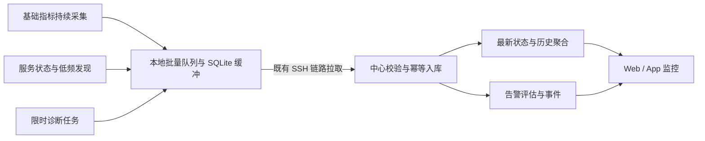

# Viron 监控整体改造方案

日期：2026-09-09  
状态：评审草案；本文件提出目标方案，不表示功能已实现或已批准进入开发。  
范围：Linux 监控探针、中心数据链路、Web/App 监控界面、告警与迁移。  
依据：当前 dev 分支的代码与项目文档；尚未进行本轮真实页面视觉验收、目标主机测试和容量压测。

## 1. 核心决定

把监控做成一个能回答“哪里异常、何时开始、影响什么、接下来查哪里”的排障工作台。

建议采用以下方向：

1. 探针从周期性启动一次完整扫描，改为持续基础采集、独立服务发现与按需诊断。
2. 指标从主机总量扩展到磁盘设备、文件系统、网卡、进程和容器，并统一采样与聚合口径。
3. 监控主界面采用异常列表和可比较的主机表；主机详情承担排障，NOC 留作投屏入口。
4. 图表、事件、进程和服务共享时间范围，并明确数据缺口和证据边界。
5. 保留现有 SSH 拉取、离线缓冲、环境授权、安装升级基础和 SQLite/MySQL 元数据兼容，通过版本化协议渐进迁移。

首个可发布版本必须同时交付“可信采集 + 主机详情 + 异常总览”。完整服务健康、外部通知和探针批量管理可在此基础上递增。

## 2. 现状与问题依据

现有能力包括主机指标、PSI、Top 进程、服务发现、部署指标、历史查询、磁盘事件、阈值告警、探针安装升级、SQLite/WAL 缓冲及单调序列拉取。改造复用这些基础。

| 现状 | 对用户的影响 | 改造决定 |
| --- | --- | --- |
| daemon 每轮启动 collector 子进程，子进程重新初始化插件；CPU 预热，Linux 速率用本次采集前后计数计算 | 采集周期与实际测量窗口不同，不能把每个点直接解释为完整周期均值 | 持续保存计数基线，记录真实窗口；首个速率样本标记预热 |
| 基础指标、各类插件 Gather、Kubernetes 发现处于同一次完整采集流程 | 慢插件会延迟整批结果；发现频率难以独立调整 | 基础采集、运行状态、资源发现分别调度和失败隔离 |
| 文件系统容量有明细，但 Linux 磁盘 I/O、网卡计数主要先汇总到主机 | 看得见总量变化，难以定位具体设备 | 保留设备与接口维度，主机汇总明确去重范围 |
| 部分数值字段为必填非空数字，失败快照有零值字段 | 下游需要额外判断，存在把未知数据解释为低占用的风险 | 每个采集模块与序列具有质量状态，未知值为 null |
| 共享新鲜度判定最低阈值为 30 分钟 | 页面刷新与采集状态脱节，旧值容易继续呈现为近期状态 | 展示采集年龄、同步延迟和预期周期，分别判断失联与数据过期 |
| 主机历史按序列抽样，服务历史优先选择桶末样本；服务汇总含算术平均 | 抽样可能遗漏尖峰；总占用和节点均值需要更清晰地区分 | 服务端生成保峰聚合，按指标定义 sum、加权均值和 max |
| 主机卡片、综合压力分数、排名和 NOC 并存 | 信息丰富，但异常原因、持续时间和下一步路径应更突出 | 异常优先，具体指标作为主要判断依据，评分仅辅助排序 |

代码依据：

- [daemon 调度](../monitor/main.go)、[子进程采集入口](../monitor/collector_linux.go)、[插件采集](../monitor/collector/collector_linux.go)。
- [Linux 计数与进程](../monitor/collector/linux_diagnostics.go)、[当前数据模型](../monitor/collector/model.go)、[本地缓冲](../monitor/storage.go)。
- [中心拉取](../src/server/service-monitor.ts)、[主机历史](../src/server/routes/monitor-history.ts)、[服务历史](../src/server/monitoring-timeseries.ts)。
- [共享状态与排序](../src/shared/monitoring.ts)、[主机列表](../src/client/components/monitoring/HostFleetPanel.vue)、[主机详情](../src/client/components/HostMonitorDashboard.vue)。

上述为静态实现观察。实际开销、长时间漂移、异常发生率和视觉可用性，在实施第一阶段建立基线后确认。

## 3. 使用场景与范围

### 3.1 优先解决六类问题

| 用户问题 | 需要的证据 | 页面落点 |
| --- | --- | --- |
| 现在有哪些环境有问题？ | 活跃异常、持续时间、影响服务、数据质量 | 总览 |
| 这台主机为什么突然变慢？ | 同一时间段的 CPU、PSI、磁盘延迟、网络及进程 | 主机详情 |
| 哪块磁盘快满或存在 I/O 阻塞？ | 容量、inode、设备映射、吞吐、IOPS、延迟、队列 | 存储分区 |
| 服务在运行，为什么用户访问不了？ | 部署状态和从指定位置发起的 HTTP/TCP 检查 | 服务详情 |
| 刚才发生过什么？ | 保峰历史、重启/OOM/告警事件、当时的采样进程 | 历史排查 |
| 是主机出问题，还是探针没采到？ | 链路、collector、模块错误、积压、新鲜度 | 探针状态 |

### 3.2 本次边界

首期聚焦 Linux 主机、已支持的服务运行时，以及 Web/App 一致的监控体验。暂不建设完整调用链 APM、通用日志存储平台、eBPF 分析、任意自定义仪表盘或自动修复系统。现有日志入口、SSH 工作台和服务维护作为排障后的操作入口。

Windows 桌面 App 继续消费同一中心监控数据；Windows 主机探针是独立后续能力。

## 4. 展示与交互设计

### 4.1 页面结构

```text
监控
├── 总览             异常、影响范围、近期事件、数据覆盖
├── 主机             筛选表格、资源趋势、比较
│   └── 主机详情     概况 / CPU / 内存 / 存储 / 网络 / 进程 / 事件
├── 服务             可用性、部署健康、资源与依赖
│   └── 服务详情     检查结果 / 部署节点 / 资源 / 事件
├── 告警与事件       待处理、已认领、恢复、维护窗口
└── 探针             安装覆盖、采集状态、版本、资源开销、升级

投屏模式：从总览进入，使用同一套状态与指标口径。
```

这是监控内部导航，不为每个分区新增全局一级菜单。首个版本先显示总览、主机和现有告警入口；其余分区随能力交付开放。

环境页进入监控时自动带入环境筛选；从服务维护进入时同时带入服务、主机与时间范围。环境内与全局复用同一个详情组件。

### 4.2 总览：先看到具体问题

```text
监控     [环境：全部授权环境] [搜索主机 / 服务] [最近 1 小时] [实时]
数据覆盖 46/48 台 · 2 台采集异常 · 最近同步 8 秒前

待处理异常 4       受影响服务 2       主机失联 1       数据过期 1

需要处理
严重度  对象          问题                         持续时间  影响      操作
严重    db-prod-01    /data 剩余 8 GiB，使用率 96%  18 分钟   订单库    查看存储
警告    api-prod-02   CPU > 85%，持续 6 分钟        6 分钟    订单 API  查看 CPU
未知    worker-03    SSH 拉取失败，最后采样 4 分钟前            批任务    查看探针

近期事件                                 环境健康分布
14:32 api-prod-02 服务重启                生产 2 项异常 / 测试 1 项异常
14:27 db-prod-01 磁盘容量告警             每项均可进入过滤后的列表
```

数值为布局示例，不是当前环境数据。总览不使用跨全体主机的平均 CPU 作为主要健康判断；健康主机不能稀释异常主机。

### 4.3 主机列表：方便筛选和比较

- 默认表格，列包含主机、环境、健康原因、CPU、内存、最紧张挂载点、网络、迷你趋势、采集年龄；支持列显隐与排序。
- 异常、失联、无数据分别筛选；页内显示“当前范围内总数 / 有有效数据数”。
- 使用真正的服务端筛选、排序与分页；大规模列表不能只对已拉取的一页排序。
- 允许选择最多 4 台主机，按同一时间范围对比 CPU、内存、存储与网络。
- 卡片模式可保留为用户选项；主机名称、异常原因和更新时间优先于装饰元素。
- 实时排序变化时保持正在阅读或选中的行稳定，避免刷新导致点击目标跳动。

### 4.4 主机详情：排障的核心页面

```text
db-prod-01   生产 / 订单     [SSH] [关联日志] [探针状态]
运行 12 天 · 探针采集正常 · 最新样本 7 秒前 · 同步延迟 3 秒
[最近 1 小时 ▼] [时间范围] [暂停实时] [对比上一时段]

异常摘要：/data 可用 8 GiB；磁盘写延迟近 10 分钟升高
事件轴：                     |部署|       |告警|

[CPU] [内存] [存储] [网络] [进程] [事件]
存储
挂载点 / 设备        容量      inode      读写速率    平均延迟    队列
/data → nvme1n1      96%       31%        …          …          …

容量趋势                  延迟与队列趋势
吞吐与 IOPS               相关进程 / 容器（采样覆盖说明）
```

所有图表共用时间范围、悬浮游标和选区。拖选异常时段后，事件与进程列表同步过滤；回退保留时间、分区与筛选条件。刷新不清空已展示的数据，失败在就地状态条提示。

概况显示最相关的四至六张图，其余细节进入分区。打开存储问题时直接定位具体挂载点和设备，不让用户重新查找。

### 4.5 图表规范

- 时间和时区始终明确；支持最近 15 分钟、1 小时、6 小时、24 小时、7 天、30 天及有界自定义范围。
- 当前值、区间均值和区间峰值分别标注。悬浮说明采样窗口、聚合粒度、单位与缺失情况。
- 短时图优先原始有效样本；长时图使用均值线与 min/max 范围，保留尖峰。
- 不跨数据缺口连线，不把无数据画成 0；补传数据出现时标明其原始采集时间。
- 多系列使用稳定颜色，告警颜色仅表达严重度；线型、文字和图标同时承担辨识，兼容色觉差异。
- 主机 CPU 以总容量的百分比显示；进程/容器同时可查看“使用核心数”，不能把不同口径放进同一个堆叠图。
- 不同单位避免共用容易误读的纵轴。多网卡、多设备通过图例选择和详情表展开。
- 历史进程明确写“当时采样到的进程”。未被保存的进程不声称可以回溯；无有效总量时不绘制“其他进程”填充。
- Web 与 App 共用布局和键盘交互。宽屏支持双列图，中等窗口单列；窄窗口保留关键字段并允许表格横向滚动。

### 4.6 服务与探针页面

服务页区分三种信息：部署是否运行、指定位置能否访问、资源是否异常。首期 HTTP/TCP 检查只代表探测位置的合成检查结果，不称为真实用户成功率或请求 QPS。检查点耗时分位数与真实请求延迟分位数分开命名。

探针页显示版本、能力、主机标识、最后采集/接收时间、积压时长、缓存大小、每个模块的成功率与耗时，以及自身 CPU/内存。安装、升级、配置、诊断、卸载具有明确结果与失败原因。

## 5. 探针架构



### 5.1 进程与调度模型

保留 daemon 作为 supervisor、缓冲和控制入口。基础 collector 改为常驻工作进程，保留上次计数和单调时间基线；daemon 可单独重启故障 collector。可能阻塞的服务发现运行在独立、可终止的 worker 中，不与基础采集共享一个超时窗口。

继续复用已经引入的 Telegraf 插件及 Linux 读取能力。通过内部接口把采集、归一化与产品数据模型分离；暂不开放任意第三方代码加载。

以下是建议默认值，需经第一阶段测量调整：

| 任务 | 默认周期 | 边界 |
| --- | --- | --- |
| CPU、内存、PSI、磁盘与网卡计数 | 5 秒 | 低配模式 15/30 秒；记录真实测量窗口 |
| 进程与已纳管容器资源 | 10 秒 | 分 CPU、内存、I/O 保存 Top N 并集；限制进程扫描预算 |
| 已纳管服务状态 | 15 秒 | 使用上次发现结果，不每轮扫描全部候选 |
| 硬件/挂载/网卡清单、服务完整发现 | 5 分钟 | 可手工触发；模块独立超时，失败保留最后清单并标陈旧 |
| HTTP/TCP 检查 | 30 秒 | 默认 3 秒超时、并发限制、重叠时跳过并记原因 |
| 现场精细诊断 | 1 秒，最长 5 分钟 | 用户主动启动，受权限与资源预算控制，到期自动恢复 |

每个任务记录计划时间、开始/结束时间、有效窗口、执行耗时与状态。上一轮未结束时不无限堆积；跳过记录为缺口。第一轮计数基线、重启、计数器回退和设备更换均产生 reset/warmup 标记。

### 5.2 指标覆盖

| 领域 | 首期必须具备 | 随后扩展 |
| --- | --- | --- |
| CPU | 总利用率、user/system/iowait/steal、核心数、load、PSI | 按核心分析与限时精细诊断 |
| 内存 | total/available/used/cache、Swap 使用及换页、PSI | OOM 事件关联；权限允许时采集更细的回收统计 |
| 文件系统 | 挂载点、设备、文件系统类型、容量、inode、只读状态 | 网络文件系统专项检查 |
| 块设备 | 逐设备吞吐、IOPS、平均读写完成时间、队列及忙碌时间 | 更细的延迟分布需要额外数据来源 |
| 网络 | 逐接口 RX/TX、错误、丢弃、链路状态与速率可用性 | TCP 重传、连接状态统计与探测位置对比 |
| 进程 | PID + 启动时间身份、名称、CPU 核心数、RSS、I/O、所属工作负载 | 按服务聚合、异常前后证据保留 |
| 容器/服务 | 稳定实例标识、状态、重启、CPU、内存、限制可用性 | cgroup 节流、OOM、更多运行时能力 |
| 探针自身 | 资源开销、模块健康、缓存与积压、采集耗时、丢弃次数 | 配置批量分发与升级分组 |

设备模型区分块设备、分区、逻辑卷和挂载点，明确可获得的映射与未知关系，避免把父设备和子设备 I/O 重复相加。网卡区分物理、虚拟、loopback，不把同一流量经过多个接口的数值直接称为主机外部吞吐。

Linux 磁盘计数推导的是窗口平均完成时间等统计，不能凭这些计数生成每次 I/O 的 P95/P99。设备忙碌时间也不能独立作为所有设备的饱和度结论。

### 5.3 能力与安全

采集模块状态至少区分 ok、unsupported、permission_denied、timeout、error。能力不足时显示原因；不以零值代替。

沿用当前安装权限和 systemd 加固边界，第一阶段逐项核实 root、容器 socket、日志及 kubeconfig 的实际需要。协议和进程拆分必须支持后续最小权限；不承诺一次改造即可无 root 完成全部采集。

采集器不默认保存进程完整参数、环境变量、HTTP 响应正文、凭据或 kubeconfig 内容。健康检查配置引用现有授权资源；探测目的地和重定向在执行端校验，检查输出有长度限制。探针诊断接口仅提供固定类型的采集动作，避免新增任意命令执行入口。

## 6. 数据与传输设计

### 6.1 版本化数据契约

新增监控协议 v2，与现有 metricsVersion 分开管理。记录批次和指标至少包含：

- 身份：workspace、agentId、bootId、streamId、sequence、资源稳定标识；agentId 不以 IP 或显示名称替代。
- 时间：observedAt、windowStart/windowEnd、elapsedMs、receivedAt；速率基于单调时钟差值。
- 指标：metric、unit、kind（gauge/counter/rate）、受限维度和值。
- 质量：valid/warmup/reset/partial/missing、来源模块、采样粒度与覆盖范围。
- 配置：schemaVersion、capabilities、configRevision。

这些是逻辑字段，传输可以使用列式或批量编码减少重复。度量定义集中维护，单位、CPU 分母、空值和聚合规则由中心与客户端共用。

### 6.2 SSH 拉取与实时体验

保留“目标机无需新增对外端口”的部署优势。中心是监控同步和告警的唯一调度方；App 不因本机直连模式另外拉取一份同一监控流。

- 新数据采用短批次拉取，建议目标正常网络下 10–15 秒一次；探针采集周期与中心同步周期独立。
- 使用有界 worker 队列、单主机串行与公平调度，替代整批等待最慢主机后才进入下一批的调度方式。
- 避免每个小批次重复建立完整认证链路；在既有 SSH runtime 支持的生命周期内复用受控连接，异常与失权及时回收。
- 断线指数退避并加入抖动；限制单主机追赶带宽、每轮工作量和全局 SSH 连接预算。
- 历史积压流与最新状态快照分开交付，保证长时间断线后页面先恢复最新状态；历史按顺序补传。
- 最新快照有自身版本，不推动历史 ACK。历史 ACK 只能确认已事务持久化的连续序列或显式 gap，不能越过未入库数据。
- 重复批次按工作空间、Agent、流和序列幂等处理；相同主机多个 SSH 引用在授权范围内复用采集结果，查询仍逐资源授权。

中心到前端首期保留轻量增量轮询。实测确认推送能显著改善连接数或时效后，再通过既有服务通道增加事件推送。

### 6.3 状态必须可解释

分别维护三组状态：

| 状态轴 | 含义 | 示例 |
| --- | --- | --- |
| 连接状态 | 中心能否访问探针 | 可达 / SSH 失败 / 认证失败 / 未检查 |
| 采集状态 | 各模块是否正常产出 | 正常 / 部分失败 / 停止 / 不支持 |
| 数据状态 | 当前展示值是否及时有效 | 新鲜 / 延迟 / 过期 / 预热 / 无数据 |

界面可以给出一句主状态，同时允许展开查看证据。SSH 不可达不等同于主机已经关机；没有额外证据时使用“监控失联”。

建议新鲜度基于 max(3 × 采集周期，2 × 正常同步周期) 加可测调度余量判定，并设置有界宽限。连接重试退避不能不断延长新鲜阈值。时钟偏差单列，不能靠负延迟表现为正常。

### 6.4 历史存储与聚合

首期保留 SQLite/MySQL 支持，增加监控专用结构化分区或分桶表，避免长期把所有查询都建立在大 JSON 快照扫描上。具体物理结构由原型压测决定；保留存储接口供后续独立时序后端使用，首期不强制增加部署组件。

建议初始保留策略：5 秒主机/设备原始数据 24 小时，1 分钟聚合 30 天，15 分钟聚合 180 天。进程 Top N 10 秒样本默认保留 24 小时，异常证据按限额保留更久。所有值均为拟定默认值，允许降低，不代表当前已经支持。

- Gauge 聚合保存有效时长、加权和、min/max/last 与覆盖率，不能直接平均平均值。
- Counter 保存边界与 reset 信息，rate 用有效时间差计算；缺口和重启不产生负速率或虚假尖峰。
- 服务总内存对同一时刻已覆盖实例求和，节点平均内存单独命名；CPU 优先汇总核心数，归一化比例使用对应有效容量。
- 桶内峰值从实际样本计算，不用桶末样本冒充峰值；服务总峰值不能把不同时间各节点的峰值直接相加。
- 分位数只对已保留的有效样本或可合并分布计算并说明口径；不能平均各桶 P95。首期没有分布时不提供无法保证的长时 P95。
- 聚合与展示抽样分离：统计先在真实样本/聚合量上计算，绘图再限点；保留缺口和极值。
- 旧版短窗口样本保留原标签，不回填成新版连续区间数据。图表跨迁移点显示口径变化。

本地队列同时限制实际数据库、WAL 和临时文件占用。容量接近上限时先按已定义语义降采样，再按策略丢弃并形成持久 gap；界面显示实际可保留时长，不能无条件承诺“离线保存 30 天”。

### 6.5 容量预算

以下只是估算方法：若每主机 100 条有效指标序列、5 秒一次、紧凑存储每数据点平均 24 字节，则每天约 173 万点、41 MB；200 台约 8.3 GB/天，尚未包含索引、WAL、进程和事件。真实字节数必须测量。

因此实施前必须验证批量编码、写入批次、聚合和维度上限。100 条序列只是计算示例，多网卡、多磁盘主机可能显著超出。高基数进程不能无限进入长期历史。

资源预算降级顺序：降低进程保留与发现频率 → 降低历史原始精度 → 降低基础采样频率。每次降级都记录并可见。新鲜度错误判断与写入失败不能通过隐藏数据来“达标”。

## 7. 告警与排障闭环

### 7.1 规则

首期升级既有 CPU、内存、磁盘和部署规则，加入 inode、数据过期与采集失败。随后加入设备 I/O、HTTP/TCP 检查、容器 OOM/重启规则。

规则包含对象范围、阈值、持续时间、恢复阈值/持续时间、严重度、无数据策略和维护窗口。采用“持续 2 分钟”等明确时间语义；采样周期变化不能让同一规则的行为成倍改变。

采样值超过阈值只表示检测到现象。需要 PSI、延迟、队列等额外证据时，规则说明列出判断依据，不直接把“CPU 高”称为故障根因。

### 7.2 状态与通知

异常生命周期：pending → firing → recovering → resolved；已认领、已静默是处置属性，不等于恢复。相同对象与规则聚合为同一事件，保留阈值、峰值、触发证据和配置版本。

探针失联时抑制由缺失指标产生的重复资源告警；维护窗口抑制通知但保留事实。补传旧样本补齐历史事件，默认不补发已经结束的告警通知；重连后的当前持续异常按新鲜样本继续评估。

保留现有应用内和系统通知，后续优先增加通用 Webhook，再做具体平台适配。通知发送通过持久队列、幂等键、退避重试及失败记录完成。

### 7.3 从告警继续操作

告警详情包含异常前后图表、关联设备、当时采样进程、相关服务和事件。提供“打开对应分区”“打开 SSH”“查看关联日志”。日志没有对应历史时明确提示，只传递其实际支持的过滤条件，不能把当前 tail 当作历史证据。

操作回到既有服务维护和审批审计路径。监控首期只给出可验证的线索与导航，不自动执行重启、清理或写命令。

## 8. 工程落点

| 模块 | 改造职责 |
| --- | --- |
| monitor/main.go、collector_linux.go | supervisor、worker 生命周期、独立调度、控制协议 |
| monitor/collector/* | 长驻计数基线、设备维度、能力与质量、运行时插件隔离 |
| monitor/model.go、storage.go | v2 批次、实时快照与历史流、序列/ACK/gap、存储限额 |
| src/server/service-monitor.ts | 公平拉取队列、重试、实时优先、版本协商与幂等接收 |
| src/server/routes/monitor-history.ts、monitoring-timeseries.ts | 原始/聚合查询、维度筛选、口径与覆盖率 |
| src/shared/monitoring.ts、monitor-performance.ts | 指标字典、状态、单位、聚合和诊断证据模型 |
| src/server/monitor-alerts.ts、monitor-event-calendar.ts | 时间规则、告警生命周期、历史补传与覆盖率 |
| MonitoringView、HostFleetPanel、HostMonitorDashboard | 总览、分页主机表、详情分区、时间联动 |
| ServiceApmPanel、NocScreen、MonitorTimeSeriesChart | 服务语义收口、投屏降级为入口、图表统一 |
| monitor-installer、相关桌面与服务端入口 | 分组升级、能力检测、失败恢复与版本兼容 |

API 以最新状态、指标查询、事件查询、探针管理四类划分。统一支持资源范围、from/to、step、维度与分页，返回有效覆盖、截断、质量和来源信息。所有查询按现有工作空间与环境权限校验，不能以 agentId 直接绕过授权。

## 9. 分阶段交付

| 阶段 | 交付物 | 退出条件 |
| --- | --- | --- |
| A：基线与合同 | 当前页面真实截图、六类故障样例、采集/查询基准、指标字典、v2 schema、主机详情低保真稿 | 核实实际数据口径；冻结首期范围和可测性能预算 |
| B：数据基础 | 持续基础采集、设备/网卡、独立发现、质量状态、v2 缓冲与公平同步 | 原始数据可对账；断线/重启/局部失败不产生假零值；新旧探针共存 |
| C：首个可发布版本 | 新主机详情、时间联动、异常总览、分页主机表、核心告警与保峰历史 | 六类核心场景可走通；真实 Web/App 和双库验收；可回退 |
| D：服务与处置 | HTTP/TCP 检查、服务详情、认领/维护窗口、事件关联和通知队列 | 明确合成检查口径；处置与恢复可追溯 |
| E：规模与体验 | 探针分组升级、容量配置、比较视图、NOC 调整、可选精细诊断 | 200 台目标规模压测与长期稳定性通过 |

执行依赖为 A → B → C → D/E。页面设计可在 A 中确定，但真实数据交互验收必须等待 B；不把静态演示数据的视觉效果当作监控完成度。

首期明确不纳入：全链路追踪、Redis/MySQL 完整 exporter、Kubernetes 集群级平台、自动修复、无限自定义图表、长期保存全部进程。实施工作量在 A 结束后按实际协议和存储改动估算，不先给出未经验证的日期承诺。

## 10. 验收标准

以下均为拟定目标，不是现有性能结论。基准配置与数据规模必须记录在测试报告中。

### 10.1 数据正确性

- 在同一时间窗口，将 CPU/内存/磁盘/网卡与原始系统计数对账；每项给出公式、允许误差和采样时间差。
- 构造发生在旧采集短窗口之外的 10–20 秒 CPU 突刺，新版连续采样及长时聚合保留异常证据；小于采样周期的突刺不承诺完整捕获。
- 重启、PID 复用、网卡重建、计数回退、时钟跳变和设备挂载变化不串接成错误序列。
- 关闭任一采集模块，仅其对应指标缺失，基础模块继续产出；缺失值不参与健康均值。
- 原始样本与聚合结果可重算对账；主机/服务总量、均值、极值和覆盖率有确定测试样例。

### 10.2 故障和恢复

- 断网 30 分钟恢复后，当前状态先恢复、历史有界追赶；重复拉取不产生重复点或重复通知。
- 缓存逼近上限、磁盘写满、中心事务失败时，ACK 不越过未持久化数据；发生丢弃后 gap 可追溯。
- 一个慢主机或卡住的运行时扫描不阻塞其他主机与基础采集。
- Endpoint/工作空间切换、失权、卸载和退出时，关联连接与临时诊断任务按已有生命周期回收。

### 10.3 体验与性能

- 参考主机：4 vCPU、8 GiB、500 个进程、20 个容器、4 块设备、4 个网卡。标准采集下探针总 CPU 时间平均占单核不超过 3%，RSS 不超过 150 MiB，先测基线再决定是否调整目标；发现/诊断峰值单独报告。
- 参考中心：4 vCPU、8 GiB、SSD、网络 RTT 20 ms、200 台同等标准采样主机；记录每个指标与进程维度实际数量，并分别验证 SQLite 与 MySQL。
- 正常网络和预算内，新数据端到端可见延迟 P95 ≤ 20 秒；单台探针重连后最新状态可见 ≤ 30 秒。
- 参考中心下，总览 API P95 ≤ 1 秒；24 小时详情查询 P95 ≤ 1.5 秒、30 天聚合查询 P95 ≤ 2 秒；冷查询和热查询分别报告。
- 用确定的故障样例，用户从总览最多两次导航到达异常设备或进程分区；切换分区不丢失时间范围。
- 图表刷新不闪空、不重置缩放；异常颜色与文字一致；无数据与正常一眼可分。
- 至少 72 小时稳定性测试，检查 RSS、goroutine、SSH 连接、DB/WAL、积压与告警数量是否无界增长。

## 11. 兼容迁移与回退

1. 先发布能读取 v1/v2 的中心，保持旧探针和现有页面可用；v1 数据明确显示旧采样口径。
2. 新指标表、流表和配置采用增量迁移，保留旧表；第一阶段不做不可逆的数据清理。
3. 选择少量测试主机升级并对比，再按组推进。通过单一采集源输出兼容视图，避免同机启动两套重采集器。
4. 新页面按工作空间启用；旧入口保留到新页面完成真实场景验收。灰度期间新旧告警评估可影子对比，但只有一套发送通知。
5. 升级前检查二进制与协议兼容；健康检查失败时回退前一版程序和配置。v1/v2 spool 分离或通过版本化读取隔离，旧程序不能直接打开不兼容新库。
6. 回退保留 v2 已采集历史与中心数据；停止新写入不等于删除新数据，后续重新启用可继续读取。
7. 全量验收后再更新现行技术文档与路线图。历史改造方案保留作为记录；本草案不会自动覆盖既有已交付契约。

实施产生代码改动时，遵循项目 dev 提交、推送、匹配验证和当前系统打包流程；本次仅新增方案文档。

## 12. 需要评审的产品取舍

建议默认采用以下选择，作为后续实施讨论的起点：

| 取舍 | 建议 | 代价 |
| --- | --- | --- |
| 监控首页形态 | 异常优先的工作台，主机表为日常入口 | NOC 不再占据主要设计投入 |
| 默认基础采样 | 5 秒，提供低配模式 | 必须同步改造批量写入、聚合和容量控制 |
| 数据传输 | 继续 SSH 拉取，优化实时和历史通道 | 时效受 SSH 网络与连接预算影响 |
| 首期部署复杂度 | 保持现有中心数据库，预留时序存储接口 | 必须用压测证明 200 台目标；不满足时调整存储方案或公布较低支持规模 |
| 排障深度 | 先把主机、设备、进程与容器关联做完整 | 应用调用链和数据库专项监控后置 |
| 长期历史 | 分层聚合，明确覆盖与峰值 | 无法长期保留所有进程和原始 5 秒精度 |

推荐优先评审主机详情的信息布局、5 秒采样带来的容量预算，以及首个版本的 B+C 范围。确认后再据此拆分开发任务。
