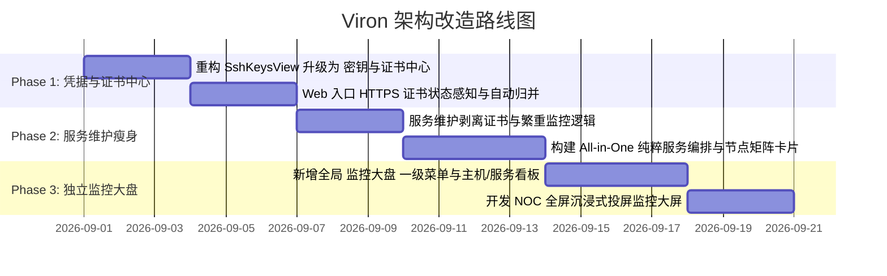

# Viron 服务维护、监控大盘与凭据管理架构改造方案

## 1. 背景与重构动因

### 1.1 现有设计的主要痛点
当前 Viron 在「环境详情 → 服务维护」以及「全局主导航」中存在明显的信息架构（IA）层级错位与用户心智割裂：

1. **三维混杂，抽象层级不对等**：
   - 当前在环境详情的「服务维护」页签下，强行塞入了**业务服务（应用层）**、**SSH 宿主机监控（物理硬件层）** 以及 **SSL/TLS 证书（网络安全层）**。
   - 用户想查看主机的磁盘空间或排查 CPU 瓶颈，必须先进入某个环境的“服务维护”，再去左侧切换“主机”Tab，认知路径反直觉。
2. **操作与可观测性混淆**：
   - 运维的核心场景分为两类：**做动作（Operations/Action-oriented）**（如：发布、部署、启停、重启、跑脚本）和 **看态势（Observability/State-oriented）**（如：7×24 巡检、负载时序、Top 进程堆叠、异常突刺诊断、大屏投屏）。将复杂的监控图表与日常启停操作挤在同一页面，导致核心操作按钮被严重边缘化，界面臃肿。
3. **SSL 证书定位尴尬与多对一维护缺失**：
   - 证书通常用于边缘网关与 Web 入口，在服务维护中属于“二等公民”。同时，**多个 Web 入口往往共用同一张泛域名证书或多域名证书**（例如一张 `*.viron.dev` 证书被 API、管理后台、文档中心共用），当前缺乏证书指纹自动归集与多入口映射机制。
4. **全局「SSH 密钥」页面单薄浪费**：
   - 全局左侧导航栏独立占用了一个一级菜单「SSH 密钥」，但该页面功能过于单一（仅有导入、生成与导出），未能形成企业级的安全凭据资产库。

---

## 2. 总体重构目标与设计原则

```
┌────────────────────────────────────────────────────────────────────────────────────────┐
│                                   重构核心原则                                          │
├────────────────────────────────────────────────────────────────────────────────────────┤
│ 1. 职责正交 (Orthogonality) : 应用运维、硬件监控、安全凭据三权分立，边界清晰            │
│ 2. 意图分流 (Intent-driven) : 编排启停走「服务维护」，态势排障看「监控大盘」             │
│ 3. 双层联动 (Dual-layer)    : 全局集中资产管控 (Centralized) ↔ 环境就地轻量感知 (Local)│
│ 4. 无感归集 (Auto-dedup)    : 基于证书 SHA-256 指纹，多 Web 入口共用证书自动合并去重    │
└────────────────────────────────────────────────────────────────────────────────────────┘
```

---

## 3. 全局信息架构 (IA) 演进蓝图

### 3.1 全局左侧主导航（AppShell 菜单演进）

```
[重构前]                                    [重构后]
├── 📊 环境总览                             ├── 📊 环境总览
├── 📦 连接资源池                           ├── 📦 连接资源池
├── 🔑 SSH 密钥 (单薄)        ── 升级为 ──> ├── 🛡️ 密钥与证书 (SSH 密钥 + 全局 SSL 证书大盘)
├── 💻 SSH 工作台                           ├── 💻 SSH 工作台
├── 🗄️ 数据库工作台                         ├── 🗄️ 数据库工作台
├── ⚡ Redis 工作台                         ├── ⚡ Redis 工作台
├── 📖 知识库                               ├── 📊 监控大盘 (新增：全域主机/服务可观测中心与 NOC 大屏)
├── 📋 操作审计                             ├── 📖 知识库
└── 👥 组织与用户                           ├── 📋 操作审计
                                            └── 👥 组织与用户
```

### 3.2 环境详情内部页签（Environment Console 演进）

```
[重构前]                                    [重构后]
├── 🌐 Web 入口                             ├── 🌐 Web 入口 (增强：就地显示对应 HTTPS 证书状态徽标)
├── 💻 SSH 终端                             ├── 💻 SSH 终端 (含 SFTP)
├── 📜 日志                                 ├── 📜 日志流
├── 🗄️ 数据库                               ├── 🗄️ 数据库
├── ⚡ Redis                                ├── ⚡ Redis
├── 📖 知识库                               ├── 📖 知识库
└── 🛠️ 服务维护 (混杂监控+证书+操作) ── 瘦身 ─> └── 🛠️ 服务维护 (纯粹化：业务编排、节点矩阵、一键启停、Runbook)
```

---

## 4. 各功能模块详细改造设计

### 模块一：【服务维护】页面瘦身与纯粹化改造

#### 1. 业务定位
卸下宿主机全局时序监控与 TLS 证书的繁重包袱，定位为 **“纯粹、高效的业务服务运维与调度控制台”**。

#### 2. 界面布局结构
* **顶部快捷动作条 (Operations Ribbon)**：
  - 针对选中的服务，直接平铺服务级 Runbook 功能按钮：`[滚动平滑重启]`、`[全链路健康体检]`、`[清理缓存]`、`[实时日志流]`、`[+ 配置按钮]`。
* **部署节点矩阵 (Deployments Grid)**：
  - 以卡片网格展示该服务的所有部署节点（Docker 容器 / Systemd 守护进程 / Kubernetes Deployment / 裸进程）。
  - **卡片直观呈现核心指标**：所在主机 IP、容器/Unit 标识、CPU%、内存占用、运行时间、重启次数。
  - **一等公民操作按钮**：直接在节点卡片露出 `[▶ 启动]`、`[⏹ 停止]`、`[🔄 重启]`、`[💻 直连 SSH]`、`[📜 节点日志]`。
* **服务发现快速纳管 (Service Discovery)**：
  - 顶部常驻 `[🔍 扫描发现 (N)]` 入口，点击弹出抽屉或模态窗口，展示探针扫描到的未纳管进程候选，提供一键 `纳管至当前服务` 或 `录入新服务`。

---

### 模块二：新增【监控大盘】(Monitoring & Observability Dashboard)

#### 1. 业务定位
作为独立的一级监控中心与可观测性工作台，提供跨主机、跨服务的性能时序、智能诊断和投屏大屏能力。

#### 2. 核心视图规划

```
┌────────────────────────────────────────────────────────────────────────┐
│  监控大盘 (Monitoring Center)                                          │
│  [ 🖥️ 主机基础设施大盘 ]   [ 🏢 业务服务性能大盘 ]   [ 📺 NOC 全屏监控大屏 ]│
└────────────────────────────────────────────────────────────────────────┘
```

##### 视图 1: 🖥️ 主机基础设施大盘 (Host Fleet View)
* **主机硬件概览矩阵**：
  - 卡片式展示所有 SSH 主机的实时 CPU 总利用率、内存/Swap 已用与占比、主磁盘挂载点容量/IOPS、网络吞吐、Linux PSI 压力、核心温度。
* **探针管理与拉取状态**：
  - 展示各主机 `viron-monitor` 探针版本（如 v1.4.2）、在线状态、采集时间戳；支持批量一键安装、升级探针、清理本地缓存。
* **智能性能诊断 Findings**：
  - 规则与时序分析引擎自动标记异常时段（如 `14:10 - 14:35 磁盘 I/O 突发性高负载 89.4%`），并列出当时 Top 5 贡献进程。
* **Top 5 进程堆叠时序图 (Process Composition TimeSeries)**：
  - 支持 1h / 6h / 24h / 7d / 30d 范围切换，图表展示核心进程在时间轴上的资源占比，支持鼠标悬浮采样。

##### 视图 2: 🏢 业务服务性能大盘 (Service APM View)
* **服务资源消耗排名**：按业务维度聚合计算各服务的累计 CPU、内存消耗与时序波动。
* **高负载节点排行榜**：自动罗列当前环境中负载最高、重启最频繁的前 10 个异常节点。

##### 视图 3: 📺 NOC 沉浸式全屏大屏模式 (Big Screen Mode)
* **设计目标**：适合运维中控室、大屏投屏或开发者副屏常驻。
* **大屏内容布局**：
  - **左侧**：拓扑节点运行状态分布环形图 + 实时告警事件滚动流；
  - **中部**：集群总体 CPU、内存利用率动态波形仪表盘 + 主机热力图 (Heatmap)；
  - **右侧**：各节点 IOPS 与网络吞吐排行 + 存储容量水位预警。

---

### 模块三：【密钥与证书】(Security & Credentials) 资产中心

#### 1. 业务定位
将原有的「SSH 密钥」与全局「SSL/TLS 证书」合并，统一收拢工作空间内的安全凭证资产。

#### 2. 内部结构划分

```
┌────────────────────────────────────────────────────────────────────────┐
│  🛡️ 密钥与证书 (Security & Credentials)                                │
│  [ 🔑 SSH 密钥 (3) ]             [ 🛡️ SSL/TLS 证书 (5) ]              │
└────────────────────────────────────────────────────────────────────────┘
```

##### Tab 1: 🔑 SSH 密钥 (SSH Keys)
* 继承并优化现有能力：SSH 私钥导入、在线生成密钥对、公钥导出、指纹查看、关联 SSH 连接数统计。

##### Tab 2: 🛡️ SSL/TLS 证书 (SSL Certificates)
* **全局证书大盘统计**：
  - `总证书数`、`🟢 正常有效`、`🟡 即将到期 (30/14/7天)`、`🔴 已过期`、`⚠️ 待关联/探测异常`。
* **证书资产卡片列表**：
  - **证书主体信息**：主域名（如 `*.viron.dev`）、颁发者 CA（如 `Let's Encrypt`）、SHA-256 唯一指纹、SAN 备用域名列表。
  - **到期倒计时**：清晰显示 `剩余 232 天` 或高亮预警 `剩余 7 天 (即将到期)`。
  - **受保护的 Web 入口与主机**：展示该证书覆盖了哪些 Web 入口（例如 `api.viron.dev`、`admin.viron.dev`）以及绑定探测的 SSH 主机。
  - **运维动作**：`[🔄 重新探测]`、`[✏️ 编辑/绑定]`、`[🗑️ 删除]`。

---

### 模块四：【Web 入口】(Web Entries) 的就地证书感知与联动

#### 1. 业务定位与多对一维护模型
解决“多个 Web 入口使用同一张证书”的维护问题，实现**零重复录入、自动去重归并**。

```
              ┌──────────────────────────────────────────────┐
              │          SSL 证书资产 (Certificate)           │
              │  · 域名: *.viron.dev                         │
              │  · SHA-256 指纹: 3B:9A:8C:7D:...              │
              └──────────────────────┬───────────────────────┘
                                     │ 1 : N 自动覆盖
               ┌─────────────────────┼─────────────────────┐
               ▼                     ▼                     ▼
      ┌─────────────────┐   ┌─────────────────┐   ┌─────────────────┐
      │ Web 入口 1      │   │ Web 入口 2      │   │ Web 入口 3      │
      │ https://api...  │   │ https://admin...│   │ https://doc...  │
      │ [🟢 剩余 232天] │   │ [🟢 剩余 232天] │   │ [🟢 剩余 232天] │
      └─────────────────┘   └─────────────────┘   └─────────────────┘
```

#### 2. 具体交互与呈现
1. **自动归并**：
   - 当用户录入或自动发现 `https://api.viron.dev` 时，探针执行探测并获取其证书 SHA-256 指纹。
   - 若系统内已存在相同指纹的证书（如 `*.viron.dev`），自动建立关联引用，**无需用户手动重复登记**。
2. **卡片就地徽标**：
   - 每个 HTTPS Web 入口卡片右下角直接显示状态：`[🟢 剩余 232天]`、`[🟡 7天后到期]`。
3. **轻量详情 Popover**：
   - 点击徽标弹出悬浮卡片，显示证书基本信息、本证书同时保护的其它 Web 入口列表、以及 `[一键重新探测]`。探测完成后，所有关联入口状态同步更新。

---

## 5. 底层数据结构与 API 变更方案

### 5.1 数据表与关系模型 (Schema)
* **`ssh_keys`**：保持不变（工作空间级私钥加密托管）。
* **`ssl_certificates`**：
  - `id`: string (PK)
  - `workspace_id`: string (所属工作空间)
  - `environment_id`: string (可选，主关联环境)
  - `fingerprint_sha256`: string (唯一哈希指纹，用于去重归并)
  - `leaf_cn`: string (通用名称，如 `*.viron.dev`)
  - `leaf_sans`: json (备用名称数组)
  - `issuer`: string (颁发者)
  - `not_before`: timestamp
  - `not_after`: timestamp (过期时间戳)
  - `status`: string (`valid` | `expiring` | `expired` | `error`)
* **`ssl_endpoints`**：
  - `id`: string (PK)
  - `certificate_id`: string (FK -> ssl_certificates.id)
  - `ssh_connection_id`: string (执行探测的 SSH 主机)
  - `host`: string
  - `port`: number (默认 443)
  - `sni`: string
  - `last_probed_at`: timestamp
  - `probe_error`: text
* **`web_entries` 关联**：
  - `web_entries` 表增加 `certificate_id` 软关联或通过 URL hostname 动态关联匹配。

### 5.2 核心 API 路由调整
* **凭据与证书 API**：
  - `GET /api/v1/workspaces/:id/certificates`：获取当前工作空间全量 SSL 证书列表及关联 Web 入口。
  - `POST /api/v1/certificates/probe`：对指定证书/端点触发远端探测。
* **监控大盘 API**：
  - `GET /api/v1/monitoring/overview`：获取环境/工作空间级别的主机与服务综合性能指标快照。
  - `GET /api/v1/monitoring/hosts/:id/timeseries`：拉取指定主机的降采样时序与 Top 5 进程堆叠数据。
* **服务维护 API**：
  - `GET /api/v1/environments/:id/service-deployments`：轻量获取服务与节点清单及当前启停状态，剥离繁重的历史指标 Payload。

---

## 6. 实施路线图与阶段规划 (Roadmap)



### 阶段一：凭据与证书体系升级 (Phase 1)
1. 将全局左侧菜单 `SSH 密钥` 升级为 `密钥与证书 (Security & Credentials)`，支持 SSH 密钥与 SSL 证书双 Tab。
2. 实现基于 SHA-256 指纹的多 Web 入口证书自动归并，并在「Web 入口」列表中展示安全徽标与轻量探测浮层。

### 阶段二：【服务维护】轻量化与 All-in-One 纯粹运维流 (Phase 2)
1. 从 `ServiceMaintenancePanel` 中彻底移除证书代码，精简数据 Payload。
2. 优化服务卡片与部署节点网格，直接露出启动/停止/重启、Runbook 脚本执行器与关联日志。

### 阶段三：独立【监控大盘】与 NOC 全屏大屏交付 (Phase 3)
1. 在全局导航中上线 `监控大盘` 一级菜单。
2. 交付主机基础设施矩阵、服务 APM 排行榜、智能性能诊断时序图以及可用于投屏展示的 NOC 沉浸大屏。
