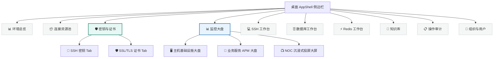
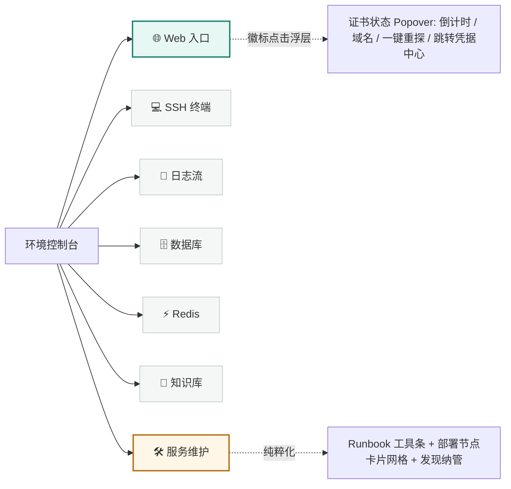
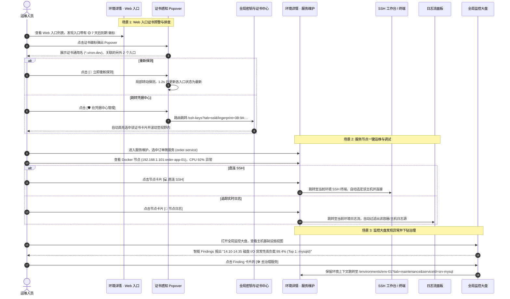

# UI/UX 规格：服务维护、监控大盘与凭据中心

> 负责人：Gemini（产品体验与 UI/UX 负责人）  
> 文档状态：`REVIEW_REQUIRED`（已完成完整规格编制，等待用户批准后转为 `APPROVED`）  
> 适用版本：Viron 重构规范 v2.0  
> 目标开发阶段：Phase 1（凭据与证书中心）、Phase 2（服务维护瘦身）、Phase 3（监控大盘与 NOC 全屏）  
> 本文档为 Grok（实现）与 Codex（架构/QA）的唯一 UI/UX 验收基准。

---

## 1. 文档信息

| 字段 | 值 | 说明 |
| --- | --- | --- |
| 设计版本 | `2.0.0-final` | 覆盖 Phase 0B 全量设计要求 |
| 负责人 | Gemini (UI/UX Agent) | 负责交互、视觉层级、状态矩阵与验收规格 |
| 状态 | `REVIEW_REQUIRED` | 等待用户批准 |
| 目标桌面基准尺寸 | `1440 × 900 px` / `1920 × 1080 px` | 桌面端主工作窗口基准分辨率 |
| 窄窗口响应式断点 | `< 1280 px`（紧凑布局）、`< 900 px`（折叠侧栏）、`< 640 px`（单列流式） | 兼容分屏、笔记本窄屏 |
| NOC 投屏目标分辨率 | `1920 × 1080 (1080p)`、`2560 × 1440 (2K)`、`3840 × 2160 (4K)` | 大屏/副屏全天候沉浸常驻 |
| 依赖设计规范 | Viron Design System (`src/client/styles/base.css`, `design.md`) | Modern-Minimal, Teal 主题色, JetBrains Mono 数据展示 |

---

## 2. 设计原则与体验哲学

```
┌────────────────────────────────────────────────────────────────────────────────────────┐
│                                 UI/UX 核心体验四大支柱                                  │
├────────────────────────────────────────────────────────────────────────────────────────┤
│ 1. 职责正交 (Orthogonality) : 调度启停走运维，态势排障看大盘，安全证书归凭据，绝不混杂    │
│ 2. 意图直达 (Intent-Driven) : 核心动作一键露出（启动/停止/重启/SSH/日志），拒绝层层下钻   │
│ 3. 双层联动 (Dual-Layer)    : 全局统一资产库 (Global Central) ↔ 环境轻量就地感知 (Local)│
│ 4. 无感归集 (Auto-Dedup)    : 相同 SHA-256 指纹证书多端点/多入口自动去重归并，零重复录入 │
└────────────────────────────────────────────────────────────────────────────────────────┘
```

1. **视觉语言一致性**：
   - 继承 Viron 的浅色/深色主题体系：浅色基底 `var(--paper)` (`#f7f7f7`) + 表面 `var(--surface)` (`#ffffff`)，深色基底 `#0e1719` + 表面 `#152124`。
   - 品牌重音色：`var(--teal-600)` (`#18806d`)，辅助警示色：`var(--amber-600)` (`#b46b0d`)，危险色：`var(--red-600)` (`#b7473f`)。
   - 数据展示字体采用等宽字体 `var(--font-mono)`（JetBrains Mono），数字与倒计时具有严格对齐与可读性。
2. **拒绝“不可见状态”**：
   - 所有异步探针探测、主机离线、时序中断、证书即将到期均有显式徽标（Badge）与气泡卡片（Popover）。
   - 任何破坏性操作（如停止服务、删除共享证书）必须提示受影响范围（如“将影响 3 个 Web 入口”）。
3. **沉浸感与工程实用主义**：
   - NOC 模式采用纯暗色（Deep Navy `#0b1118`）高对比度仪表盘设计，支持远距离大屏投屏，消除视觉噪音与非必要滚动条。

---

## 3. 全局信息架构 (IA) 演进与流转

### 3.1 全局主导航结构演进 (AppShell)



#### 路由与访问权限表

| 菜单项 | 路由路径 | 路由名称 | 权限要求 | 说明 |
| --- | --- | --- | --- | --- |
| 📊 环境总览 | `/` | `overview` | 全部登录用户 | 保持现有能力，展示环境卡片列表 |
| 📦 连接资源池 | `/connections` | `connections` | 全部登录用户 | 保持现有能力，主机/DB/Redis 连接池 |
| 🛡️ 密钥与证书 | `/ssh-keys` | `ssh-keys` | 管理员 (`owner`/`admin`) | **升级原 SSH 密钥**，支持 SSH 密钥与 SSL 证书双 Tab |
| 📊 监控大盘 | `/monitoring` | `monitoring` | 全部登录用户 | **新增一级入口**，提供主机、APM 与 NOC 投屏大盘 |
| 💻 SSH 工作台 | `/ssh` | `ssh` | 全部登录用户 | 终端会话与 SFTP 传输 |
| 🗄️ 数据库工作台 | `/database` | `database` | 全部登录用户 | 数据库查询与结构管理 |
| ⚡ Redis 工作台 | `/redis` | `redis` | 全部登录用户 | 键值浏览与命令控制台 |
| 📖 知识库 | `/knowledge` | `knowledge` | 全部登录用户 | 运维文档与 Runbook 沉淀 |
| 📋 操作审计 | `/audit` | `audit` | 全部登录用户 | 审计操作日志 |
| 👥 组织与用户 | `/organization` | `organization` | 全部登录用户 | 组织成员与空间管理 |

### 3.2 环境详情内页签结构演进 (Environment Detail)



### 3.3 跨模块协同流转与上下文保留 (Cross-Module Navigation)



---

## 4. 模块一：密钥与证书中心 (`/ssh-keys`)

### 4.1 页面整体布局与 Tab 结构

- **顶部 Header**：
  - 页面主标题：`🛡️ 密钥与证书`（中英文国际化）。
  - 副标题/描述：`集中管理工作空间内的 SSH 连接私钥与 SSL/TLS 域名证书资产`。
  - 右侧主动作区：
    - 当前在 `SSH 密钥` Tab 时显示：`[📥 导入私钥]`、`[+ 生成密钥对]`。
    - 当前在 `SSL/TLS 证书` Tab 时显示：`[🔍 手动录入端点探测]`、`[🔄 全局批量重新探测]`。
- **全局指标总览条 (Metric Banner)**：
  - 采用磨砂玻璃卡片与柔和渐变底色（Teal Gradient），包含 4 个核心计数指标：
    1. `总证书数`（Total Certs）
    2. `🟢 正常有效`（Valid）
    3. `🟡 即将到期`（Expiring in 30/14/7 days）
    4. `🔴 已过期 / 异常`（Expired / Mismatch / Probe Failed）
- **Tab 切换容器**：
  - `[🔑 SSH 密钥 (N)]` 与 `[🛡️ SSL/TLS 证书 (M)]`，URL 联动 `?tab=ssh` 或 `?tab=ssl`。

### 4.2 Tab 1：SSH 密钥 (SSH Keys)

继承并优化现有成熟交互：
1. **密钥卡片矩阵**：展示密钥名称、算法类型标签（`ED25519` / `RSA 3072` / `RSA 4096`）、公钥 SHA-256 指纹、关联连接数（如 `3 条连接正在使用`）、创建者与更新时间。
2. **卡片内操作按钮**：
   - `[📋 复制公钥]`：一键写入剪贴板，成功 Toast 提示。
   - `[📥 导出 ⌄]` 下拉菜单：`导出公钥文件 (.pub)`、`导出私钥文件 (需二次确认警告)`。
   - `[✏️ 重命名]`：弹窗修改密钥展示名称。
   - `[🗑️ 删除]`：若连接引用数 `> 0` 则禁用删除按钮并提示 `该密钥仍被 N 条 SSH 连接使用，无法删除`；为 0 时弹窗警告后删除。
3. **导入私钥模态框**：支持选择本地私钥文件（拖拽/点击，最大 128 KiB）或直接文本粘贴，支持设置私钥密码。
4. **生成密钥模态框**：支持选择 ED25519（推荐）/ RSA 3072 / RSA 4096，可选设置保护口令，生成成功后引导导出公钥并部署至 `~/.ssh/authorized_keys`。

### 4.3 Tab 2：SSL/TLS 证书 (SSL Certificates)

#### 4.3.1 资产卡片/列表信息架构

每张证书以**独立资产卡片**（或表格视图）呈现，卡片结构严格对齐证书主体与指纹归并关系：

```
┌────────────────────────────────────────────────────────────────────────────────────────────────────────┐
│ 🛡️ *.viron.dev                     [🟢 正常有效 · 剩余 232 天]     [ Let's Encrypt Authority X3 ]    │
├────────────────────────────────────────────────────────────────────────────────────────────────────────┤
│ SHA-256 指纹:  3B:9A:8C:7D:E4:10:F2:88:91:AA:BB:CC:DD:EE:FF:00:11:22:33:44:55:66:77:88:99:AA:BB:CC:DD:EE:FF:00 │
│ 备用域名 (SANs): viron.dev, *.viron.dev, api.viron.dev, admin.viron.dev, doc.viron.dev                │
│ 有效期:        2026-03-01 至 2026-10-15  (颁发于 128 天前)                                              │
├────────────────────────────────────────────────────────────────────────────────────────────────────────┤
│ 🌐 受保护的 Web 入口 (3):                                                                              │
│   • [PROD] 用户后台 (https://admin.viron.dev) ── 探测主机: prod-bastion-01 (🟢 OK)                     │
│   • [PROD] 核心 API (https://api.viron.dev)   ── 探测主机: prod-bastion-01 (🟢 OK)                     │
│   • [DOCS] 文档中心 (https://doc.viron.dev)   ── 探测主机: docs-node-02    (🟢 OK)                     │
├────────────────────────────────────────────────────────────────────────────────────────────────────────┤
│ [🔄 重新探测全部端点]        [🔗 关联/解绑 Web 入口]        [✏️ 编辑探测节点]        [🗑️ 删除证书记录] │
└────────────────────────────────────────────────────────────────────────────────────────────────────────┘
```

#### 4.3.2 证书搜索、过滤与排序工具条

- **搜索框**：支持按主域名、备用域名（SANs）、颁发机构 CA、指纹哈希（前缀/完整）实时过滤。
- **状态筛选器**：全部 / 正常有效 (Valid) / 30天内到期 / 14天内到期 / 7天内到期 / 已过期 (Expired) / 探测失败 / 域名不匹配。
- **环境筛选器**：按归属环境快速筛选。
- **排序方式**：按到期时间升序（最先过期排在前，默认）、按域名字母序、按更新时间降序。

#### 4.3.3 核心交互与操作流程

1. **自动归并机制（去重）**：
   - 当从 Web 入口或后台探针探测发现新端点时，提取其证书 SHA-256 指纹。
   - 若系统已存在相同指纹，自动将其加入该证书的“受保护入口列表”与“探测端点列表”，无需人工重复录入。
2. **手动录入 / 关联端点**：
   - 点击 `[🔍 手动录入端点探测]` 弹出对话框：输入目标主机（域名/IP）、端口（默认 443）、SNI 扩展名、执行探测的 SSH 跳板机/宿主机。
   - 点击 `[开始探测]`，前端显示探测中加载态，探测成功后解析出证书详情并展示预览确认卡片。
3. **重新探测 (Re-probe)**：
   - 单卡片重新探测：点击 `[🔄 重新探测]`，卡片进入刷新加载态，完成后更新证书剩余天数、有效期及各端点握手状态。
   - 全局重新探测：顶部常驻 `[🔄 全局重新探测]`，防重复点击内置 60 秒冷却，后台队列拉取并实时刷新进度条。
4. **删除证书二次确认**：
   - 若该证书被 `N` 个 Web 入口或 `M` 个活跃探测端点引用，弹窗警告：“该证书当前正保护 N 个 Web 入口（例如 admin.viron.dev ...）。删除后将移除这些入口的证书关联与到期监控，但不会影响实际网络连接。确认删除？”
5. **只读用户权限约束**：
   - 只读成员（Member）可查看证书信息、倒计时、关联入口与探测状态，但操作按钮（重新探测、编辑、删除、录入）置灰禁用，并附带 Tooltip 提示 `需要管理员权限`。

---

## 5. 模块二：Web 入口就地证书感知 (`Web Entries`)

### 5.1 Web 入口卡片上的证书徽标 (Badge) 状态矩阵

在环境详情内「Web 入口」卡片右下角，HTTPS 类型的入口自动渲染状态徽标：

| 状态 | 视觉样式（类名/颜色） | 徽标文案 | 交互行为 | 触发条件 |
| --- | --- | --- | --- | --- |
| 正常有效 | 🟢 背景 `var(--teal-50)`，边框/文字 `var(--teal-700)` | `🟢 剩余 N 天` | 点击弹出 Popover | 探测成功且剩余天数 > 预警阈值 (通常 > 14天) |
| 即将到期 | 🟡 背景 `var(--amber-100)`，边框/文字 `var(--amber-600)` | `🟡 N 天后到期` | 点击弹出 Popover（高亮预警） | 探测成功且 `0 <= 剩余天数 <= 14` 天 |
| 已过期 | 🔴 背景 `var(--red-100)`，边框/文字 `var(--red-600)` | `🔴 证书已过期` | 点击弹出 Popover（紧急告警） | 剩余天数 `< 0` |
| 域名不匹配 | ⚠️ 背景 `var(--amber-100)`，边框/文字 `var(--amber-600)` | `⚠️ 域名不匹配` | 点击弹出 Popover | 访问 URL 域名不在证书 CN 及 SANs 清单中 |
| 探测失败 | ⚠️ 灰色虚线背景，文字 `var(--ink-500)` | `⚠️ 探测异常` | 点击弹出 Popover（展示错误日志） | SSH 连接不可达 / 端口拒绝 / TLS 握手超时 |
| 未绑定/未探测 | ⚪ 背景 `var(--ink-50)`，文字 `var(--ink-400)` | `⚪ 未配置探测` | 点击弹出 Popover（引导绑定） | 未关联执行探测的主机 |
| 探测中 | 🔄 浅绿背景，图标旋转 | `🔄 探测中...` | 禁用点击 | 后台探测请求执行中 |

> **HTTP 入口行为**：普通 `http://` 入口不显示 TLS 状态徽标，保持界面干净无冗余。

### 5.2 证书详情悬浮气泡卡片 (Popover) 设计

用户点击卡片右下角的证书徽标时，弹出轻量级 Popover（宽度 360px）：

```
┌────────────────────────────────────────────────────────┐
│ 🛡️ SSL 证书详情                        [关闭 ✕]        │
├────────────────────────────────────────────────────────┤
│ 主域名:       *.viron.dev                               │
│ 状态:         🟢 正常有效 (剩余 232 天)                │
│ 颁发者:       Let's Encrypt Authority X3               │
│ 有效期至:     2026-10-15 23:59:59 UTC                  │
│ SHA-256 指纹: 3B:9A:8C:7D:E4:10... (点击复制)          │
├────────────────────────────────────────────────────────┤
│ 本证书同时保护的其它入口 (2):                           │
│   • https://api.viron.dev                              │
│   • https://doc.viron.dev                              │
├────────────────────────────────────────────────────────┤
│ 上次探测: 10 分钟前 · 探测节点: prod-bastion-01        │
├────────────────────────────────────────────────────────┤
│ [🔄 立即重新探测]              [🛡️ 在凭据中心管理 ↗]   │
└────────────────────────────────────────────────────────┘
```

#### Popover 交互规范：
1. **立即重新探测**：
   - 点击 `[🔄 立即重新探测]` 按钮，按钮转为 Loading 动画，徽标更新为 `🔄 探测中...`。
   - 请求完成后自动就地刷新 Popover 内容与徽标天数，并弹出成功 Toast。
   - 若探测失败，Popover 底部显示红色错误原因（如 `Connection timed out on port 443`），并保留 `重试` 按钮。
2. **在凭据中心管理**：
   - 点击后导航至 `/ssh-keys?tab=ssl&fingerprint=<sha256>`，凭据中心页面加载后自动展开该证书详情并定位。
3. **关闭逻辑**：点击弹窗外空白区域、按键盘 `Esc` 键、或切换至其他页面均自动关闭 Popover。

---

## 6. 模块三：服务维护页面瘦身 (`Service Maintenance`)

### 6.1 业务定位与瘦身边界

- **彻底卸载**：宿主机硬件监控（CPU/内存/磁盘/温度历史时序）及 SSL/TLS 证书管理彻底移出「服务维护」页签。
- **纯粹聚焦**：专注于**业务服务编排、部署节点状态、一键启停/重启调度、Runbook 运维脚本执行与服务发现纳管**。

### 6.2 页面整体布局结构

```
┌────────────────────────────────────────────────────────────────────────────────────────┐
│ 🛠️ 服务维护 (Service Maintenance)              [🔍 扫描发现 (2)]   [+ 新建服务]        │
├────────────────────────────────────────────────────────────────────────────────────────┤
│ [服务下拉/搜索选择器: order-service (订单服务) ▾]  [状态: 🟢 运行中 · 3/3 节点正常]     │
├────────────────────────────────────────────────────────────────────────────────────────┤
│ ⚡ Operations Ribbon (Runbook 快捷动作条):                                             │
│   [🔄 滚动平滑重启]   [🩺 全链路健康体检]   [🧹 清理缓存]   [📜 实时聚合日志]   [+ 动作] │
├────────────────────────────────────────────────────────────────────────────────────────┤
│ 📦 部署节点矩阵 (Deployments Grid) - 3 节点:                                           │
│ ┌───────────────────────────┐ ┌───────────────────────────┐ ┌───────────────────────────┐ │
│ │ 🐳 Docker: order-app-01   │ │ 🐳 Docker: order-app-02   │ │ ⚙️ Systemd: order-sync    │ │
│ │ 主机: 192.168.1.101 (Prod)│ │ 主机: 192.168.1.102 (Prod)│ │ 主机: 192.168.1.103 (Prod)│ │
│ │ 状态: 🟢 运行中 (Up 14d)  │ │ 状态: 🟢 运行中 (Up 14d)  │ │ 状态: 🟢 Active (running) │ │
│ │ CPU: 12.4%   MEM: 512 MB  │ │ CPU: 18.2%   MEM: 540 MB  │ │ CPU: 2.1%    MEM: 128 MB  │ │
│ │ 重启次数: 0               │ │ 重启次数: 1               │ │ 重启次数: 0               │ │
│ ├───────────────────────────┤ ├───────────────────────────┤ ├───────────────────────────┤ │
│ │ [▶] [⏹] [🔄] [💻SSH] [📜] │ │ [▶] [⏹] [🔄] [💻SSH] [📜] │ │ [▶] [⏹] [🔄] [💻SSH] [📜] │ │
│ └───────────────────────────┘ └───────────────────────────┘ └───────────────────────────┘ │
└────────────────────────────────────────────────────────────────────────────────────────┘
```

### 6.3 顶部快捷动作条 (Operations Ribbon)

- 针对当前选中的服务，平铺展示该服务配置的 Runbook 快捷动作。
- 支持的动作图标包括：`🔄 重启`、`🚀 部署`、`🩺 体检`、`🧹 清理`、`📜 日志`、`⚡ 脚本`。
- **点击执行交互**：
  - 点击非破坏性动作（如体检、查状态）：顶部出现轻量进度条，执行完成后右侧滑出抽屉或浮层展示多节点执行输出与 stdout/stderr。
  - 点击高危动作（如清库、重启）：弹出确认对话框，列出目标节点清单，要求二次确认。

### 6.4 四类部署节点卡片规格 (Deployments Grid)

统一卡片网格布局（支持 1~3 列自适应响应式），卡片右上角标明 Provider 类型，主体清晰呈现核心运行指标与一等公民操作：

| 节点类型 | 标识图标与徽标 | 核心参数展示 | 状态文案 | 一键操作区 |
| --- | --- | --- | --- | --- |
| **Docker** | 🐳 `Docker` 蓝标 | 容器 ID / 容器名称、镜像名与 Tag、映射端口、所在主机 IP | 🟢 `Up 12d` / 🔴 `Exited (1)` / 🟡 `Restarting` | `[▶ 启动]` `[⏹ 停止]` `[🔄 重启]` `[💻 直连SSH]` `[📜 容器日志]` |
| **Systemd** | ⚙️ `Systemd` 灰标 | Unit 名称 (如 `viron.service`)、服务描述、所在主机 IP | 🟢 `active (running)` / 🔴 `failed` / ⚪ `inactive` | `[▶ 启动]` `[⏹ 停止]` `[🔄 重启]` `[💻 直连SSH]` `[📜 journal日志]` |
| **Kubernetes** | ☸️ `K8s` 蓝标 | Pod 命名空间 / Pod 名称、Deployment 副本集、Node IP | 🟢 `Running (Ready)` / 🔴 `CrashLoopBackOff` / 🟡 `Pending` | `[🔄 重启Pod]` `[💻 容器Shell]` `[📜 Pod日志]` |
| **裸进程** | 🖥️ `Process` 绿标 | 进程 PID、可执行文件路径、启动用户、工作目录 | 🟢 `Running (PID: 28911)` / 🔴 `Stopped` | `[⏹ Terminate]` `[🔄 重启]` `[💻 直连SSH]` |

#### 节点核心指标实时展示：
- `CPU 使用率`（百分比 + 微型彩色进度条）
- `内存占用`（已用内存 / 总量，自动格式化为 MB/GB）
- `连续运行时间`（Uptime 格式化，如 `14d 6h`）
- `异常重启计数`（Restart Count，若 `> 0` 标记为琥珀色高亮）

### 6.5 批量操作与部分失败重试交互

1. **多选批量操作条**：支持卡片勾选或 `[全选所有节点]`，底部滑出批量动作栏：`[批量重启 (N)]`、`[批量停止 (N)]`。
2. **分步执行与状态汇总模态框**：
   - 批量执行时弹出全局进度弹窗，按节点展示执行进度：
     - `节点 1 (192.168.1.101)`: 🟢 成功 (耗时 1.2s)
     - `节点 2 (192.168.1.102)`: 🔴 失败 (Exit code 1: port 8080 already in use)
   - 弹窗底部汇总：`已完成 1/2，1 个节点失败`，提供 `[一键重试失败节点]` 与 `[查看错误详情]` 按钮。

### 6.6 服务发现快速纳管 (Service Discovery)

1. 顶部右侧常驻 `[🔍 扫描发现 (N)]` 入口，气泡数字标明探针在各主机扫描到的未纳管进程/容器数量。
2. 点击后右侧滑出发现抽屉（Drawer），按主机分层展示候选项目：
   - 每项展示进程名称、端口、启动命令行、发现时间。
   - 提供操作：`[+ 纳管至当前服务]`、`[+ 录入为全新服务]`、`[忽略候选]`。
3. 点击纳管后，自动补全节点配置并在服务卡片中即时生成对应部署节点卡片。

---

## 7. 模块四：独立监控大盘 (`/monitoring`)

### 7.1 业务定位与核心视图架构

作为全域统一的可观测性与态势中控台，支持三种核心视图无缝切换：

```
┌────────────────────────────────────────────────────────────────────────────────────────┐
│ 📊 监控大盘 (Monitoring & Observability)                                               │
│ ┌────────────────────────────────────────────────────────────────────────────────────┐ │
│ │ 视图: [ 🖥️ 主机基础设施大盘 ]   [ 🏢 业务服务 APM 大盘 ]   [ 📺 NOC 全屏监控大屏 ] │ │
│ └────────────────────────────────────────────────────────────────────────────────────┘ │
│ 作用域: [工作空间: 当前空间 ▾]  [环境: 全部环境 ▾]  [时间: 1h ▾]  [刷新: 15s ▾] [🔄 立即]│
└────────────────────────────────────────────────────────────────────────────────────────┘
```

### 7.2 视图 1：🖥️ 主机基础设施大盘 (Host Fleet View)

#### 7.2.1 页面构成
1. **集群硬件指标总览栏**：
   - 在线主机数 / 总主机数
   - 集群加权平均 CPU 利用率（动态仪表波形）
   - 集群加权平均内存使用率
   - 磁盘告警总数（使用率 > 90% 的挂载点数量）
2. **主机快速选择与健康矩阵卡片 (Host Fleet Grid)**：
   - 展示全部受监控的 SSH 主机卡片：
     - 主机名称、IP、操作系统/架构图标（Linux / Ubuntu / Debian / CentOS / macOS / Arm64）。
     - 探针状态徽标：`🟢 在线 (v1.4.2)`、`🔴 离线 (30分钟前)`、`⚠️ 探针缺失 / 版本过旧`。
     - 实时 CPU%、内存%、最高磁盘占用%（如 `/data: 88%`）、网络出入带宽、核心温度。
3. **智能性能诊断 Findings (Performance Anomalies)**：
   - 系统规则引擎自动识别出近期的异常时段并以时间轴卡片呈现：
     - 示例：`⚠️ 14:10 - 14:35 磁盘 I/O 突发性高负载 (89.4%)`
     - 贡献度排行：列出当时引起高负载的 Top 5 进程（如 `mysqld (64.2%)`, `rsync (18.1%)`）。
     - 快捷操作：`[查看时序突刺]`、`[前往对应服务]`。
4. **Top 5 进程时序堆叠图 (Process Composition TimeSeries)**：
   - 采用 ECharts / Canvas 高性能渲染的时序面积堆叠图。
   - 时间跨度支持切换：`1 小时 (1h)`、`6 小时 (6h)`、`24 小时 (24h)`、`7 天 (7d)`、`30 天 (30d)`。
   - 鼠标 Hover 采样显示悬浮十字线与详细指标 Tooltip（进程名、PID、用户、实时 CPU/内存绝对值及占比）。
   - 图表下方支持切换指标视角：`CPU 进程堆叠`、`内存进程堆叠`、`磁盘 I/O 吞吐`、`网络带宽时序`、`Linux PSI 压力`。
5. **探针生命周期管理条**：
   - 底部提供主机探针运维工具栏：支持批量 `一键安装探针`、`检查升级`、`清理探针本地缓存数据`。

### 7.3 视图 2：🏢 业务服务性能大盘 (Service APM View)

1. **服务资源消耗综合排行榜**：
   - 聚合计算当前工作空间/环境下所有业务服务的累计 CPU Core-Hours 与内存占用。
   - 柱状/条形排行榜直观展示消耗最高的前 10 个业务服务。
2. **高负载与不稳定节点榜单 (Problem Nodes Leaderboard)**：
   - 自动甄别并排序当前负载最高、内存泄露风险最大、重启最频繁的前 10 个异常节点卡片。
   - 每项露出：服务名、节点标识、主机 IP、当前 CPU/内存、近 24h 重启次数、`[立即排查]` 按钮。
3. **服务健康拓扑矩阵**：
   - 以微卡片矩阵展示各服务健康度，快速识别哪些服务处于副本不足或全部停用状态。

### 7.4 视图 3：📺 NOC 沉浸式全屏监控大屏 (NOC Big Screen)

#### 7.4.1 设计理念与视觉基调
- 专为大屏幕、监控机房大屏、副屏投屏打造。
- 纯暗色主题（深空黑 `#0b1118` + 荧光青 `#00f2c3` + 预警琥珀 `#ffb300` + 故障霓红 `#ff4d4f`）。
- 点击 `[📺 全屏沉浸]` 隐藏一切系统侧边栏与标题栏，占满整个显示器视口，按 `Esc` 或点击悬浮缩小按钮随时退出。

#### 7.4.2 NOC 大屏三栏式布局图

```
┌──────────────────────────────────────────────────────────────────────────────────────────────────────────────────┐
│  VIRON CLUSTER OPERATIONS CENTER (NOC)        [LIVE ● 2026-08-27 10:55:00]       [ 1920×1080 ] [ 退出全屏 ✕ ]   │
├──────────────────────────────────┬────────────────────────────────────────────┬──────────────────────────────────┤
│ 【左栏：态势与告警事件流】        │ 【中栏：集群综合负载与主机热力图】         │ 【右栏：资源吞吐与容量预警】      │
│                                  │                                            │                                  │
│ 1. 节点健康状态分布环形图        │ 1. 集群总体 CPU / 内存动态仪表盘           │ 1. 节点网络实时出入吞吐排行       │
│    🟢 28 正常   🔴 1 故障        │    ┌──────────┐      ┌──────────┐          │    • prod-gateway-01: 124 Mbps   │
│    🟡 3 告警    ⚪ 0 离线        │    │ CPU: 34% │      │ MEM: 68% │          │    • prod-api-02:      85 Mbps   │
│                                  │    └──────────┘      └──────────┘          │    • prod-db-01:       42 Mbps   │
│ 2. 实时告警滚动事件流 (Real-time)│ 2. 主机矩阵热力图 (Fleet Heatmap)          │                                  │
│    • 10:54:12 [🔴 DISK CRITICAL] │    ┌────┐ ┌────┐ ┌────┐ ┌────┐ ┌────┐      │ 2. 磁盘挂载点容量水位预警排行     │
│      prod-db-01 /data 达到 94%   │    │ 22%│ │ 45%│ │ 91%│ │ 15%│ │ 38%│      │    • prod-db-01 (/data): 94% 🔴  │
│    • 10:52:05 [🟡 MEMORY WARN]   │    └────┘ └────┘ └────┘ └────┘ └────┘      │    • prod-log-01 (/var): 88% 🟡  │
│      order-app-02 内存 91%       │    ┌────┐ ┌────┐ ┌────┐ ┌────┐ ┌────┐      │    • prod-k8s-03 (/):    76% 🟢  │
│    • 10:48:30 [🟢 RECOVERED]     │    │ 12%│ │ 58%│ │ 34%│ │ 82%│ │ 29%│      │                                  │
│      bastion-01 CPU 恢复正常     │    └────┘ └────┘ └────┘ └────┘ └────┘      │ 3. 实时磁盘 IOPS 排行榜          │
└──────────────────────────────────┴────────────────────────────────────────────┴──────────────────────────────────┘
```

### 7.5 时间范围与自动刷新控制

- **时间选择器**：`1小时 (1h)`、`6小时 (6h)`、`24小时 (24h)`、`7天 (7d)`、`30天 (30d)`，切换即时触发局部增量/降采样加载。
- **刷新频率**：支持下拉选择 `15秒 (15s)`、`30秒 (30s)`、`60秒 (60s)` 或 `⏸ 暂停自动刷新`。
- **状态指示**：顶部展示 `上次更新于 10:55:02 (12秒前)`，数据拉取时刷新图标微动转动。

---

## 8. 通用状态矩阵 (Universal State Matrix)

为确保系统在任何异常、极端及网络边界场景下均具备优雅体验，全模块必须遵循以下状态矩阵实现：

| 场景 | 页面/组件视觉反馈 | 用户可用操作 | 恢复/降级路径 |
| --- | --- | --- | --- |
| **首次加载 (Initial Loading)** | 呈现骨架屏 (Skeleton Screen)，保持页面外框与导航稳定，避免布局跳动 | 允许切换 Tab 或返回上一页 | 接口返回后平滑淡入（150ms），禁止整页白屏 |
| **局部增量刷新 (Refreshing)** | 原数据保持呈现，顶部或操作按钮显示微型旋转加载 Spinner | 用户可继续浏览或操作其他区域 | 数据返回后就地更新数值，禁止闪烁 |
| **空数据状态 (Empty States)** | 居中显示该模块主题插画 + 明确主文案 + 主引导动作按钮（如“暂无证书，导入第一个证书”） | 点击主引导按钮触发新建/导入 | 录入首条数据后自动切换为正常列表视图 |
| **无管理权限 (Readonly/Member)** | 敏感操作按钮（删除、生成、修改配置、一键重启）置灰禁用，增加锁图标及 Tooltip 提示 | 允许查看、复制公钥/指纹、导出公钥、查看时序图 | 提示“需联系工作空间管理员 (Owner/Admin) 操作” |
| **登录失效 (Session Expired)** | 弹出不遮挡主要浏览的非阻断浮层，提示“登录已过期” | 点击 `[重新登录]` | 记录当前完整 URL 路径（含 Tab 与 Query），登录成功后原路返回 |
| **API 局部失败 (Partial Failure)** | 页面非故障区域正常展示，故障区块显示局部警示卡片及重试按钮 | 点击该区域 `[重试]` 按钮 | 仅重新请求该局部 API，不刷新整个页面 |
| **主机/探针离线 (Host Offline)** | 主机卡片显示灰色或红色离线徽标，指标展示最后采集时间戳并标注 `(陈旧数据)` | 点击 `[测试 SSH 连接]` 或 `[排查探针]` | SSH 恢复连接且探针拉取新数据后自动恢复绿色 |
| **数据陈旧 (Stale Data)** | 数据超过 2 个采集周期未更新时，图表与指标上方浮现黄色警示条：“数据更新停滞于 10 分钟前” | `[手动刷新]`、`[检查采集任务]` | 探针心跳恢复后警示条自动消退 |
| **危险破坏性操作 (Destructive Action)** | 弹出模态警示框，红色高亮危险对象名称，详细列出受影响的关联资产数量 | 必须点击 `[确认删除/停止]` 或输入名称确认 | 支持按 `Esc` 或点击取消安全退出 |
| **超长文本/多标签 (Extreme Data)** | 主机名/域名/路径单行截断并以 `...` 结尾，提供悬浮完整 Tooltip 与一键复制按钮 | Hover 查看完整内容，点击复制 | 布局网格保持对齐，严禁文本撑破容器 |

---

## 9. 响应式断点、全屏模式与可访问性 (A11y)

### 9.1 响应式断点规则

- **宽屏桌面 (`>= 1280 px`)**：
  - 完整展示左侧导航栏、多列卡片网格（3~4 列）、全量时序图与诊断面板。
- **紧凑桌面 / 分屏 (`900 px ~ 1279 px`)**：
  - 侧边栏自动收起为图标模式（可点击展开）。
  - 卡片网格自适应调整为 2 列。
  - 顶部指标条由 4 列横排转为 2×2 网格。
- **窄窗口 / 小屏幕 (`< 900 px`)**：
  - 侧边栏完全隐藏，通过顶部汉堡菜单按钮滑出抽屉式导航。
  - 卡片网格变为 1 列纵向流式排版。
  - 表格与复杂时序图支持水平安全滚动（X-scroll with fade indicator）。
- **NOC 全屏模式 (`F11` / 全屏切换)**：
  - 固定比例与弹性栅格自适应 16:9 / 16:10 / 21:9 超宽屏。
  - 隐藏系统滚动条，所有子面板内部滚动或自动循环轮播。

### 9.2 可访问性规范 (Accessibility)

1. **色彩对比度**：
   - 所有文本与背景的对比度满足 WCAG 2.1 AA 级标准（正文文本对比度 `>= 4.5:1`，大标题及关键徽标 `>= 3:1`）。
   - 严禁单纯依靠颜色传达状态（例如绿色正常必须同时带有 `🟢` 图标或 `正常` 文字标签）。
2. **键盘导航与焦点管理**：
   - 保证所有交互元素（按钮、输入框、Tab、下拉菜单、Popover 触发器）均可通过 `Tab` 键聚焦。
   - 焦点态拥有清晰的视觉外框（`outline: 2px solid var(--teal-500); outline-offset: 2px;`）。
   - 模态框与 Popover 打开时捕获焦点，按 `Esc` 键平滑关闭并将焦点退回触发按钮。
3. **屏幕阅读器与 ARIA 属性**：
   - 所有仅包含图标的按钮必须显式声明 `:aria-label` 与 `:title`。
   - Tab 切换组件标注 `role="tablist"`、`role="tab"`、`aria-selected="true|false"`。
   - 动态更新区域标注 `aria-live="polite"`。
4. **减少动效支持 (`prefers-reduced-motion`)**：
   - 当系统开启减少动效偏好时，关闭所有脉冲呼吸动画、动态波形仪表过渡及复杂位移动效，转换为瞬间状态切换。

---

## 10. 动效设计与性能预算

1. **允许的微动效**：
   - 卡片 Hover 微抬升：`transform: translateY(-1px); box-shadow: var(--shadow-md); transition: transform .18s ease, box-shadow .18s ease;`。
   - Popover / Dropdown 弹出：淡入并轻微下落（`opacity: 0 -> 1, transform: translateY(-4px) -> 0, duration: 150ms`）。
   - 刷新 Spinner：平滑匀速旋转（`animation: spin 1s linear infinite`）。
2. **性能与硬件加速限制**：
   - 在包含数十张卡片与图表的大盘中，禁止使用耗费 GPU 的大面积 `backdrop-filter: blur()`。
   - 所有涉及位移与透明度的动效严格限制在 `transform` 与 `opacity` 属性，确保 60 FPS 流畅度。

---

## 11. 开发者后端数据依赖与接口契约要求

为支撑上述 UI/UX 规格，客户端对后端 API 及数据 Payload 的依赖与降级策略如下：

| 功能模块 | 依赖 API 路由 | 请求方法 | 核心字段要求 | 降级容错方案 |
| --- | --- | --- | --- | --- |
| **凭据中心 · 证书列表** | `/api/v1/workspaces/:id/certificates` 或 `/api/v1/certificates` | `GET` | `items`: 证书指纹、主域名、SANs 数组、颁发者、有效期、关联 Web 入口列表、关联探测端点 | 若无新接口，从现存 `/api/v1/environments/:id/service-maintenance` 中的 `tlsEndpoints` 聚合 |
| **凭据中心 · 重新探测** | `/api/v1/certificates/probe` | `POST` | 入参: `certificateId` 或 `{ host, port, sni, sshConnectionId }`；返回探测后证书快照与剩余天数 | 探测失败返回明确 `error` 字符串，前端展示错误气泡 |
| **Web 入口 · 证书感知** | `/api/v1/environments/:id/web-entries` | `GET` | 每个 entry 包含 `tls`: `{ status, daysRemaining, endpointId, fingerprintSha256 }` | 若无 tls 字段，展示 `⚪ 未配置探测` |
| **服务维护 · 瘦身接口** | `/api/v1/environments/:id/service-deployments` | `GET` | 仅返回服务基本信息与部署节点实时状态，剥离历史时序指标大对象 | 降级沿用现存接口但前端忽略 `hosts` 历史图表字段 |
| **服务维护 · 快捷动作** | `/api/v1/services/:id/script-actions/execute` | `POST` | 入参: `actionId`, `deploymentIds`；返回各节点执行 stdout/stderr 与 exitCode | 失败节点返回非零 exitCode 与错误提示 |
| **监控大盘 · 综合快照** | `/api/v1/monitoring/overview` | `GET` | 入参: `environmentId` (可选)；返回主机健康矩阵、在线统计、APM 节点消耗排行 | 若未提供全局接口，按选中环境分别拉取并前端聚合 |
| **监控大盘 · 降采样时序** | `/api/v1/monitoring/hosts/:id/timeseries` | `GET` | 入参: `range=1h|6h|24h|7d|30d`, `resolution`；返回降采样点、Top 5 进程堆叠、异常 Findings | 缺失时时序图显示“暂无历史时序数据” |

---

## 12. 页面级精确验收条件 (Given / When / Then)

### 场景 1：凭据中心多 Web 入口证书自动归并与查看 (Phase 1 验收)
- **Given**：系统内存在 2 个 HTTPS Web 入口（`https://admin.viron.dev` 与 `https://api.viron.dev`），且两者使用相同证书（指纹为 `3B:9A:8C:...`）。
- **When**：管理员打开全局「🛡️ 密钥与证书」页面，切换到「SSL/TLS 证书」Tab。
- **Then**：
  1. 页面仅展示 1 张对应指纹的证书卡片，主域名显示 `*.viron.dev`。
  2. 卡片内部“受保护的 Web 入口”列表中清晰列出全部 2 个入口链接。
  3. 点击卡片上的 `[🔄 重新探测]` 按钮，两个入口对应的探测端点均发起探测并同步更新剩余天数。

### 场景 2：Web 入口证书状态感知与 Popover 联动 (Phase 1 验收)
- **Given**：用户处于环境详情的「🌐 Web 入口」页签，某个入口证书剩余 7 天到期。
- **When**：用户将鼠标移至或点击该入口右下角的 `🟡 7 天后到期` 徽标。
- **Then**：
  1. 弹出证书详情 Popover，展示颁发者、有效期至日期、SHA-256 指纹及本证书保护的其他入口。
  2. 点击 Popover 中的 `[🔄 立即重新探测]`，按钮显示 Loading，探测成功后徽标和弹窗数据就地更新。
  3. 点击 `[🛡️ 在凭据中心管理 ↗]`，浏览器导航至凭据中心并自动高亮该证书。

### 场景 3：服务维护纯粹化与一键运维 (Phase 2 验收)
- **Given**：用户打开环境详情的「🛠️ 服务维护」页签。
- **When**：页面完成数据加载。
- **Then**：
  1. 页面顶部展示 Operations Ribbon 快捷动作条，服务下方以网格卡片展示 Docker / Systemd 部署节点。
  2. 页面内不再出现任何宿主机时序图、Linux 磁盘/温度历史图表或 SSL 证书配置面板。
  3. 点击任意 Docker 节点的 `[▶ 启动]` 或 `[🔄 重启]` 按钮，该卡片即时呈现运行反馈与状态刷新。
  4. 点击节点的 `[💻 直连 SSH]`，页面平滑跳转至当前环境 SSH 终端并自动连入该节点宿主机。

### 场景 4：监控大盘三视图切换与 NOC 沉浸全屏 (Phase 3 验收)
- **Given**：用户点击全局主导航的「📊 监控大盘」。
- **When**：用户在「主机基础设施」、「业务服务 APM」与「NOC 投屏大屏」之间切换。
- **Then**：
  1. 切换至「主机基础设施」可查看各主机硬件指标矩阵、智能 Findings 与 Top 5 进程时序堆叠图。
  2. 切换至「业务服务 APM」可查看全环境服务资源消耗排名与高负载节点榜单。
  3. 切换至「NOC 投屏大屏」并点击 `[全屏沉浸]`，页面以深黑机房高对比度主题全屏撑满，展示实时告警流、集群仪表盘与主机热力图，按 `Esc` 键能顺畅退出全屏。

---

## 13. 设计资产索引

| 资产类型 | 资产名称 / 路径 | 适用模块 | 说明 |
| --- | --- | --- | --- |
| 矢量图标 | `ShieldCheck`, `KeyRound`, `LockKeyhole`, `Fingerprint` | 密钥与证书中心 | Lucide Vue 矢量图标 |
| 矢量图标 | `Activity`, `CircleGauge`, `Server`, `Radio`, `Boxes`, `Flame`, `Sparkles` | 监控大盘 & NOC 大屏 | Lucide Vue 矢量图标 |
| 矢量图标 | `Play`, `Square`, `RotateCw`, `Terminal`, `FileText`, `ScanSearch` | 服务维护卡片与 Ribbon | Lucide Vue 矢量图标 |
| 样式主题 | `src/client/styles/base.css` | 全局基础变量 | Modern-Minimal, Teal, Font-Mono |

---

## 14. 实现验收记录 (Phase 3 验收阶段预留)

> 本节将在 Phase 3（Grok 实现完成）后由 Gemini UI/UX Agent 进行逐项走查并记录偏差。

| 编号 | 等级 (P0~P3) | 页面/功能路径 | 实际表现 | 预期表现 | 验收判定 | 修复状态 |
| --- | --- | --- | --- | --- | --- | --- |
| UX-001 | `P1` | 密钥与证书 · 证书 Tab | 待 Phase 3 走查 | 证书按 SHA-256 指纹归并，卡片露出受保护入口 | 待验收 | `PENDING` |
| UX-002 | `P1` | Web 入口 · 证书徽标 | 待 Phase 3 走查 | 徽标 Popover 支持就地探测与跳转凭据中心 | 待验收 | `PENDING` |
| UX-003 | `P1` | 服务维护 · 节点网格 | 待 Phase 3 走查 | 彻底剥离宿主机时序与证书，一等公民操作直达 | 待验收 | `PENDING` |
| UX-004 | `P1` | 监控大盘 · NOC 全屏 | 待 Phase 3 走查 | 深色全屏大屏，包含仪表、热力图与告警流 | 待验收 | `PENDING` |

